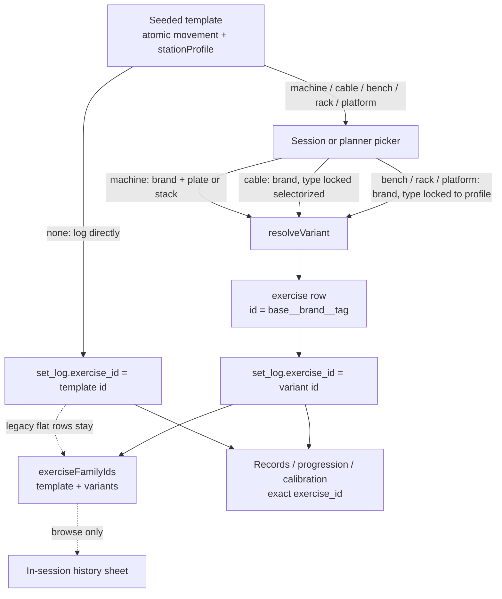

# Station composition for non-dumbbell exercises

**Status:** Design approved (James 2026-09-21). Open questions LOCKED. Implementation slices follow; this PR stays design-only and unmerged.
**Issue:** [#146](https://github.com/jms-dcksn/lifting-app/issues/146)
**Date:** 2026-09-21
**Companion:** Phase C machine variants — [2026-06-21 spec](2026-06-21-machine-brands-types-custom-exercises-design.md); shipped behavior in [Features §6](../../FEATURES.md) and [Decisions: Phase C](../../DECISIONS.md#phase-c-decisions-machine-brands-types-custom-exercises).

## Problem

Only `equipment: machine` templates must become a brand × plate/selectorized variant
before a set can be logged. Cable and barbell movements log as flat template ids.

That folds distinct stations into one identity:

- Nautilus vs Hoist cable stacks share one PR / progression / e1RM / top-weight chain.
- Flex Fitness vs Nautilus incline benches share one chain, even though pad angle and
  leverage change the load.

Cables already carry `needsCalibration: true` because stack units are arbitrary, but
there is no brand variant to hang that calibration on. The first cable session
calibrates the generic template; a later stack at another column inherits that
coefficient.

Dumbbells stay environment-agnostic (product exception, including incline DB bench).

## Current state (verified on `main` at `d008607`)

- 48 seeded rows in `src/lib/strength/coefficients.ts`. Sixteen machines are
  `machineTemplate: true` and cannot be logged until `resolveVariant` writes an
  `exercise` row. Eight cables have `needsCalibration` and **are** directly loggable.
  Twelve barbells, nine dumbbells, and three bodyweight movements log as template ids.
- A variant is `template × brand × machine_type`, stored in `exercise`. Dedup is
  `exercise_variant_unique` on
  `(user_id, base_exercise_id, coalesce(brand,''), coalesce(machine_type,''))`.
- `variantId` / `variantName` already use a third-segment tag:
  `selectorized → stack`, `plate_loaded → plate` (`src/lib/exercise-id.ts`).
- `resolveVariant` hardcodes `equipment: "machine"` and `needs_calibration: true`.
- Session / planner pickers pass `resolveMachines`; the program builder does not.
  A bare machine template shows "Choose machine" instead of set-entry
  (`active-session.tsx`, `workout-planner.tsx`).
- Records, progression, and Exercise review stay exact
  `(exercise_id, equipment_instance_id)`. Unresolved machine templates cannot earn
  records. In-session history groups `exerciseFamilyIds` (template + variants via
  `baseExerciseId`). Track default compounds pick `isReference && !machineTemplate`
  (`bb-bench`, `bb-deadlift`, `bb-back-squat`, `bb-ohp`, `bb-row`, `lat-pulldown`).
- `equipment_instance` stays dormant as a per-pad tracker. The review `equipment`
  query filters `set_log.equipment_instance_id` (`none` or an instance id). It is
  not station identity.

Phase C explicitly scoped brand/type to machines and left cables flat. This spec
reverses that judgment for cables and for the barbell stations James locked.

## Locks (James 2026-09-21)

Treat as decided. Implementation does not reopen them.

| Profile | Seeds | Picker | Calibration |
| --- | --- | --- | --- |
| `machine` | all 16 machine templates | brand + `plate_loaded` \| `selectorized` | yes, on the variant |
| `cable` | all 8 cable templates | brand only; `machine_type` locked `selectorized` | yes, on the brand variant |
| `bench` | `bb-bench`, `bb-incline-bench`, `bb-hip-thrust` | brand only | no — ordinary lb |
| `rack` | `bb-back-squat`, `bb-front-squat`, `bb-ohp` | brand only | no — ordinary lb |
| `platform` | `bb-deadlift`, `bb-rdl` | brand only | no — ordinary lb |
| `none` | all 9 dumbbells; bodyweight `weighted-dip`, `weighted-pullup`, `hanging-knee-raise`; barbell `bb-row`, `bb-reverse-lunge`, `bb-shrug`, `bb-curl` | none — log the template | unchanged (cables are not in this row) |

Dumbbell incline bench is an explicit product exception: no station, even though
the barbell incline press requires a bench brand.

## Domain model

One atomic movement. Optional station. Same two storage locations as Phase C.

### Atomic movement (seeded template)

Lives in `coefficients.ts`. Gains `stationProfile`:

```ts
type StationProfile = "machine" | "cable" | "bench" | "rack" | "platform" | "none";
```

`stationProfile !== "none"` means the template has no absolute load identity and
must be instantiated before log, pin-as-loggable, or records. This is the
generalization of today's `machineTemplate`.

Keep `equipment` (`barbell | dumbbell | cable | machine | bodyweight`) as the
logging convention (total vs one-dumbbell vs added bodyweight). Station is not a
sixth equipment value.

During the first implementation slice, replace call sites that mean "not yet
loggable" (`def.machineTemplate`) with `needsStation(def)`
(`stationProfile !== "none"`). Leave `machineTemplate` as a derived alias
(`stationProfile === "machine"`) only if a call site truly means machine, then
delete the flag.

### Station variant (`exercise` row)

`template × brand × station tag`. Trackable identity. `set_log.exercise_id` points
here after resolve. Created lazily by extending `resolveVariant` — no parallel
find-or-create path.

Inherit `pattern`, `coefficient`, `increment`, and `equipment` from the template.
Set `needs_calibration` from the template (cables true, barbell stations false).
Set `is_reference: false` on the row; the template remains the pattern reference
for Board short-names and priors.

### Profile `none`

No `exercise` row. `set_log.exercise_id` is the seeded id, as today.

### Custom exercises

No seeded `stationProfile`. v1:

- Custom `machine`: brand + type (unchanged).
- Custom `cable`: brand; type locked `selectorized`; `needs_calibration: true`.
- Custom barbell / dumbbell / bodyweight: flat. No bench/rack/platform picker.

## Exercise → profile (all 48 seeds)

| id | name | equipment | stationProfile | resolve? | calibrate variant? |
| --- | --- | --- | --- | --- | --- |
| `bb-bench` | Barbell Bench Press | barbell | `bench` | brand | no |
| `bb-incline-bench` | Barbell Incline Bench | barbell | `bench` | brand | no |
| `db-bench` | Dumbbell Bench Press | dumbbell | `none` | — | — |
| `db-incline-bench` | Dumbbell Incline Bench | dumbbell | `none` | — | — |
| `weighted-dip` | Weighted Dip | bodyweight | `none` | — | — |
| `machine-chest-press` | Machine Chest Press | machine | `machine` | brand + type | yes |
| `pec-deck` | Pec Deck / Chest Fly | machine | `machine` | brand + type | yes |
| `bb-ohp` | Barbell Overhead Press | barbell | `rack` | brand | no |
| `db-shoulder-press` | Dumbbell Shoulder Press | dumbbell | `none` | — | — |
| `machine-shoulder-press` | Machine Shoulder Press | machine | `machine` | brand + type | yes |
| `bb-row` | Barbell Row | barbell | `none` | — | — |
| `db-row` | Dumbbell Row | dumbbell | `none` | — | — |
| `machine-row` | Machine Row (ISO-Lateral) | machine | `machine` | brand + type | yes |
| `seated-cable-row` | Seated Cable Row | cable | `cable` | brand | yes |
| `lat-pulldown` | Lat Pulldown (Cable) | cable | `cable` | brand | yes |
| `weighted-pullup` | Weighted Pull-up | bodyweight | `none` | — | — |
| `high-row` | High Row | machine | `machine` | brand + type | yes |
| `bb-back-squat` | Barbell Back Squat | barbell | `rack` | brand | no |
| `bb-front-squat` | Barbell Front Squat | barbell | `rack` | brand | no |
| `hack-squat` | Hack Squat | machine | `machine` | brand + type | yes |
| `leg-press` | Leg Press | machine | `machine` | brand + type | yes |
| `bb-deadlift` | Barbell Deadlift | barbell | `platform` | brand | no |
| `bb-rdl` | Romanian Deadlift | barbell | `platform` | brand | no |
| `back-extension` | Back Extension | machine | `machine` | brand + type | yes |
| `db-split-squat` | Bulgarian Split Squat | dumbbell | `none` | — | — |
| `db-step-up` | Dumbbell Step-Up | dumbbell | `none` | — | — |
| `bb-reverse-lunge` | Barbell Reverse Lunges | barbell | `none` | — | — |
| `bb-hip-thrust` | Barbell Hip Thrust | barbell | `bench` | brand | no |
| `glute-drive` | Glute Drive | machine | `machine` | brand + type | yes |
| `seated-hip-abduction` | Seated Hip Abduction | machine | `machine` | brand + type | yes |
| `leg-extension` | Leg Extension | machine | `machine` | brand + type | yes |
| `seated-leg-curl` | Seated Leg Curl | machine | `machine` | brand + type | yes |
| `standing-calf-raise` | Standing Calf Raise | machine | `machine` | brand + type | yes |
| `bb-shrug` | Barbell Shrug | barbell | `none` | — | — |
| `cable-shrug` | Cable Shrug | cable | `cable` | brand | yes |
| `bb-curl` | Barbell Curl | barbell | `none` | — | — |
| `db-curl` | Dumbbell Curl | dumbbell | `none` | — | — |
| `cable-curl` | Cable Curl | cable | `cable` | brand | yes |
| `hammer-rope-curl` | Hammer Rope Curls | cable | `cable` | brand | yes |
| `cable-pushdown` | Cable Triceps Pushdown | cable | `cable` | brand | yes |
| `db-skullcrusher` | Dumbbell Skullcrusher | dumbbell | `none` | — | — |
| `db-lateral-raise` | Dumbbell Lateral Raise | dumbbell | `none` | — | — |
| `cable-lateral-raise` | Cable Lateral Raise | cable | `cable` | brand | yes |
| `machine-lateral-raise` | Machine Lateral Raise | machine | `machine` | brand + type | yes |
| `reverse-pec-deck` | Reverse Pec Deck (Rear Delt) | machine | `machine` | brand + type | yes |
| `cable-crunch` | Cable Crunch | cable | `cable` | brand | yes |
| `machine-ab-crunch` | Machine Ab Crunch | machine | `machine` | brand + type | yes |
| `hanging-knee-raise` | Hanging Knee Raises | bodyweight | `none` | — | — |

Counts: 16 machine, 8 cable, 3 bench, 3 rack, 2 platform, 16 none (9 DB + 3 BW + 4 BB).

## ID and naming

Extend the existing helpers. Do not add a fourth id segment.

```
variantId  = `${baseId}__${slug(brand)}__${machineType}`
owned id   = `${variantId}__${userId}`   // when the canonical slug is taken
```

| Stored `machine_type` | Display tag | Used by |
| --- | --- | --- |
| `selectorized` | `stack` | machines (pin stack); all cables (locked) |
| `plate_loaded` | `plate` | machines only |
| `bench` | `bench` | barbell bench profile |
| `rack` | `rack` | barbell rack profile |
| `platform` | `platform` | barbell platform profile |

`TYPE_TAG` in `exercise-id.ts` already maps the first two. Add the three station
tags. `variantName` stays `${baseName} — ${brand} (${tag})`.

Examples:

- `lat-pulldown__nautilus__selectorized` → `Lat Pulldown (Cable) — Nautilus (stack)`
- `bb-incline-bench__flex-fitness__bench` → `Barbell Incline Bench — Flex Fitness (bench)`
- `bb-back-squat__rogue__rack` → `Barbell Back Squat — Rogue (rack)`
- `bb-deadlift__eleiko__platform` → `Barbell Deadlift — Eleiko (platform)`
- `machine-chest-press__hammer-strength__plate_loaded` unchanged

Reuse `KNOWN_BRANDS` as the dropdown seed. "Other" remains free-text (Flex Fitness,
Rogue, Eleiko). No second brand list in v1.

Two stations of the same movement + brand + tag still collapse to one variant —
the same limit machines have today. `equipment_instance` stays dormant.

## Schema

**Reuse `exercise` and `exercise_variant_unique`. Store bench / rack / platform in
`machine_type`. Do not add `station_kind`.**

Expand the allowed values of the existing column:

```
machine_type: 'selectorized' | 'plate_loaded' | 'bench' | 'rack' | 'platform' | null
```

There is no CHECK constraint today (migration `0008` is a comment only). A follow-up
migration updates the comment. No unique-index rewrite. No column rename.

TypeScript: introduce `StationTag` as that union. Keep `MachineType` as
`selectorized | plate_loaded` for the machine-only plate/stack control.
`resolveVariant` accepts `StationTag`. Cable callers pass `selectorized`; bench /
rack / platform callers pass themselves.

`stationProfile` lives on the seeded `ExerciseDef` only. Variants inherit the
profile by reading the template through `base_exercise_id`. The row does not need
a second profile column.

### Why not `station_kind`

A new column would be a parallel identity axis: the unique index, `variantId`
third segment, and `TYPE_TAG` already *are* the station tag. Bench vs rack is
determined by the template's `stationProfile`; storing it on the variant exists
only so the id and the unique index can name it. Adding `station_kind` forces an
index rewrite and a dual-write for no extra query the product needs.

The column name `machine_type` is now slightly wrong. Keep the name. A rename
migration is cost without behavior. Phase C already defined this column as
identity, not math.

### `resolveVariant` changes

```ts
// today
equipment: "machine"
needs_calibration: true
machineType: MachineType  // selectorized | plate_loaded

// after
equipment: base.equipment          // machine | cable | barbell
needs_calibration: !!base.needsCalibration
machineType: StationTag            // locked by stationProfile
```

Reject a tag that does not match the template profile (cable + `plate_loaded`,
`bb-bench` + `rack`, machine + `bench`). Brand may still be null (same as today's
machine "no brand" path).

## UX

Experience gate: James cannot log a cable or an incline barbell bench without
picking a brand. That is the dogfood path. Builder convenience does not bypass it.

### Picker (`exercise-picker.tsx`)

Rename the session flag `resolveMachines` → `resolveStations` when touching that
file. Behavior:

| `stationProfile` | Session / planner (`resolveStations`) | Builder (`resolveStations={false}`) |
| --- | --- | --- |
| `none` | return template | return template |
| `machine` | brand + type form → `resolveVariant` | store template |
| `cable` | brand-only form; type locked `selectorized` | store template |
| `bench` / `rack` / `platform` | brand-only form; type locked to the profile | store template |
| already-resolved variant | return as-is (one tap) | return as-is |

Brand-only form copy is profile-specific: **Choose cable**, **Choose bench**,
**Choose rack**, **Choose platform**. Machines keep **Choose machine**. No plate /
stack control on cable or barbell-station forms.

### Session and planner

If the slot's effective exercise `needsStation`, hide set-entry and show the
profile-specific choose control (same place as today's "Choose machine").
`logSet` and swap RPC already reject unresolved machine templates; extend that
guard to every `needsStation` template.

Planner cookie identity is unchanged. `workout-plan.ts` already skips
`machineTemplate` when previewing a concrete exercise; switch that check to
`needsStation`.

### Builder

Programs and Strong Foundations slots may keep storing `lat-pulldown`,
`bb-incline-bench`, `seated-cable-row`, and the other station templates. Resolve
happens the first time that slot is logged or swapped in a session. Do not
pre-instantiate templates in `createFromTemplate`.

### Custom form

When equipment is `cable`, show the brand field and lock type. When equipment is
`machine`, keep brand + type. Other equipment: no station fields.

## Impact

Exact `exercise_id` remains the progression, record, and calibration key.
Families are browse-only, as today.

### Records (rep / e1RM / top-weight)

Scope stays `(user_id, exercise_id, equipment_instance_id)`
([workout records](../../DECISIONS.md#workout-records)). A Nautilus cable stack
and a Hoist cable stack are different `exercise_id`s, so they do not share PRs.
A leftover flat `lat-pulldown` row keeps its own chain (see History).
`eligibleRecordSet` must treat `needsStation` templates as ineligible, the way
it treats `machineTemplate` today. Calibration working sets on cable variants
stay eligible observations; first exposure is still not a PR.

No change to load conventions or to e1RM math.

### Exercise review `equipment` query

`?equipment=` continues to mean `equipment_instance_id` (`none` or an instance
id). It does **not** become a station switcher. Station identity is the path
`exerciseId`.

After resolve, review of a Nautilus pulldown is
`/history/lat-pulldown__nautilus__selectorized?equipment=none`. Historical flat
rows stay at `/history/lat-pulldown?equipment=none`. Entry points that already
pass `equipment` keep doing so. Do not invent a second query param.

### Track default compounds

`defaultCompoundIds` currently skips `machineTemplate`. Five of the six default
ids become station templates: `bb-bench`, `bb-deadlift`, `bb-back-squat`,
`bb-ohp`, `lat-pulldown` (`bb-row` stays `none`).

**Locked (James 2026-09-21):** keep those template ids as the default tile keys
and short names so Bench / Squat / Deadlift / OHP / Pulldown do not vanish. For
a default compound whose profile is not `none`, resolve the tile's **numbers
and review href** to the latest finished set among
`exerciseFamilyIds(templateId)` (variant or leftover flat row). Pins on a
specific variant stay exact-id. Do not merge PR numbers across family members.

### Calibration

Cable brand variants use the existing `needsCalibration` path in
`recommend.ts` / `recomputeAndUpsertStat`: first session is a calibration set;
`personal_coefficient` anchors against other variants' pattern strength, then
holds. Distinct working-set sessions increment `coeff_confidence_n`.

Barbell station variants are ordinary lb. They do not enter the calibration
branch. A new Flex Fitness incline bench with no history uses
`pattern_strength × template coefficient` via `startingWeight()`, then
double-progression on that variant's own first sets.

Do not rewrite progression math (`sessionTarget`, `selectProgressionReference`,
bump/floor rules). A new variant has no exact-id history, so it already takes
the no-prior branch.

### Swaps and family browse

`exerciseFamilyIds` already returns template + variants once `baseExerciseId` is
set. Cable and barbell-station variants join that family automatically. In-session
history can show leftover flat template sets beside new variant sets. Records and
targets do not use the family.

Swap ranking stays in-pattern. Filter unresolved station templates out of
candidates the same way machines are filtered today. Resolving a swap target
uses `resolveStations`. Manual swap persistence (`exercise_swap_scope`) is
unchanged; it stores a concrete catalog id.

Fluid / Coach proposals that name a station template must resolve before log
(existing "Choose a specific exercise or machine first" guard, generalized).

### Catalog merge

`catalog.ts` already merges seeds with the owner's `exercise` rows. No new merge
layer. `getCatalogMap` callers stay as they are. Seeded ids still win collisions,
so a leftover template id is never overwritten by a variant row.

## History policy (no rewrite)

**Locked (James 2026-09-21).** No rewrite of flat cable/barbell `set_log` rows.

Existing rows that point at those template ids are left alone. No backfill, no
`UPDATE` to a synthetic variant, no invented brand.

Family browse groups the template with later variants. The next time the user
logs that movement in a resolving context, they pick a station and
`resolveVariant` creates the row. From that set forward, identity is the variant.

Consequences:

- Old PRs and progression stay on the template id.
- New PRs and progression live on the variant. They do not "continue" the old
  chain. The first variant session is a first exposure (quiet for records;
  cables calibrate).
- Default-compound tiles use family-latest numbers and href (above). Direct
  review of the template id still shows only leftover flat rows.

Rewriting would require guessing a brand for every historical cable and bench
set. That guess is worse than a split chain.

## Implementation slices

Small, ordered, each green on its own. Product code is a follow-up PR, not this
design branch.

1. **Domain + ids.** Add `stationProfile` to all 48 seeds. `needsStation()`.
   Expand `StationTag` / `TYPE_TAG`. Table-driven tests for the inventory and for
   `variantId` / `variantName` on `stack` / `plate` / `bench` / `rack` /
   `platform`. No UI.
2. **`resolveVariant`.** Inherit `equipment` and `needs_calibration`. Accept
   cable and barbell-station templates. Reject tag/profile mismatches. Extend
   `exercise-actions.test.ts`. Comment-only SQL for `machine_type`.
3. **Picker + session gate.** Brand-only vs brand+type forms. `resolveStations`.
   Profile-specific choose copy. `logSet` / swap / planner / pins reject every
   `needsStation` template. Dogfood: cable brand and incline-bench brand are
   unavoidable before the first set.
4. **Family, Track, review hrefs.** Confirm `exerciseFamilyIds` includes new
   variants. Default compounds use family-latest numbers and href. Review
   `equipment` query stays instance-scoped.
5. **Calibration + records verification.** Cable variant first session
   calibrates; barbell station does not. Records remain exact-id. Tests cover
   family browse of leftover template + new variant without merging PRs.
6. **Shipped-doc refresh.** [Features §6](../../FEATURES.md), Phase C judgment
   note, this spec's status → Approved / shipped. Not part of the design PR.

## Out of scope

- AI Coach (#143, [AI-COACH.md](../../AI-COACH.md)). Catalog loaders already
  return `exercise` rows; no agent-specific station tool.
- Bodyweight stations (dip / pull-up / hang). The three bodyweight seeds stay
  `none`.
- Rewriting progression, e1RM, or recommend math.
- Rewriting historical `set_log` rows.
- New `station_kind` column or `equipment_instance` activation.
- Dumbbell stations, including incline DB bench.
- A second brand list, or distinguishing two same-brand benches.
- Pre-instantiating stations in program templates.

## Open questions — LOCKED (James 2026-09-21)

1. **History:** no rewrite of flat cable/barbell `set_log` rows. Family browse
   groups template + later variants; the next log creates a variant. Split PR
   chains are accepted.
2. **Track default compounds:** family-latest numbers and review href among
   `exerciseFamilyIds(templateId)`. Pins on a specific variant stay exact-id.
3. **Copy:** profile-specific — **Choose bench** / **Choose cable** /
   **Choose rack** / **Choose platform** / **Choose machine**. Not generic
   “Choose station”.

## Template → variant → set_log


