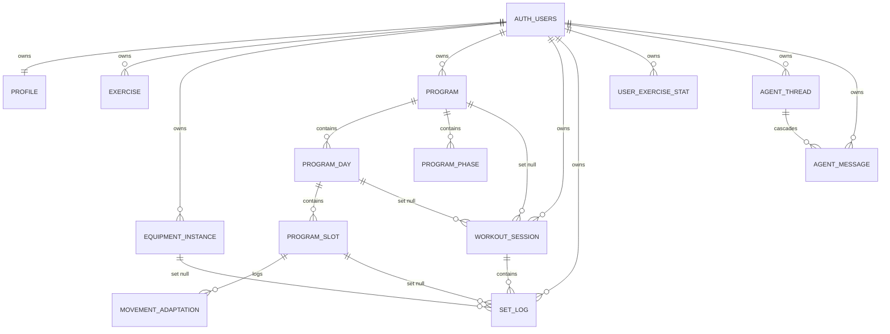
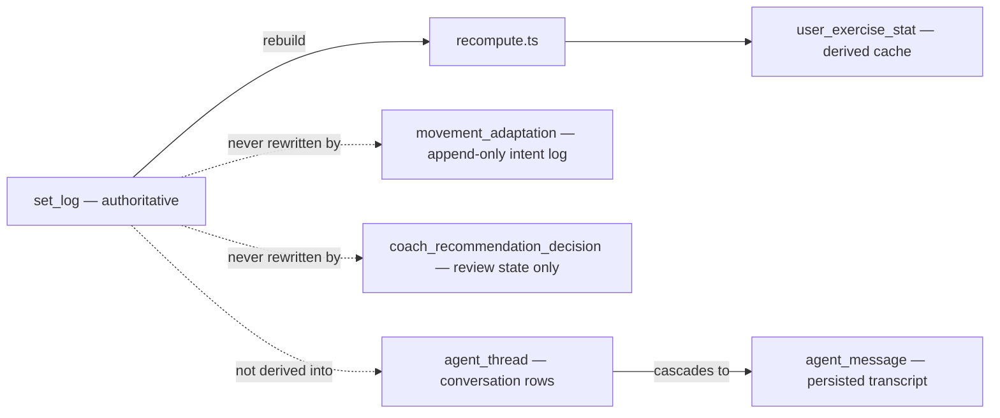

## Overview

The application's entire persistent state lives in Postgres, defined by an ordered, additive
sequence of files in `supabase/migrations/`. `src/lib/supabase/types.ts` is a generated mirror
of that schema used for compile-time safety; it is never hand-edited and never the source of
truth. The schema separates a small set of **authoritative** tables (what the user actually did)
from **derived/rebuildable** caches (fast summaries of that history), and enforces per-user
ownership almost entirely through Postgres row-level security (RLS) rather than application-layer
checks. Conversation memory is a separate owner-scoped pair, `agent_thread` and
`agent_message`, not a derivation of `set_log`.

## Entity map



User ownership of the shipped agent tables, plus the structural cascades and history-preserving nulls around programs and sets.

## Core tables

### Identity and catalog

- `profile` mirrors `auth.users` for app-level fields (`display_name`, `bodyweight`,
  `goal_weight`, `default_rest_seconds`, `sex`, period-tracking consent fields). A
  `security definer` trigger (`handle_new_user`, hardened in `0003_harden_signup_trigger.sql`
  to pin `search_path` and be non-RPC-callable) inserts the row on `auth.users` signup.
- `exercise` holds only **user-created** rows: custom exercises and machine/cable/station
  variants. The large seeded catalog (movement patterns, coefficients) lives in application
  code (`src/lib/strength/coefficients.ts`), not in this table. `exercise_id` is a text slug
  used across `set_log` and `program_slot`, intentionally **not** a foreign key, so the seeded
  catalog can evolve in code without migrations. A variant unique index
  (`exercise_variant_unique`) scopes one row per `(user_id, base_exercise_id, brand,
  machine_type)`, coalescing nulls so brand/type absence doesn't produce duplicates.
- `equipment_instance` records a specific machine at a specific gym (label/gym free text);
  loading differs by brand/unit, so this disambiguates within the app.

### Programs

- `program` is the top-level container: `name`, `description` (renamed from `notes`),
  `tags`, `weeks`, `style` (`classic | fluid`), and `is_active`. A **partial unique index**
  `program_one_active_per_user on program (user_id) where is_active` enforces "at most one
  active program" at the database level — the application cannot leave two rows active even
  under a bug.
- `program_day` is an ordered, named day within a program (`position`, `name`).
- `program_slot` is an ordered exercise slot within a day: `exercise_id`, `pattern` (used to
  filter same-pattern swap candidates), `target_sets`, `rep_min`/`rep_max`, `target_rir`, plus
  later additions `rest_seconds` (per-slot override of the profile default) and
  `plateau_patience` (stalled-exposure window before Fluid plateau detection; `null` means
  "auto by movement type"). The slot's exercise is concrete, but pattern-tagged so a swap can
  re-derive an appropriate working weight.
- `program_phase` gives classic programs reusable, week-ranged overrides: a contiguous
  `week_start`–`week_end` window can override `target_rir_min/max` and/or `set_multiplier`.
  Check constraints enforce valid week ranges (1–52), a valid RIR pair, a set multiplier in
  `(0, 2]`, and that a phase supplies at least one override (`program_phase_has_override`).
  Block position (which day/week is next) is **derived from finished sessions**, never stored.
- `movement_adaptation` is Fluid programs' append-only **intent log**: what the plateau
  engine recommended (`rep_change | swap | dismiss | manual_swap`) and what the user did,
  keyed to a `program_slot_id`. It is explicitly not a cache of `set_log` and is never replayed
  to reconstruct performance — it only explains why a slot's rep range or exercise changed.

### Sessions and sets

- `workout_session` is one instance of training: `user_id`, `program_id` (nulled, not
  cascaded, if the program is deleted — see below), `program_day_id`, `week_index`,
  `performed_at`, `finished_at` (null while in progress; only finished sessions count toward
  "next workout" sequencing and history), plus later subjective fields `readiness` (1–5),
  `joint_pain` (`none | mild | significant`), and a length-capped free-text `notes`. It also
  carries `exercise_swaps` (`jsonb`, default `{}`), a session-local map of slot → substituted
  exercise that is independent of whether the underlying program was also mutated.
- `set_log` is **the authoritative record of what happened** — "atomic truth" per the schema's
  own comment. Every other performance signal in the app is derivable from it. Columns capture
  `exercise_id`, `equipment_instance_id`, `set_index`, `weight`, `reps`, `rir`, `is_warmup`,
  `is_calibration`, a cached `e1rm` (computed from weight/reps/rir at write time), and
  `program_slot_id` (nullable; ties a set back to the slot it was logged against, surviving a
  later swap, and is null for ad-hoc sets not tied to any program). An optional
  `idempotency_key` plus a partial unique index on `(session_id, idempotency_key)` (added in
  `20260916000000_idempotent_logset.sql`) lets the client retry a log-set request safely: the
  server returns the existing row instead of inserting a duplicate on unique-constraint
  conflict.
- `user_exercise_stat` is the **derived, rebuildable** per-user strength cache: `current_e1rm`,
  `personal_coefficient` (a machine/cable variant's calibrated load coefficient),
  `coeff_confidence_n` (how many calibration sessions informed it), and `last_updated`, keyed
  by `(user_id, exercise_id)`. The schema comment is explicit: this table can be rebuilt from
  `set_log` at any time (see `src/lib/strength/recompute.ts`). Application code must never treat
  it as a record of historical fact — record baselines and history views read `set_log`
  directly, not this cache.
- `user_exercise_pin` is a small owner-scoped **display preference** table (which exercises show
  as pinned tiles, in what `position`), capped at 8 by the application layer, not a constraint.
  It has no bearing on `set_log`, coefficients, swaps, or PR eligibility — purely a UI ordering
  concern.

### Body tracking

- `bodyweight_log` is date-keyed body-weight history (`logged_on`, `weight`), unique per
  `(user_id, logged_on)`; `profile.bodyweight` remains an immutable fallback for accounts that
  have never logged a dated entry, but reads prefer the newest logged row.
- `body_measurement_log` is the equivalent for tape measurements: one row per `(user_id,
  logged_on, site)`, `site` constrained to `waist | neck | arm | thigh | chest`. It follows the
  same owner-scoped shape as `bodyweight_log` — a missing site on a date is simply a missing
  row, not a null placeholder.
- `period_observation` is opt-in, female-only menstrual tracking: one row per observed bleeding
  day, gated by `profile.sex = 'female'` and `profile.period_tracking_enabled`, with consent
  version/timestamp tracked on `profile`. V1 is observation-only — no predictions, no training
  automation, no external sharing — enforced by omission (no columns for those concerns exist
  yet), not by a runtime flag.
- `coach_recommendation_decision` stores only the user's response (`accepted | dismissed |
  deferred`, with `deferred_until` required exactly when `status = 'deferred'`) to one Coach
  recommendation snapshot. The recommendation itself is always recomputed from history; this
  table never mutates program or training data, so a review decision cannot corrupt a
  prescription.

### Agent threads

`agent_thread` and `agent_message` are shipped owner-scoped tables, not a planned schema.
`20260920181553_agent_threads.sql` created them; `20260927170000_agent_multi_thread.sql`
replaced the original one-thread-per-user constraint with the current many-thread contract.
Generated `Database` types mirror both tables, including the composite owner foreign key.
Neither table references a program, session, or `set_log` row. Conversation memory is the
transcript itself, not embeddings over training history. Chat behavior — drafts, the model
window, and the `/api/agent/chat` contract — lives in
[Coach and AI agent](/openwiki/workflows/coach-and-ai-agent.md).

- `agent_thread` is one conversation: `id`, `user_id`, required `title`, `created_at`, and
  `updated_at`. A user may own many threads. `agent_thread_id_user_key unique (id, user_id)`
  replaced `agent_thread_user_key unique (user_id)`. The app supplies `id` (LangSmith
  `uuid7()`); the multi-thread migration dropped the column default, so an insert that omits
  it fails with `23502`. `title` is `text not null`. The migration backfilled it from each
  surviving thread's earliest user text (whitespace collapsed, first 80 characters) and used
  `New chat` when that text was empty. New titles are produced the same way by
  `threadTitleFromUserText` at the first send. The migration also deleted empty Slice 0
  threads before that backfill; those rows had no messages, and the delete is not reversible.
- `agent_message` is one persisted turn part: `thread_id`, `user_id`, `role`
  (`user | assistant | tool`), `parts` (a `jsonb` array, default `[]`), and `created_at`.
  Storing parts as JSON is what lets tool calls survive a reload. `agent_message_thread_created_idx`
  on `(thread_id, created_at)` supports reading a thread in order. The UI reads the full
  transcript; the model window is a later cut in application code, not a second table.
- Ownership is a composite foreign key, not a second RLS policy. `agent_message_thread_owner_fkey`
  is `(thread_id, user_id) references agent_thread (id, user_id) on delete cascade`. RLS only
  compares a row's own `user_id` with `auth.uid()`, so it cannot see who owns the named
  thread. The composite key closes that gap for every role, including a client that bypasses
  RLS: inserting or moving a message onto another user's thread fails with `23503`. Deleting
  a thread cascades its messages. Deleting `auth.users` cascades both tables through each
  row's `user_id`.
- Ordering is `updated_at`, maintained by the writer rather than a trigger. `saveMessage`
  inserts the message, then stamps `agent_thread.updated_at` to that message's `created_at`.
  History lists the latest 50 threads with `order by updated_at desc`, backed by
  `agent_thread_user_updated_idx` on `(user_id, updated_at desc)`. A new chat is a draft with
  no row; the first send inserts the thread and its first message together in application
  code. If that message insert fails, `startTurn` deletes the thread before rethrowing.
  There is no database transaction around that pair, and no agent RPC.

## Ownership and RLS pattern

Every user-owned table follows the same shape: a `user_id uuid not null references
auth.users(id) on delete cascade` column, `alter table ... enable row level security`, and a
single policy (usually named `"own rows"`) of the form:

```sql
create policy "own rows" on <table>
  using (user_id = auth.uid()) with check (user_id = auth.uid());
```

`profile` is the one exception, keyed by `id = auth.uid()` instead of a separate `user_id`
column. RLS is the primary enforcement mechanism — application code does not additionally
filter most reads by user, and Postgres rejects cross-user access unconditionally at the row
level. Newer tables tend to wrap the predicate as `(select auth.uid()) = user_id` inside a `for
all` policy instead of separate `using`/`with check` clauses; both forms are equivalent RLS-wise,
and grants (`grant select, insert, update, delete on table ... to authenticated`) accompany the
newer style explicitly. `agent_thread` and `agent_message` use that newer form
(`"users manage own agent threads"` / `"users manage own agent messages"`, `for all to
authenticated`) plus the same table grants. The composite foreign key above is an additional
integrity constraint, not a replacement for those policies. The one elevated read path in the
system, the Coach weekly API, uses a server-only secret client that bypasses RLS entirely —
every one of its queries therefore carries an explicit `COACH_API_USER_ID` predicate as a
substitute for the RLS boundary it has stepped around. The agent chat path does not use that
client. See `/openwiki/integrations/supabase.md` for that boundary and the client/session-refresh
plumbing.

## Additive-migration discipline

Files under `supabase/migrations/` are timestamp- or sequence-ordered and treated as an
append-only history: new behavior arrives as a new file that adds columns, tables, indexes, or
functions; existing files are not edited retroactively (`20260921233233_station_machine_type_comment.sql`
is a pure `comment on column` addition documenting new `machine_type` sentinel values, explicitly
avoiding a `check` rewrite or column rename). Consequences of this discipline that show up
repeatedly in the schema:

- Nullable columns default to meaning "not set" or "use a fallback" rather than requiring a
  backfill (`program_slot.rest_seconds is null` → use `profile.default_rest_seconds`;
  `program_slot.plateau_patience is null` → auto by movement type).
- Renames are rare and deliberate (`program.notes` → `program.description` in
  `0006_program_metadata.sql`); most evolution is column/table addition.
- A dedicated backfill migration (`0011_backfill_james_hit_phases.sql`) is the exception that
  proves the rule — targeted, named, and scoped to one account's data rather than a schema-wide
  correction.
- Security hardening is itself layered on: `0003_harden_signup_trigger.sql` re-defines
  `handle_new_user()` only to pin `search_path` and revoke direct RPC execution, without
  touching the trigger wiring from `0001_init.sql`.
- The agent schema evolved the same way. `20260927170000_agent_multi_thread.sql` adds `title`,
  deletes empty Slice 0 threads, backfills titles, drops the id default and the one-thread key,
  and replaces the message foreign key. It does not edit `20260920181553_agent_threads.sql`.

## Atomic-write RPCs

Supabase-js has no interactive multi-statement transaction API for arbitrary queries, so any
program mutation that touches more than one table — or that must never leave a partially
applied state — is implemented as a Postgres function (RPC) rather than a sequence of
client-issued statements. Every RPC in this system uses `security invoker` (never `definer`)
plus an explicit `user_id = auth.uid()` predicate on every write inside the function body: RLS
still applies to the invoking user's session, and the explicit predicate is defensive redundancy
against RLS misconfiguration, not the primary enforcement mechanism. See
`docs/PROGRAM-TRANSACTIONS.md` for the full design rationale.

- **`save_program(p_tree jsonb)`** (`20260917000000_atomic_program_mutations.sql`) is the single
  entry point for inserting, upserting, cloning, and applying a template to a program. It takes
  a complete program tree (program metadata, an optional `phases` array, and a `days` array with
  nested `slots`) and, in one transaction: atomically flips `is_active` for every one of the
  user's programs with a single `update ... set is_active = (id = v_program_id)` (never toggling
  through zero-active or two-active), upserts program/phase/day/slot rows with
  `on conflict (id) do update`, and deletes rows whose IDs are absent from the input
  (upsert-then-delete-missing). Preserving row `id`s across an edit — rather than deleting and
  reinserting — is what keeps `set_log.program_slot_id` pointing at the correct slot after a
  builder save; this is the single most important invariant this RPC protects.
- **`set_active_program(p_program_id uuid)`** is a minimal single-statement RPC: it verifies
  ownership, then runs the same conditional `update ... set is_active = (id = p_program_id)`
  across all of the user's programs, so gallery activation can never observe an intermediate
  state with zero or two active programs.
- **`swap_session_exercise(p_session_id, p_slot_id, p_exercise_id, p_pattern, p_scope)`**
  (`20260911005629_exercise_swap_scope.sql`) is the reference implementation this design
  generalized from, and predates `save_program`. It takes `for update` locks on the session and
  slot rows, rejects a swap on an already-finished session, always records the swap into
  `workout_session.exercise_swaps`, and — only when `p_scope = 'program'` — also updates
  `program_slot.exercise_id/pattern` and, for Fluid programs, appends a `manual_swap` row to
  `movement_adaptation`. It never rewrites `set_log`.
- **`save_bodyweight_entry(...)`** (`20260912143620_bodyweight_calendar_writes.sql`) atomically
  handles insert, correction, and explicitly confirmed same-date replacement for
  `bodyweight_log`, serializing per-owner writes with `pg_advisory_xact_lock` so two calendar
  writes to the same date cannot race.

Deliberately **not** wrapped in an RPC: single-statement writes like `logSet`, `deleteSet`, and
`finishSession` remain a Server Action issuing one Supabase-js call directly, since a single
statement is already atomic. `acceptAdaptation` (log a Fluid adaptation, then optionally call
`swap_session_exercise`) is also left as two calls; a logged adaptation with a failed follow-up
swap is considered recoverable and detectable rather than corrupting, so the design in
`docs/PROGRAM-TRANSACTIONS.md` treats wrapping it as low-priority, not required. Agent thread
creation is the same kind of exception: `startTurn` inserts the thread, then the first message,
and deletes the thread if the message insert fails. That cleanup is application-level, not an
atomic RPC.

## Deletion and cascade semantics

Foreign keys encode two different deletion philosophies depending on whether the deleted row is
structural or historical:

- Deleting a `program` cascades to its `program_day`, `program_slot`, and `program_phase` rows
  (structure has no meaning without its owner), but **does not** cascade to `workout_session` or
  `set_log`. `workout_session.program_id` and `program_day_id` are `on delete set null`, and
  `set_log.program_slot_id` is likewise `on delete set null`. Deleting the active program does
  not auto-activate another program, so a user can be left with zero active programs by their
  own action — this is a valid, if unusual, program-state, distinct from the invariant the
  atomic RPCs protect (never an *inconsistent* zero/two-active transition mid-write).
  `set_log` itself is never deleted by a program or slot removal: it is the one table treated as
  permanently authoritative regardless of what structural rows reference it.
- Deleting a `program_day` cascades to its `program_slot` rows (a day's slots have no meaning
  without the day), which is also the exact mechanism `save_program`'s upsert-then-delete-missing
  step relies on to remove an entire day's slots in one statement.
- Deleting an `agent_thread` cascades to its `agent_message` rows through
  `agent_message_thread_owner_fkey`. A message cannot outlive its thread, and it cannot be
  re-pointed at a thread owned by someone else.
- Every user-owned row ultimately cascades from `auth.users` deletion (`on delete cascade`),
  so removing an account removes all owned data without a separate purge routine. That includes
  both agent tables.

## What's authoritative vs. derived



- **Authoritative** (source of truth, never derived from anything else): `set_log`,
  `workout_session`, `program`/`program_day`/`program_slot`/`program_phase` (the program's
  *current* structure — distinct from the historical prescriptions recorded per-session via
  `workout_session.program_day_id`/`week_index`), `bodyweight_log`, `body_measurement_log`,
  `period_observation`.
- **Derived/rebuildable** (safe to recompute or drop and regenerate from authoritative data):
  `user_exercise_stat` (rebuilt from `set_log` by `src/lib/strength/recompute.ts`), and the
  Coach engine's live recommendations (recomputed from history on every request; only the
  review *decision* about them, in `coach_recommendation_decision`, is persisted).
- **Append-only intent, neither fully authoritative history nor a cache**:
  `movement_adaptation` records what the plateau engine proposed and what the user did with it,
  used to explain rep-range/exercise changes but never replayed to reconstruct performance
  numbers.
- **Conversation state, neither a training ledger nor a cache of one**: `agent_thread` and
  `agent_message` persist the owner's chats. They are not rebuilt from `set_log`, and writing
  a message does not mutate a program, session, or set. Training facts stay in the tools the
  agent calls, not in these rows.

## Focused tests

`supabase/tests/agent_thread_rls.sql` is the pgTAP suite for the shipped thread contract
(11 assertions). As the owner it can read only its own thread and messages, insert a message
on its own thread, start a second thread, and update its own message parts. It cannot create
a thread or message for another user (`42501`), omit the app-chosen thread id (`23502`), or
attach or move its own message onto another user's thread (`23503`).

## Related pages

- `/openwiki/concepts/programs-and-periodization.md` covers how `program_phase`,
  `program_slot`, and Fluid's `movement_adaptation` combine to produce a prescription.
- `/openwiki/concepts/strength-engine.md` covers how `set_log` feeds `e1rm`, personal
  coefficients, and progression targets.
- `/openwiki/integrations/supabase.md` covers the client/session plumbing, the Coach API's
  elevated read path, and the RLS boundary this page's ownership pattern depends on.
- `/openwiki/workflows/coach-and-ai-agent.md` covers the chat route, draft-then-save flow,
  and the model window cut over a thread's persisted messages.
- `/openwiki/testing/testing-strategy.md` covers the SQL regression suite
  (`supabase/tests/*.sql`) that exercises RLS policies and the atomic RPCs' rollback/invariant
  behavior.
