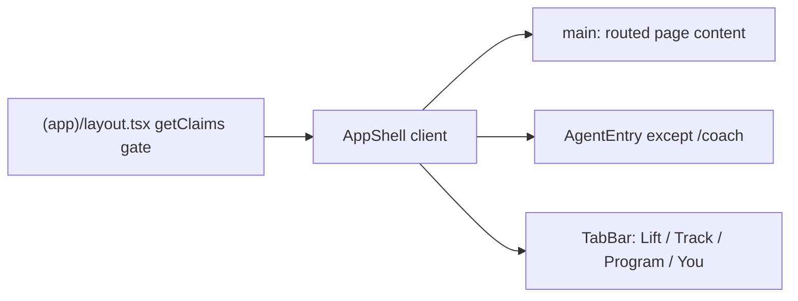
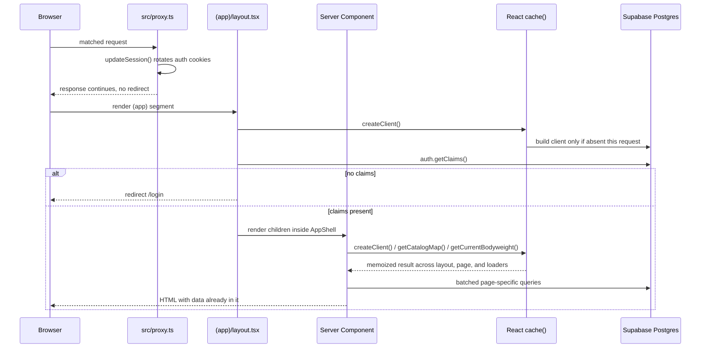
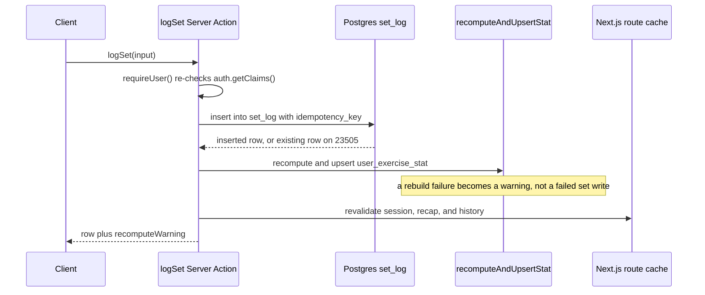

## What this system is

lifting-app is a progressive-overload lifting tracker on Next.js App Router with Supabase
(Postgres, Auth, and row-level security). The signed-in app assumes an active network during
workouts: there is no offline database or sync engine. The architecture is shaped for one
owner's history staying cheap to scan, a gym tap staying local, and user-owned rows being
enforced by `auth.uid()`.

The codebase separates into three layers:

- **Strength engine** (`src/lib/strength/`) — framework-free, unit-tested TypeScript with no
  Next.js or Supabase imports. It normalizes a logged set into an estimated 1RM, models
  per-pattern strength, derives session targets, and detects plateaus. See
  [Strength engine](../concepts/strength-engine.md).
- **Server loaders and Server Actions** (`src/lib/*.ts`, `src/app/(app)/**/actions.ts`) —
  the only application code that talks to Postgres. Loaders assemble screen data from the
  ledger; actions perform authenticated writes, rebuild derived caches, and revalidate
  routes.
- **UI** (`src/app/(app)/**`) — Server Components render hydrated data. A small set of Client
  Components owns interaction (the active session, charts, the tab shell, and the agent
  sheet) and calls Server Actions for writes.

`src/lib/strength/` is imported from both runtimes. Interactive targets run client-side in
the active workout (`useMemo` around `sessionTarget()`), while writes, stat rebuilds, and
Coach's weekly report run the same functions server-side. Keeping the engine framework-free
is what keeps "what the phone shows" and "what gets written" on one formula.

## The signed-in shell

Every authenticated screen lives under the `src/app/(app)` route group. Parentheses mean
the segment is not part of the URL. `(app)/layout.tsx` is the sole app-wide page gate: it
creates the request's Supabase client, calls `supabase.auth.getClaims()`, and redirects to
`/login` when there are no claims. Server Actions repeat that check independently
(`requireUser()`) because a layout guard does not protect an action invoked on its own.

*The signed-in layout renders one client shell: page content, the Coach entry, and four tabs.*

`AppShell` (`src/app/(app)/app-shell.tsx`) is a Client Component. It reads the pathname, and
an inner component reads search params, then `hideAppChrome()` decides whether the bottom
chrome appears. The tab bar is hidden on immersive flows that already own a sticky primary
action: the active workout (`/session/[id]`, including recap), the next-workout planner
(`/workout/next`), and the program builder (`/program/new` or `/program/[id]?mode=edit`).
When chrome is visible, `AgentEntry` mounts a Coach button and sheet on every tab except
`/coach`, where the full-screen chat already owns the conversation. That entry is not a
fifth tab. See [Coach and AI agent](../workflows/coach-and-ai-agent.md).

| Tab | Path | Role |
| --- | --- | --- |
| Lift | `/` | Home: active program status, resume or start the next workout, last-session recap |
| Track | `/analytics` (and `/analytics/*`, `/history/*`) | Scoreboard and Explore: PRs, month review, Coach, Body, Volume, Exercise review |
| Program | `/program` (and `/program/*`) | Gallery, read-only detail, builder |
| You | `/settings` (and `/settings/*`) | Profile, bodyweight, rest defaults, period tracking, sign-out |

`isTrackPath()` keeps the Track tab visually active on `/history/[exerciseId]`, so
per-exercise review reads as a Track destination rather than an unlabeled fifth tab.

## Request path for a typical page load

Auth is split so cookie refresh and access control are not the same job:

*A matched request refreshes cookies in the proxy, gates in the app layout, then reuses one cached client for page reads.*

1. **`src/proxy.ts`** is the Next.js 16 successor to `middleware.ts`. Its matcher runs on
   navigations except `_next/`, the favicon, the web manifest, the rest service worker, and
   image assets. It calls `updateSession()` in `src/lib/supabase/middleware.ts`, which
   touches `auth.getClaims()` only to rotate Supabase cookies onto the response. It does
   not redirect unauthenticated users.
2. **`(app)/layout.tsx`** creates the request's public, cookie-scoped client and calls
   `auth.getClaims()`. Missing claims redirect to `/login`. This is the page access gate.
3. **The Server Component** (Home is `src/app/(app)/page.tsx`) reads through that same
   RLS-respecting client, resolves the active program, next workout, and recent history,
   and renders HTML with the data already embedded. There is no client fetch waterfall for
   the initial paint.
4. **A Server Action** such as `logSet`, `saveProgram`, or pin/unpin re-derives the user,
   writes the ledger, optionally rebuilds a derived cache, and calls `revalidatePath()` for
   every route whose rendered data the write could change.

### `React.cache()` collapses duplicate work within one request

Three loaders are wrapped in React's `cache()` so layout, page, and nested action calls
that need the same data hit Postgres once per request:

- `createClient()` in `src/lib/supabase/server.ts` — the cookie-scoped Supabase client.
- `getCatalogMap()` in `src/lib/catalog.ts` — seeded templates merged with the owner's
  station variants and custom exercises. Seeded ids win collisions.
- `getCurrentBodyweight()` in `src/lib/current-bodyweight.ts` — the newest dated
  `bodyweight_log` observation, falling back to `profile.bodyweight`.

`cache()` memoizes by argument identity, not only by function. Because `createClient()` is
itself one instance per request, passing that same client into `getCatalogMap(supabase,
userId)` or `getCurrentBodyweight(supabase, userId)` from layout, page, and an action hits
one cache entry. A fresh client at each call site would silently stop the dedupe. Different
user ids still miss: the user id is part of the cache key. The scope does not carry into
the next request.

`src/lib/request-cache.test.ts` checks this with a fake Supabase client and a scoped
`cache()` dispatcher. It forces the React server build, because the default `react`
condition treats `cache()` as a passthrough. In one simulated request, three calls to
`getCatalogMap` issue one `exercise` query, and three calls to `getCurrentBodyweight` issue
one `bodyweight_log` query and one `profile` query.

The weekly Coach API is outside this model. `GET /api/coach/v1/weekly` has no browser
session, so it does not use the cached public client. The in-app agent chat is also
separate, but it stays on the cookie client. Both are described below.

## Mutation path: action, ledger, derived cache, revalidate

Writes go through Server Actions colocated with their feature
(`src/app/(app)/session/actions.ts`, `src/app/(app)/program/actions.ts`, and the other
feature action files). Logging a set is the canonical shape:

*Logging a set re-checks auth, writes the ledger, rebuilds the derived stat, then invalidates the routes that render that set.*

`logSet()` re-authenticates, resolves the catalog, and rejects an unresolved station
template. It confirms the session belongs to the caller, computes `e1rm` from
`effectiveLoad()` at write time, and inserts `set_log` with an `idempotency_key`. A unique
conflict (`23505`) returns the existing row instead of failing, so a retried tap is safe.
It then calls `recomputeAndUpsertStat()`. If that rebuild throws, the action still returns
the saved set and a `recomputeWarning`; the ledger write is not rolled back because the
cache failed. `retryRecomputeStat()` can rebuild later. Finally it revalidates
`/session/[id]`, `/session/[id]/recap`, and `/history/[exerciseId]`.

`editSet()` and `deleteSet()` follow the same auth, ledger, rebuild, and warning shape.
They also revalidate `/analytics`, `/analytics/month`, `/analytics/volume`, and
`/analytics/coach`, because those screens render history the edit or delete changed.

## Why the design is shaped this way

**Authoritative writes, derived reads.** `set_log` is the sole authoritative ledger: each
working set stores weight, reps, RIR, the e1RM computed at write time, the exact
`exercise_id`, and an optional equipment instance. Track summaries, Coach, month review,
and PR pills are TypeScript functions over that ledger (and the program rows needed to
interpret it), computed at read time. The app does not keep a parallel analytics schema or
materialized views. A screen that needs a window — 21 Chicago days, the last 8
session-bests, a seven-day Coach report — applies that window in the loader or a pure
helper rather than adding another cached table. Personal history is small enough that
those reads stay a scan plus an in-memory fold.

**`user_exercise_stat` is a rebuildable cache, not a source of truth.** It stores each
exercise's current e1RM and, for machines and cable variants, a personal coefficient, so
session targets and Coach proposals do not replay full history on every read. It is rebuilt
from working `set_log` rows by `recomputeStat()` after a relevant log, edit, or delete, and
it is never edited as its own product surface. Record eligibility does not read it.
`loadWorkoutRecords()` pages saved `set_log` rows and `workoutRecords()` replays them, so a
stale or in-flight stat cannot mint a personal record.

**Batched reads.** Server Components issue independent queries together rather than in a
waterfall. Home resolves the next workout and the last finished session in one
`Promise.all`, then the last-session summary, week-record chips, and the unfinished-warmup
excluded `set_log` scan in a second. `listProgramSummaries()` loads programs, days, and
slots as three batched queries and aggregates in memory instead of one query per program.
Batching plus `cache()` is how several loaders avoid N sequential round trips.

**Compute next to the interaction; aggregate on the server.** The active workout is chatty.
A swap, rep edit, or RIR change should recompute the suggested target with no network round
trip, so `sessionTarget()` runs client-side in a `useMemo` against server-hydrated stats
and history. Track, Coach, and month review fold full history on the server and ship
already-shaped data. Charts stay client components because Recharts needs the DOM. The
read-only agent uses the same server helpers rather than a second formula; see the agent
path below.

**Optimistic where the body is waiting, honest when a write fails.** `handleLog()` starts
the rest timer the moment the set is logged locally, before `logSet()` returns. A failed
write does not stop that clock. The timer lives in `RestTimerProvider` on
`session/[id]/layout.tsx` and persists its end timestamp outside the revalidated page, so a
`set_log` refresh cannot reset it. The set row itself is optimistic and reverts when the
transition fails; the card shows "Couldn't save that set" rather than silently dropping it.
PR pills come from `recordsPromise` / `loadWorkoutRecords()`, which reads persisted
`set_log` rows. `workoutRecords()` is documented as a replay of saved sets and must not be
called with optimistic rows, so a `temp-` row cannot earn a record before it is saved.

**RLS is the wall; the weekly Coach API is the one elevated door.** User-owned tables are
scoped by row-level security to `auth.uid()` (`profile` uses `id`). The only application
read that bypasses RLS is `GET /api/coach/v1/weekly`. It still puts an explicit user
predicate on every query rather than trusting the bypass.

## Two read paths that are not the page request

### Weekly Coach API

`GET /api/coach/v1/weekly` is the sole elevated read. The route calls
`createCoachWeeklyHandler()`, which requires a server token of at least 32 characters and a
UUID `COACH_API_USER_ID` before it does any work; missing configuration returns 503. The
caller presents `COACH_API_TOKEN` as a bearer token or as a `?token=` capability query,
compared in constant time. `loadCoachWeekly()` then builds `createCoachApiClient()` from
`SUPABASE_SECRET_KEY` with session persistence off, so the key bypasses RLS. Every query in
`loadCoachWeeklyWithClient()` still filters by that configured user id (`profile` filters
`id`). Responses are `private, no-store` and `X-Robots-Tag: noindex, nofollow`. The payload
is the same `CoachCheckInReport` and deterministic recommendations the in-app Coach uses,
not a second aggregation. Configuration and rotation live with
[Supabase](../integrations/supabase.md).

### In-app agent chat

The shipped agent is a separate cookie-auth path, not the weekly secret client and not an
unbuilt design. `POST /api/agent/chat` and `GET /api/agent/chat` call `getClaims()` and use
the user-scoped server client. Slice 0 is read-only: `WRITE_TOOL_NAMES` is empty, and
`bindReadTools()` exposes only `weeklyCoach`, `activeProgram`, `exerciseReview`, and
`nextWorkout`. Those wrap `loadCoachUi`, `getActiveProgram`, Exercise review grouping, and
`loadNextWorkout` plus `sessionTarget()`. Conversation rows live in owner-scoped
`agent_thread` / `agent_message`. The UI is the `AgentEntry` sheet plus the full-screen
page at `/coach`. Product copy says Coach; code and routes say agent so they do not collide
with Track Coach at `/analytics/coach`. Behavior, threads, and later slices are on
[Coach and AI agent](../workflows/coach-and-ai-agent.md).

## Related pages

- [Data model](data-model.md) — the `set_log` ledger, program tree, and derived tables.
- [Strength engine](../concepts/strength-engine.md) — e1RM, recommendation, progression,
  and plateau detection.
- [UI conventions](../concepts/ui-conventions.md) — tab shell, chrome hiding, and client
  interaction boundaries.
- [Supabase integration](../integrations/supabase.md) — client construction, RLS, cookie
  refresh, and the elevated Coach client.
- [Workout session lifecycle](../workflows/workout-session-lifecycle.md) — start, log,
  finish, and recap.
- [Coach and AI agent](../workflows/coach-and-ai-agent.md) — weekly report, recommendations,
  the private API, and the shipped read-only chat.
