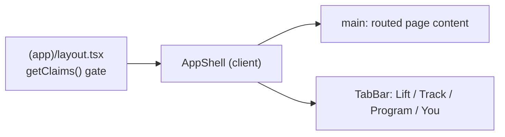
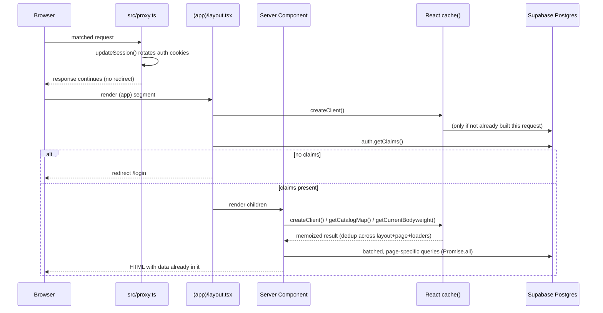
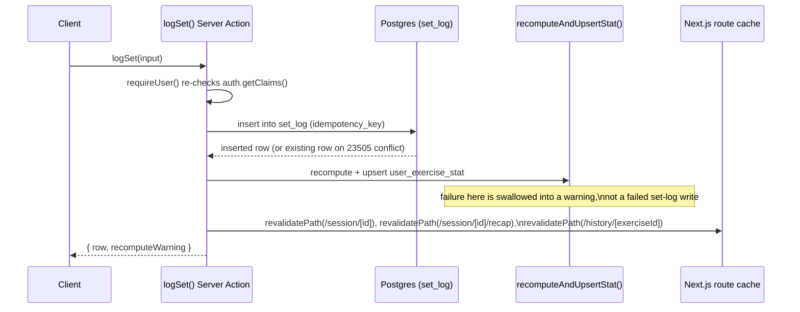

## What this system is

lifting-app is a personal, single-owner progressive-overload lifting tracker built on
Next.js App Router with Supabase (Postgres + Auth + row-level security). It assumes
one signed-in owner and an active network connection during workouts; there is no
offline database or sync engine. That scale model — years of one person's sets stay
cheap to scan, a tap in the gym stays fast, and the security story is one rule
(`auth.uid()` owns the row) — motivates most of the choices below
(`repo://docs/architecture.html#L393-L399`).

The codebase separates cleanly into three layers:

- **Strength engine** (`src/lib/strength/`) — framework-free, unit-tested TypeScript with
  no Next.js or Supabase imports. It normalizes a logged set into an estimated 1RM,
  models per-pattern strength, derives session targets, and detects plateaus. See
  [Strength engine](../concepts/strength-engine.md) for the algorithms.
- **Server loaders and Server Actions** (`src/lib/*.ts`, `src/app/(app)/**/actions.ts`) —
  the only code that talks to Postgres. Loaders assemble screen data from the ledger;
  actions perform authenticated writes and trigger cache rebuilds and revalidation.
- **UI** (`src/app/(app)/**`, App Router) — Server Components render hydrated data;
  a small set of Client Components own interaction (the active session, charts, the tab
  shell) and call Server Actions for writes.

`src/lib/strength/` is imported from both runtimes: interactive targets run client-side
in the active workout (`useMemo` around `sessionTarget()`), while writes, stat rebuilds,
and Coach's weekly report run the exact same functions server-side. Keeping the engine
framework-free is what prevents the formula from drifting between "what the phone shows"
and "what gets written" (`repo://docs/architecture.html#L696-L745`).

## The signed-in shell and the four tabs

Every authenticated screen lives under the `src/app/(app)` route group (parentheses mean
the segment name is not part of the URL). `(app)/layout.tsx` is the sole app-wide gate:
it creates the request's Supabase client, calls `supabase.auth.getClaims()`, and redirects
to `/login` when there are no claims. Server Actions repeat this check independently
(`requireUser()` pattern) because a layout guard alone does not protect a Server Action
invoked directly (`repo://src/app/(app)/layout.tsx`).

`AppShell` (`repo://src/app/(app)/app-shell.tsx`) is a Client Component that reads the
current pathname and search params to decide whether to render the bottom tab bar at all.
`hideAppChrome()` (`repo://src/lib/app-chrome.ts`) hides it on immersive, single-purpose
flows that already own a sticky primary action: the active workout (`/session/[id]`),
the next-workout planner (`/workout/next`), and the program builder
(`/program/new`, `?mode=edit`). The four tabs and their `match()` predicates are:

| Tab | Path | Role |
| --- | --- | --- |
| Lift | `/` | Home: active program status, resume/start the next workout, last-session recap |
| Track | `/analytics` (and `/analytics/*`, `/history/*`) | Scoreboard + Explore: PRs, month review, Coach, Body, Volume, Exercise review |
| Program | `/program` (and `/program/*`) | Gallery, read-only detail, builder |
| You | `/settings` (and `/settings/*`) | Profile, bodyweight, rest defaults, period tracking, sign-out |

`isTrackPath()` keeps the Track tab visually active while browsing
`/history/[exerciseId]`, so per-exercise review reads as a Track destination rather than
a fifth, unlabeled tab (`repo://src/lib/app-chrome.ts#L3-L6`,
`repo://docs/architecture.html#L467-L470`).

## Request path for a typical page load

Auth responsibilities are deliberately split across three layers so that no single layer
does two jobs at once (a common Next.js footgun is letting middleware both refresh
sessions and gate routes):

1. **`src/proxy.ts`** (the Next.js 16 successor to `middleware.ts`) runs on every matched
   request except static assets, `_next/`, and HMR, and calls `updateSession()` from
   `src/lib/supabase/middleware.ts` to rotate Supabase auth cookies. It does **not** redirect
   unauthenticated users — that responsibility belongs entirely to the app layout
   (`repo://src/proxy.ts`).
2. **`(app)/layout.tsx`** creates a Supabase client for the request and calls
   `auth.getClaims()`. Missing claims redirect to `/login`; this is the real access-control
   gate (`repo://src/app/(app)/layout.tsx`).
3. **The Server Component page** (e.g. `repo://src/app/(app)/page.tsx` for Lift/Home) fetches
   with the same cookie-scoped, RLS-respecting public client, resolves the active program,
   next workout, and recent history, and renders HTML with the data already embedded — no
   client-side fetch waterfall for the initial paint.
4. **A Server Action** (e.g. `logSet`, `saveProgram`, pin/unpin) handles user intent. It
   re-derives the authenticated user, performs the write against the ledger, optionally
   rebuilds a derived cache, and calls `revalidatePath()` for every route whose rendered
   data the write could affect.

### `React.cache()` collapses duplicate work within one request

Three loaders are wrapped in React's `cache()` so that layout, page, and nested Server
Action calls that all need the same data hit Postgres once per request instead of once
per call site:

- `createClient()` (`repo://src/lib/supabase/server.ts#L9-L29`) — the Supabase client itself.
- `getCatalogMap()` (`repo://src/lib/catalog.ts#L59-L60`) — the merged exercise catalog
  (seeded templates plus the owner's station variants and custom exercises).
- `getCurrentBodyweight()` (`repo://src/lib/current-bodyweight.ts#L6-L24`) — the newest
  dated bodyweight observation, falling back to the profile baseline.

`cache()` memoizes by argument identity, not just by function. Because `createClient()`
itself is memoized to one instance per request, passing that same client into
`getCatalogMap(supabase, userId)` or `getCurrentBodyweight(supabase, userId)` from
different call sites (layout, page, a Server Action) still hits the same cache entry — if
each caller built its own client, the catalog and bodyweight loaders would silently stop
deduping. `repo://src/lib/request-cache.test.ts` verifies this with a fake Supabase client
and a scoped `cache()` dispatcher: three independent calls to `getCatalogMap` and to
`getCurrentBodyweight` in one simulated request issue exactly one query per underlying
table (`repo://src/lib/request-cache.test.ts#L72-L99`). This is why the client instance
must stay shared: `cache()` is what turns "every screen names an exercise" into one
catalog fetch per request rather than N.

The Coach weekly API (`GET /api/coach/v1/weekly`) is the one exception to this whole
model: it has no browser session (it runs from a scheduler), so it uses a separate,
server-held secret client that bypasses RLS. Every one of its queries carries an explicit
`COACH_API_USER_ID` predicate to compensate, and the route is capability-token gated,
read-only, and `no-store`/noindex (`repo://docs/ARCHITECTURE.md#L119-L123`,
`repo://docs/architecture.html#L523-L531`).

## Mutation path: Server Action → ledger write → derived-cache rebuild → revalidate

Writes funnel through Server Actions colocated with their feature
(`src/app/(app)/session/actions.ts`, `src/app/(app)/program/actions.ts`, etc.). The
canonical example is logging a set:

`logSet()` (`repo://src/app/(app)/session/actions.ts#L170-L260`) re-authenticates with
`requireUser()`, validates the input against the resolved catalog definition, inserts into
`set_log` with an `idempotency_key` (a unique-constraint conflict returns the existing row
instead of erroring, making retried taps safe), computes the set's `e1rm` at write time,
then calls `recomputeAndUpsertStat()` to rebuild `user_exercise_stat` for that exercise. If
the stat rebuild throws, the function still returns success for the set write and surfaces
a `recomputeWarning` instead — the ledger write must not be held hostage to the cache
rebuild. Finally it calls `revalidatePath()` for the session route, its recap route, and
the per-exercise history route so that the next render reflects the new set. Other actions
in the same file follow the same shape and revalidate `/`, `/analytics`,
`/analytics/month`, `/analytics/volume`, `/analytics/coach`, and `/program` as appropriate
to what they changed (`repo://src/app/(app)/session/actions.ts#L37-L40`,
`repo://src/app/(app)/session/actions.ts#L299-L340`).

## Why the design is shaped this way

**Authoritative writes, derived reads.** `set_log` is the single ledger — every working
set with weight, reps, RIR, the e1RM computed at write time, exact `exercise_id`, and
optional equipment instance. Everything else reachable from Track, Coach, month review,
and PR pills is a pure function over that ledger, computed in TypeScript at read time; the
app deliberately keeps no parallel analytics schema or materialized views
(`repo://docs/architecture.html#L587-L611`, `repo://docs/architecture.html#L792-L804`).
Full-history reads stay cheap at personal (single-owner) scale, so a screen that needs a
window (21 Chicago days, last 8 session-bests, a seven-day Coach report) applies that
window in the loader or a pure helper rather than introducing a new cached table.

**`user_exercise_stat` is a rebuildable cache, not a source of truth.** It stores each
exercise's current e1RM and personal coefficient so that session targets and Coach
proposals don't have to replay full history on every read. It is rebuilt from `set_log`
on every relevant log/edit/delete via `recompute.ts`'s `recomputeStat()`
(`repo://src/lib/strength/recompute.ts`), never edited directly, and is explicitly not
used as the baseline for PR/record eligibility — records replay directly from saved
`set_log` rows through `strength/records.ts` so a stale or in-flight cache can never
misreport a personal record (`repo://docs/ARCHITECTURE.md#L50-L52`,
`repo://docs/architecture.html#L560-L571`).

**Batched, `Promise.all`-shaped queries.** Server Components load screens by issuing
their independent queries concurrently rather than sequentially — see Home
(`repo://src/app/(app)/page.tsx#L39-L64`), which resolves the next workout, the last
finished session, and week-record chips together, then a second `Promise.all` for the
last-session summary, week records, and the full unfinished-warmup-excluded `set_log`
scan. Program summaries batch program/day/slot queries the same way rather than issuing
one query per program. Batching plus the `cache()` memoization above is how a page with
several loaders avoids stampeding Postgres with N sequential round trips.

**Compute next to the interaction; aggregate on the server.** The active workout is
chatty — every swap, rep edit, or RIR change should recompute the suggested target with no
network round trip, so `sessionTarget()` runs client-side in a `useMemo` against
server-hydrated stats and history. Track, Coach, and month review are reads over full
history, so their aggregation runs server-side and ships already-shaped data to the
client; charts remain client components only because Recharts needs the DOM
(`repo://docs/architecture.html#L534-L553`, `repo://docs/architecture.html#L780-L791`).

**Optimistic where the body is waiting, honest when a write fails.** The rest timer starts
the instant a set is logged locally, independent of network latency, and lives in
`session/[id]/layout.tsx` so a `set_log` revalidation cannot reset it. The set itself must
still persist to Postgres; a failed write surfaces as a visible card error rather than a
silent revert, and PR pills only ever reflect persisted rows so gold never lies about a
record that didn't actually save (`repo://docs/architecture.html#L554-L571`,
`repo://docs/architecture.html#L841-L852`).

**RLS is the wall; the Coach API is the one guarded door.** Every user-owned table is
scoped by row-level security to `auth.uid()`. The only application code path that reads
with elevated privilege is the weekly Coach API described above, and it still enforces a
single explicit user predicate on every query rather than trusting the bypassed RLS
(`repo://docs/architecture.html#L829-L840`).

## Related pages

- [Data model](data-model.md) — the `set_log` ledger, program tree, and derived tables in
  detail.
- [Strength engine](../concepts/strength-engine.md) — e1RM, pattern-strength recommendation,
  progression, and plateau/Fluid adaptation algorithms.
- [Supabase integration](../integrations/supabase.md) — client construction, RLS, auth
  cookie flow, and the elevated Coach API client.
