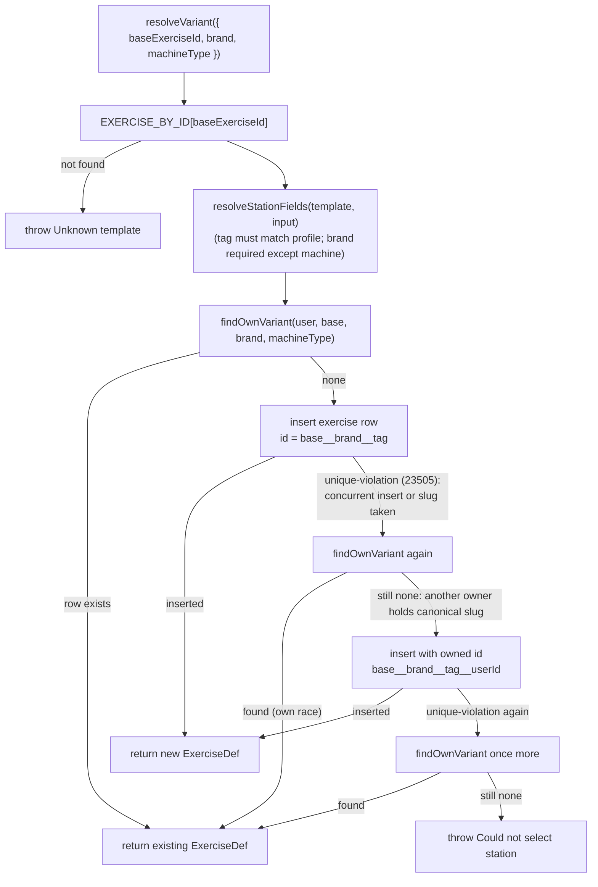
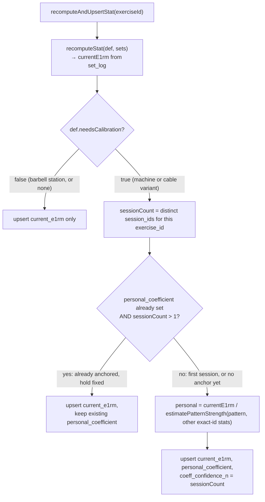

## Responsibility

The exercise catalog is the merged, in-memory `Record<string, ExerciseDef>` that every
strength-engine computation (targets, progression, records, coach recommendations) reads
from. It is assembled from two sources that never overlap in intent:

- **Seeded templates** — `SEEDS`/`EXERCISES` in `src/lib/strength/coefficients.ts`: 48 rows
  encoding movement pattern, population-prior coefficient, logging convention (`equipment`),
  and `stationProfile`.
- **Owner DB rows** — the `exercise` table, which holds brand/type *station variants*
  derived from a template, plus fully custom exercises with no template at all.

`src/lib/catalog.ts` merges these into the catalog the rest of the app consumes.
`src/lib/exercise-id.ts` owns the variant id/name/slug format. `src/lib/station.ts` and
`resolveStationFields`/`needsStation` in `coefficients.ts` own station composition rules.
`resolveVariant` and `createCustomExercise` in `src/app/(app)/exercise/actions.ts` are the
only write paths that create `exercise` rows.

## Catalog merge

```ts
// src/lib/catalog.ts
export function mergeCatalog(rows: DbExerciseRow[]): Record<string, ExerciseDef> {
  const map: Record<string, ExerciseDef> = {};
  for (const def of EXERCISES) map[def.id] = def;      // seeded, always present
  for (const row of rows) {
    if (map[row.id]) continue;                          // seeded wins any collision
    map[row.id] = dbExerciseToDef(row);
  }
  return map;
}
```

- **Seeded ids always win.** A leftover flat `set_log` row that still points at a template
  id (e.g. `lat-pulldown`) is never shadowed by a same-id DB row; in practice DB variant ids
  are always distinct (`base__brand__tag`), so this rule mainly guarantees the template
  definition itself can never be corrupted by a DB row.
- `getCatalogMap(supabase, userId)` is wrapped in React `cache()` so a request loads the
  owner's `exercise` rows once and shares the merged map across layout/page/action calls in
  that request; `getCatalogList` is the same data as an array.
- `dbExerciseToDef` maps a DB row to `ExerciseDef` but never sets `stationProfile`; a
  resolved variant is always immediately loggable (see below) — it can only be re-derived
  as needing a station if something reads `baseExerciseId` back into the template.
- Errors loading the catalog surface as a thrown error rather than an empty catalog
  (`docs/ARCHITECTURE.md` — "profile/catalog read errors must surface instead of rendering
  invented empty state").

## Identity: template, variant, custom

Three shapes of `exercise_id` exist, and progression/records/calibration always operate on
the **exact** id, never a movement pattern or "family":

| Shape | Example | Storage | Loggable directly? |
| --- | --- | --- | --- |
| Seeded template (`stationProfile: "none"`) | `bb-row`, `db-bench`, `weighted-dip` | `coefficients.ts` only | yes |
| Seeded template needing a station (`stationProfile !== "none"`) | `lat-pulldown`, `bb-incline-bench`, `machine-chest-press` | `coefficients.ts` only | no — must resolve first |
| Station variant | `lat-pulldown__nautilus__selectorized` | `exercise` row, `base_exercise_id` set | yes |
| Custom exercise | `custom-my-lift-a1b2c` | `exercise` row, `base_exercise_id` null | yes |

`exercise_id` is a text slug and intentionally **not** a foreign key: it can reference either
a seeded template (no DB row exists) or a DB `exercise` row, and `set_log` never needs to
know which.

### Variant id format (`src/lib/exercise-id.ts`)

```
variantId  = `${baseId}__${slug(brand ?? "")}__${machineType}`
ownedId    = `${variantId}__${userId}`   // fallback when the canonical slug is taken
```

- `TYPE_TAG` maps the stored `machine_type`/`StationTag` value to the display tag used in
  `variantName`: `selectorized → stack`, `plate_loaded → plate`, plus `bench`, `rack`,
  `platform` for barbell stations (identity, not a distinct fourth id segment).
- `variantName` is `${baseName} — ${brand} (${tag})` when branded, `${baseName} (${tag})`
  otherwise.
- **Canonical ids are global but not reserved per user.** `exercise.id` is a primary key
  shared across all owners, while uniqueness of *content* is enforced by the per-user index
  `exercise_variant_unique` on `(user_id, base_exercise_id, coalesce(brand,''),
  coalesce(machine_type,''))` (migration `0008_machine_variants.sql`). If another owner
  already holds the canonical slug `lat-pulldown__nautilus__selectorized`, a second owner's
  otherwise-identical variant is stored under the owned id
  `lat-pulldown__nautilus__selectorized__<userId>` instead of failing to insert.
- `slugifyCustom(name)` generates `custom-<slug>-<5-char-random>` ids for fully custom
  exercises, avoiding collisions without a lookup.

## Station composition

A station is the model that lets one atomic seeded movement (e.g. "Lat Pulldown (Cable)")
represent many physically distinct pieces of equipment (a Nautilus stack vs. a Hoist stack)
that do not share load identity, while movements with no meaningful equipment variation
(dumbbells, most barbell accessories, bodyweight) stay flat template ids.

```ts
// src/lib/strength/coefficients.ts
export type StationProfile = "machine" | "cable" | "bench" | "rack" | "platform" | "none";
export type MachineType = "selectorized" | "plate_loaded";
export type StationTag = MachineType | "bench" | "rack" | "platform";

export function needsStation(def: Pick<ExerciseDef, "stationProfile">): boolean {
  return (def.stationProfile ?? "none") !== "none";
}
```

Every seeded template carries a `stationProfile`. `needsStation(def)` (`stationProfile !==
"none"`) means the template has no absolute load identity and cannot be logged, pinned as
loggable, or earn records until it is instantiated into a DB `exercise` row.

`STATION_TAGS_BY_PROFILE` fixes which `StationTag` values a profile accepts and whether a
brand-only or brand+type picker form applies:

| `stationProfile` | Allowed `StationTag`(s) | Picker form | Brand required? | Seeded count |
| --- | --- | --- | --- | --- |
| `machine` | `selectorized`, `plate_loaded` | brand + type | no (machine "no brand" path stays) | 16 |
| `cable` | `selectorized` (locked) | brand only | yes | 8 |
| `bench` | `bench` (locked) | brand only | yes | 3 (`bb-bench`, `bb-incline-bench`, `bb-hip-thrust`) |
| `rack` | `rack` (locked) | brand only | yes | 3 (`bb-back-squat`, `bb-front-squat`, `bb-ohp`) |
| `platform` | `platform` (locked) | brand only | yes | 2 (`bb-deadlift`, `bb-rdl`) |
| `none` | — | none (log the template) | — | 16 (9 dumbbell, 3 bodyweight, 4 barbell accessories) |

`resolveStationFields(base, input)` (in `coefficients.ts`) is the shared validator behind
both `resolveVariant` and `createCustomExercise`: it rejects a `machineType` not in the
template's allowed set (e.g. a cable request for `plate_loaded`, or a `bb-bench` request for
`rack`), and requires a non-empty brand for every profile except `machine`. `bench`/`rack`/
`platform` values are stored as sentinels in the same `exercise.machine_type` column used for
`selectorized`/`plate_loaded` — there is no separate `station_kind` column; the id's third
segment, the unique index, and `TYPE_TAG` already encode the station tag, so adding a parallel
column would only duplicate identity for no extra query. Dumbbells are an explicit product
exception and never carry a station, including dumbbell incline bench, even though the
barbell incline press requires a bench brand.

`src/lib/station.ts` builds UI-facing decisions on top of these primitives:

- `isLoggableExercise(def)` — `!needsStation(def)`; used to gate pins and Fluid swap
  candidates to identities that can actually take a set.
- `stationPickerForm(def)` — returns `{ kind: "none" }`, `{ kind: "brand-and-type", copy }`
  for machines, or `{ kind: "brand-only", copy, machineType }` for cable/bench/rack/platform,
  where `machineType` is pre-locked to the profile's single allowed tag.
- `chooseStationCopy(profile)` — profile-specific button copy: **Choose machine** / **Choose
  cable** / **Choose bench** / **Choose rack** / **Choose platform** (never a generic "Choose
  station").
- `shouldResolveStation(def, resolveStations)` — session/planner pickers pass
  `resolveStations: true` so every `needsStation` template opens a station form before
  logging; the program builder passes `false` so it can keep storing the generic template id
  in a slot (stations resolve lazily the first time that slot is logged or swapped in a
  session, not at build time).
- `stationResolveInput(template, input)` — locks `machineType` to the profile's tag for
  cable/bench/rack/platform and otherwise passes through the machine picker's own choice.

## `resolveVariant`: find-or-create semantics



`resolveVariant` (`src/app/(app)/exercise/actions.ts`) is the sole write path that
instantiates a station template into a trackable `exercise` row (no parallel find-or-create
path exists). Key mechanics:

- **Dedup key is the per-user unique index**, not the global id: `findOwnVariant` looks up by
  `(user_id, base_exercise_id, brand, machine_type)`, treating `brand === null` with `.is()`
  rather than `.eq()` so unbranded machine variants dedupe correctly.
- **Field inheritance from the template**: `pattern`, `coefficient`, `increment`, and
  `equipment` all copy from the seeded base; `needs_calibration` copies `!!base.needsCalibration`
  (true for machine/cable templates, false for barbell station templates); `is_reference` is
  always `false` on the row — the template itself stays the pattern reference for Board
  short-names and Bayesian priors even after variants exist.
- **Tag/profile mismatch is rejected** before any DB call, via `resolveStationFields`.
- **Race and slug-collision handling**: on a `23505` (unique violation) from either the
  variant-uniqueness index (a concurrent request from the same user) or the primary key (a
  different owner already holds the canonical slug), `resolveVariant` re-selects the
  caller's own row; if none exists it retries the insert under the owned id
  (`ownedVariantId`) rather than surfacing an error to the user.
- Non-`23505` errors are re-thrown as-is.

`createCustomExercise` is the sibling write path for exercises the owner defines from
scratch (`base_exercise_id: null`). It derives a `StationProfile` purely from the chosen
`equipment` (`customStationProfile`: `machine → "machine"`, `cable → "cable"`, everything
else → `"none"`), reuses `resolveStationFields` to validate brand/type when the profile is
`machine` or `cable` (cable is always locked to `selectorized`), sets
`needs_calibration: profile === "machine" || profile === "cable"`, and a flat `coefficient:
1.0` (population priors do not apply to invented exercises). Custom barbell/dumbbell/
bodyweight exercises get no station fields at all — no bench/rack/platform picker for custom
entries.

## Family browsing vs. exact identity

`exerciseFamilyIds(exerciseId, catalog)` (`src/lib/exercise-history.ts`) walks
`baseExerciseId` to group a template with every variant derived from it (machine, cable, and
barbell-station variants alike). This is used **only** for in-session quick-history browsing
and for computing "family-latest" numbers/hrefs on Track's default-compound tiles; it is
never used for progression, records, or calibration, which all key on the exact
`exercise_id` (paired with `equipment_instance_id` for records). Two different brands under
the same template (`lat-pulldown__nautilus__selectorized` vs.
`lat-pulldown__hoist__selectorized`) are different exact ids and never share a PR chain, a
progression window, or a calibrated coefficient — that is the entire point of the station
model.

### History policy: no rewrite

Existing `set_log` rows that predate this station model still point at flat template ids
(e.g. a `lat-pulldown` row logged before any brand existed). These rows are **never
rewritten** onto a synthetic variant — there is no reliable brand to backfill. Consequences:

- Old PRs and progression stay on the template id forever; new PRs and progression after the
  owner resolves a station live on the variant id and do not "continue" the old chain (the
  first variant session is a first exposure: quiet for records, and calibrates if the profile
  requires it).
- `eligibleRecordSet` (`src/lib/strength/records.ts`) excludes only bare `stationProfile ===
  "machine"` templates from earning records, because those were never directly loggable and
  so can hold no legitimate historical rows. Leftover flat `lat-pulldown` or
  `bb-incline-bench` rows remain record-eligible on their template id, since they were valid,
  directly-loggable identities before this feature shipped.
- `mergeCatalog` guarantees a DB row can never be substituted for a seeded template id
  (seeded wins collisions), so a leftover flat row's definition is always the original
  template, not an accidentally-matching variant.

## Calibration: why machines/cables calibrate and barbell stations do not

`docs/ARCHITECTURE.md`: "Machines and cable brand variants require calibration because
stack/leverage units do not transfer from free weights." A newly resolved machine or cable
variant carries `needs_calibration: true` (inherited from the template); a newly resolved
bench/rack/platform variant carries `needs_calibration: false` because barbell load is
ordinary, comparable lb regardless of brand.

`recomputeAndUpsertStat` in `src/app/(app)/session/actions.ts` implements the calibration
branch, run after every set write that could change `user_exercise_stat`:



- **Anchoring, not continuous re-fitting.** On the first working session for a calibrating
  exercise id (`sessionCount <= 1`, or no `personal_coefficient` yet), the personal
  coefficient is derived once as `observed e1RM ÷ pattern strength estimated from the
  owner's other exact-id stats` (`estimatePatternStrength` in `recommend.ts`). Once anchored
  with more than one session recorded, the coefficient **holds fixed**; later progress moves
  the tracked `current_e1rm` (demonstrated strength), not the coefficient itself.
- `coeff_confidence_n` records how many distinct sessions have contributed to that exact
  exercise id, exposed to the recommender as calibration confidence.
- If all sets for an exercise are deleted (`currentE1rm == null`), `personal_coefficient` is
  cleared so the next first set recalibrates from scratch rather than reusing a stale anchor.
- **Barbell station variants skip this branch entirely** — `def.needsCalibration` is falsy,
  so `startingWeight()` for a brand-new bench/rack/platform variant with no history falls
  through to `pattern_strength × template coefficient` (the ordinary no-prior recommendation
  path), then double-progression proceeds on that variant's own first sets exactly like any
  other barbell movement. No calibration set, no `coeff_confidence_n` tracking.
- **Leftover flat template `set_log` rows are not rewritten and do not feed a new variant's
  calibration** — a new cable variant still calibrates from zero, because it is a distinct
  `exercise_id` with no prior stat row, even if the owner has years of history on the
  original flat template id.
- Pattern-strength replay in monthly/analytics surfaces intentionally does not replay
  historical personal machine coefficients — it reconstructs pattern strength from
  current data, not from time-varying calibration snapshots.

## Invariants and failure modes

- `exercise_id` is never validated as a foreign key at the database layer; catalog lookups
  (`catalog[exerciseId]`) are the enforcement point, and a missing entry must surface as an
  explicit error ("Exercise not found...", "Choose a loggable exercise.") rather than
  silently falling back.
- Session, planner, swap, and "extra pin" write paths all reject unresolved
  `needsStation` templates before persisting — `logSet`, swap RPCs, and `toggleExercisePin`
  each check `needsStation(def)` (with default-compound tiles as the one deliberate
  exception: those keep template ids as pinnable keys even though their profile requires a
  station, because Track's default tiles resolve to family-latest data instead of the
  template id directly).
- A tag/profile mismatch (e.g. asking `resolveVariant` for `rack` on a `cable` template)
  fails fast in `resolveStationFields`, before any database write.
- `resolveVariant` and `createCustomExercise` both require an authenticated user
  (`requireUser()` redirects to `/login` otherwise) and operate only on that user's own
  `exercise` rows.
- Two stations of the same movement, brand, and tag still collapse to one variant — this is
  an accepted limit, matching the pre-existing machine-variant behavior; `equipment_instance`
  (a dormant per-pad tracker) does not participate in station identity.

## Extension points

- Adding a new seeded template requires only a `coefficients.ts` entry with the right
  `stationProfile`; no migration is needed since `exercise` schema already supports every
  station tag via `machine_type`.
- A new `StationProfile` value would require updates to `STATION_TAGS_BY_PROFILE`,
  `TYPE_TAG`, `CHOOSE_STATION_COPY`, and `stationBrandRequired`, but no schema change, since
  `machine_type` is a free-form text sentinel rather than a constrained enum at the DB level.
- Custom exercises currently support only `machine` and `cable` station profiles; extending
  custom creation to barbell stations (bench/rack/platform) would mean adding a
  `customStationProfile` branch and a corresponding picker, deliberately out of scope today.
