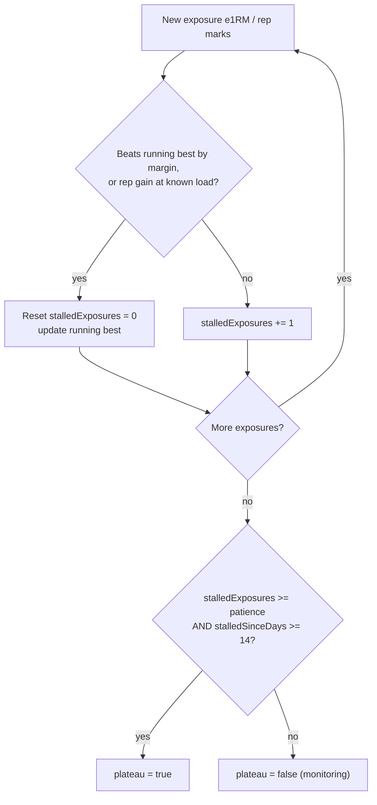
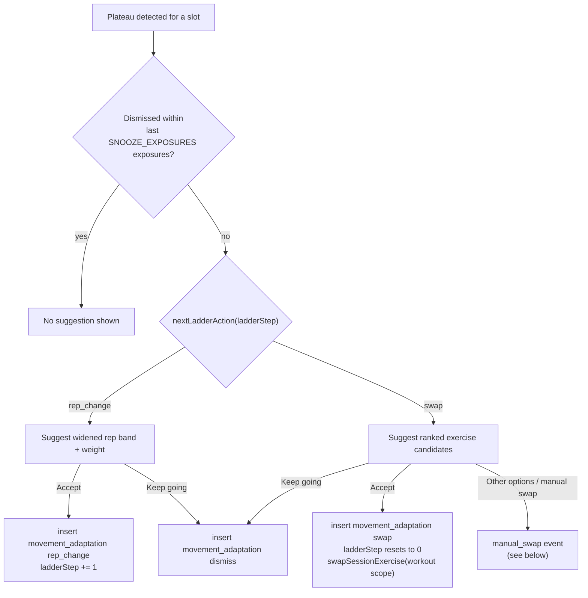

## Overview

"Fluid" is one of the two program styles (`program.style = 'classic' | 'fluid'`). A Fluid
program watches each slot's estimated one-rep max (e1RM) trend and, once it decides a
movement has genuinely stalled, proposes an intervention: first widen the rep range, then
if that doesn't help, swap to a ranked alternative exercise. Suggestions are
recommend-and-confirm — they appear at the top of the exercise card before any set is
logged, and nothing changes until the lifter accepts, dismisses ("Keep going"), or a manual
swap overrides the state. The underlying stall-evidence computation is not Fluid-only: the
same `stall-report.ts` contract also powers weekly Coach's plateau review and monthly
progress's "worth reviewing" cards.

Core files:

- `src/lib/strength/plateau.ts` — pure plateau/hysteresis math, the rep-band ladder, swap
  candidate ranking, and `foldPrescription` (replays the adaptation log into a current
  prescription).
- `src/lib/stall-report.ts` — builds one contiguous per-slot evidence series
  (`buildStallAssessments`) shared by Fluid, Coach, and monthly review.
- `src/lib/stall-data.ts` — paginated Supabase loader that assembles a `StallHistory` (slots,
  phases, sets, adaptations) for `buildStallAssessments`.
- `src/lib/fluid.ts` — server-side composition specific to Fluid: turns slot definitions +
  stall assessments + adaptation log into `PendingSuggestion`s for the active session.
- `src/app/(app)/session/[id]/page.tsx` and `active-session.tsx` — load pending suggestions
  for Fluid sessions and render the accept/dismiss/swap UI.
- `src/app/(app)/session/actions.ts` — `acceptAdaptation`, `dismissAdaptation`,
  `swapSessionExercise` server actions that append to `movement_adaptation`.

## Plateau detection with hysteresis

`detectPlateau(exposures, patience, margin?)` in `plateau.ts` walks a chronological list of
per-session exposures (`{ sessionAt, bestE1rm, repBests? }`) within one contiguous phase (see
below) and tracks a running-best e1RM. An exposure only resets the "stalled" counter if:

- its `bestE1rm` exceeds the running best by more than `margin(runningBest)` — default
  `max(1% of best, 1 lb)`, so small measurement noise doesn't look like progress; or
- it contains a rep gain at a previously observed **canonical effective load** (same
  normalized weight as an earlier exposure but more reps), even if the stored e1RM is flat.

A plateau is only reported once **both** hysteresis conditions hold:

- `stalledExposures >= patience` (exposures since the last new best), **and**
- `stalledSinceDays >= MIN_PLATEAU_DAYS` (14), measured as elapsed *training* days between the
  last new-best exposure and the most recent one — not wall-clock "now". A lifter training
  four days in a row cannot trip a plateau in three days just because the calendar keeps
  moving; the span comes from the exposures themselves.

`patience` defaults by movement type via `defaultPatience(def)`: `PATIENCE_BARBELL = 4` for
barbell equipment (heavy compounds progress slowly and noisily), `PATIENCE_DEFAULT = 3`
otherwise. A slot's explicit `program_slot.plateau_patience` override (when `>= 1`) always
wins over the movement-type default, and every consumer (Fluid, Coach, monthly review) honors
the same override consistently because they all call into the same `stall-report.ts` code
path.

*Hysteresis loop inside `detectPlateau`: a plateau only fires once both the exposure-count and elapsed-day thresholds are met.*

## The shared stall contract: `stall-report.ts`

`buildStallAssessments(history, catalog, asOf)` is the single place that turns raw
session/set/slot/phase/adaptation rows into one `StallAssessment` per program slot, called
identically from Fluid (`fluid.ts` via `stall-data.ts`), weekly Coach
(`coach-recommendations.ts`), and monthly review (`monthly-progress.ts`). Keeping this in one
module means all three surfaces agree on what counts as a stall, which matters because they
used to disagree (see "Reconciled differences" below).

Key rules encoded in `buildStallAssessments`:

- **Contiguous series.** Only finished, owner-scoped workouts count, grouped by session and
  ordered by `performed_at`; several workouts on one date do not collapse into one exposure.
  Warmup sets never contribute.
- **Identity resets evidence.** The series is scoped to an exact exercise + equipment-instance
  identity (`recordScope`). A swap away and back, a mixed-identity workout, a phase/rep-range/
  RIR/set-count change, or a recorded adaptation starts a fresh evidence window — the code
  clears `points` whenever the derived context (`recordScope`, phase id, folded prescription,
  rep range, RIR, set count) changes between exposures.
- **Deloads are boundaries, not weak sessions.** `isDeload` treats a phase with
  `set_multiplier < 1` or a name/description containing "deload" as a break: the deload session
  itself is internally state `deload`, and the first subsequent normal workout starts a new
  baseline rather than counting the deload as a stalled or poor exposure.
- **Invalid or unknown data fails conservatively.** Missing/non-finite e1RM, mixed-identity
  sets within a session, a mid-session prescription change, or an unknown week index in a
  phased program all clear the running series instead of guessing.
- **Adaptations are replayed by timestamp**, using `id` as a deterministic tie-break, and only
  adaptations at or before each exposure's timestamp apply to it — late entry of an old workout
  never borrows a later adaptation's context. An adaptation accepted after the very last logged
  workout immediately clears that slot's former plateau (the lifter already acted on it).
- **Patience** follows the slot override or `defaultPatience`, as above.
- **States**: `deload` (latest exposure is a deload session), `plateau` (hysteresis satisfied),
  `insufficient_data` (fewer than `patience + 1` exposures), or `monitoring` (progressing or
  not yet stalled long enough). Only `plateau` should surface as a review card; `monitoring`
  and `insufficient_data` are internal.
- Monthly best e1RM and plateau status are deliberately independent signals: a single lower
  monthly best never triggers a plateau, and this report never applies a recommendation or
  program change by itself — it only supplies evidence.

`stall-data.ts`'s `loadStallHistory` assembles the `StallHistory` input: it reuses monthly
history's saved sessions/sets, then paginates `program_slot`, `program_day`, `program_phase`,
and `movement_adaptation` (capped pages, `id`-ordered keyset pagination) so a missing page can
never silently join two unrelated phases together. `loadStallAssessments` is the convenience
wrapper that calls `loadStallHistory` then `buildStallAssessments`.

### Reconciled differences

Before this shared contract existed, Coach filtered history down to the *current* exercise
only (potentially joining history across an away-and-back swap), and Fluid grouped exposures
by set-creation date and included unfinished work. Both now consume the same complete,
phase-aware, contiguous session series and the same rep-progress rule, so a plateau (or the
lack of one) means the same thing everywhere it appears.

## The intervention ladder

Once a slot is plateaued, Fluid escalates through a two-rung ladder tracked by
`ladderStep` (folded from the adaptation log, see below):

1. **Rung 0 — widen the rep range.** `nextLadderAction(0)` returns `"rep_change"`.
   `pickRepBand(current, recentBands)` chooses the most novel of three standard bands —
   heavy (5–8), moderate (8–12), light (12–15) — by picking the band furthest by index from
   the current one (ties broken toward the heavier band), skipping any band already used since
   the last swap (`recentBands`) unless that would leave nothing to choose. `bandOf` maps an
   arbitrary current range onto the nearest standard band by midpoint before ranking.
2. **Rung 1+ — swap exercises.** Once `RUNGS_BEFORE_SWAP` (1) rep-range rungs have been used
   without resolving the plateau, `nextLadderAction` returns `"swap"`. `fluid.ts` builds a
   candidate pool of same-pattern, non-station-required exercises (excluding the current one)
   and ranks them with `rankSwapCandidates`: movements not recently plateaued/swapped-away-from
   beat ones that were (avoiding ping-pong back onto a movement that just failed), and among
   equally fresh candidates the staler one (trained longer ago, or never) ranks first. The top
   `MAX_SWAP_CANDIDATES` (3) candidates are surfaced, each with a computed starting weight via
   `startingWeight`.

A swap always resets the ladder to rung 0 on the new exercise and restores the slot's home
(program-defined) rep range — a swap is a fresh start, not a continuation of the widened
range. `pickRepBand`/rung tracking otherwise only advances on accepted `rep_change` rows.

## Snoozing and recommend-and-confirm

Every suggestion is confirm-first: `loadPendingSuggestions` (in `fluid.ts`) only returns a
suggestion for slots whose stall assessment state is `"plateau"`, and the session UI
(`active-session.tsx`) only shows it before any set has been logged this session
(`slot.sets.length === 0`) and while not locally dismissed. Two independent controls prevent
nagging:

- **Explicit dismiss ("Keep going").** `dismissAdaptation` appends a `dismiss` row to
  `movement_adaptation`. `loadPendingSuggestions` counts exposures strictly after the most
  recent dismissal (`folded.lastDismissAt`) and stays quiet until at least `SNOOZE_EXPOSURES`
  (2) new exposures have occurred, even though the underlying plateau assessment itself is
  unaffected — dismissal only mutes the surfaced suggestion, it does not reset detection.
- **Accept.** `acceptAdaptation` appends a `rep_change` or `swap` row with the resulting
  ladder step (`ladderStep + 1` for a rep change, `0` after a swap, since a swap always
  restarts the ladder). A `swap` acceptance also calls `swapSessionExercise` with
  `scope: "workout"` so the current session immediately reflects the new exercise.

*Recommend-and-confirm flow from a detected plateau to the logged adaptation event.*

## `foldPrescription`: replaying the intent log into a current prescription

`movement_adaptation` (see also the data-model page) is an append-only **intent log** keyed to
`program_slot_id`; it never rewrites `set_log` and is never replayed to reconstruct historical
performance. `foldPrescription(base, rows)` in `plateau.ts` is the single function that folds
that log, chronologically, into the slot's *current* prescription:

- `rep_change` rows update `repMin`/`repMax`, increment `ladderStep`, set `phaseStartAt` to the
  row's timestamp, and append the new band to `recentBands`.
- `swap` rows (coach-generated / plateau-driven) set a new `exerciseId`, restore the slot's
  home rep range, reset `ladderStep` to 0, clear `recentBands`, and set `phaseStartAt`.
- `manual_swap` rows — a user-initiated substitution saved with "Remainder of program" scope —
  set a new `exerciseId` but **preserve the current effective rep range** (unlike a
  coach-generated swap, which resets to the home band), and also reset `ladderStep` to 0,
  clear `recentBands`, and clear any pending dismissal. This is the key distinction between the
  two swap kinds: a manual swap supersedes any earlier adaptive rep-range widening state while
  keeping the rep range the lifter was already training in, whereas an accepted plateau swap
  intentionally returns to the program's original band on the new movement.
- `dismiss` rows only update `lastDismissAt` and never touch the prescription.

Both `stall-report.ts` (to reconstruct historical context per exposure) and the session page
(to render the *current* prescription) call `foldPrescription` — the former replays rows up to
each exposure's timestamp to detect context changes; the latter replays the full log to date.

### Manual swaps vs. coach-generated swaps

| | Coach-generated `swap` (accepted plateau suggestion) | Manual `manual_swap` (user substitution, program-wide scope) |
|---|---|---|
| Trigger | Accepting a Fluid swap suggestion (rung 1+ of the ladder) | Choosing "Remainder of program" from the in-workout Swap sheet |
| Rep range | Resets to the slot's home band | Preserves the current effective rep range |
| Ladder step | Resets to 0 | Resets to 0 |
| Effect on later ladder suggestions | Establishes a fresh phase for future plateau detection | Also establishes a fresh phase and clears any snooze; supersedes earlier adaptive state (rep-range widen, in-flight ladder) entirely |
| Session persistence | Also writes the session's `exercise_swaps` choice (`workout` scope) via `swapSessionExercise` | The `swap_session_exercise` RPC persists the session choice and, when scope is `program` and the program is fluid, itself appends the `manual_swap` row transactionally |

The `swap_session_exercise` RPC (`SECURITY INVOKER`) is the only writer of `manual_swap` rows.
It locks the session and slot, verifies they belong to the same program, updates
`workout_session.exercise_swaps` (a per-slot JSON map) and — for `program`-scope swaps on a
Fluid program — atomically updates `program_slot.exercise_id`/`pattern` and inserts the
`manual_swap` adaptation row in the same transaction. "This workout only" scope never touches
`movement_adaptation` or `program_slot`; it only writes the session-local JSON choice, so the
program's own exercise (and any Fluid ladder state built on it) resumes next time that slot is
scheduled.

## Downstream consumers of the same evidence

- **Weekly Coach** (`coach-recommendations.ts`) looks up the same `StallAssessment` per slot
  and, when the *latest* logged exposure is the one that completed the plateau, emits a
  `plateau_review` recommendation ("Review the rep range before considering a substitution")
  rather than auto-applying anything — Coach's own review flow always requires confirmation
  regardless of Fluid's snooze/dismiss state, and it explicitly still prioritizes pain, deload,
  and repeated-effort-miss signals ahead of a plateau review.
- **Monthly review** (`monthly-progress.ts` / `docs/MONTHLY-PROGRESS.md`) surfaces only
  `plateau`-state slots whose latest exposure falls inside the selected month as
  "worth reviewing" cards with the same underlying session evidence, linking to the filtered
  Coach next-steps view; historical months never present a past plateau as a *current*
  recommendation, and the monthly report never itself recommends or applies a change.
- All three surfaces rely on the identical patience thresholds, hysteresis math, deload/identity
  reset rules, and adaptation replay — a change to `plateau.ts` or `stall-report.ts` changes
  behavior everywhere at once, which is why the module boundary is treated as a shared contract
  rather than duplicated per feature.

## Failure and edge-case behavior

- An unfinished (in-progress) session's sets never count toward a plateau exposure —
  `buildStallAssessments` filters to `finishedAt != null`.
- A rep gain at a previously seen canonical load resets the stall clock even when the stored
  e1RM is flat, so a lifter who trades intensity for volume at the same load is not
  mislabeled as stalled.
- Bodyweight-load exposures reconstruct historical bodyweight from the stored set, never the
  lifter's current profile value, so the series stays internally consistent across a bodyweight
  change.
- Deleted program slots are omitted from stall classification even though their historical sets
  still contribute to PR totals elsewhere.
- Failed paginated reads in `stall-data.ts` throw rather than return a partial series, since a
  silently incomplete evidence set could misclassify a plateau in either direction.
