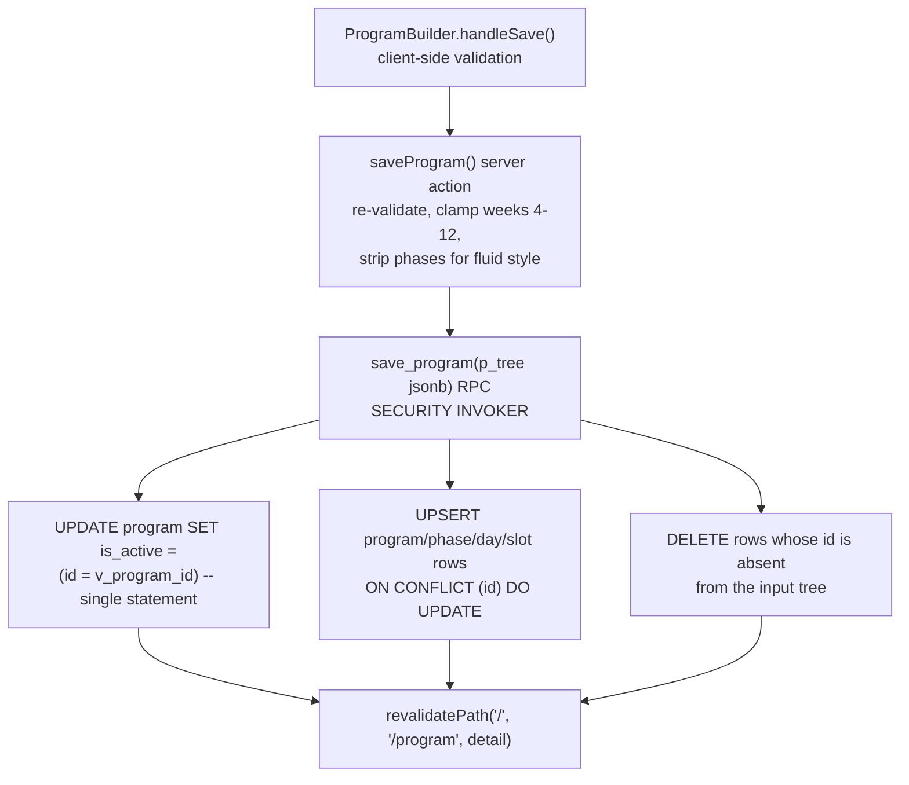
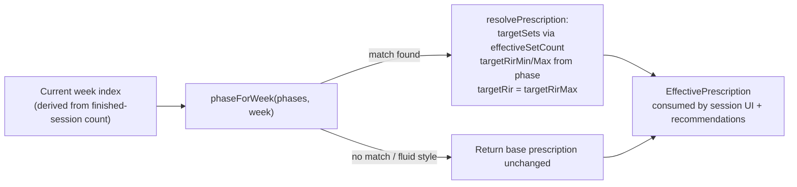

## Overview

A **program** is the top-level structure a lifter trains from: a name/description/tags, a
`weeks` block length, a `style` of `"classic"` or `"fluid"`, an ordered list of **days**, each
holding an ordered list of exercise **slots**, and (for classic programs only) an ordered list
of week-ranged **phases** that override RIR and/or working-set volume. Exactly one program per
user may be `is_active` at a time — a database-level invariant, not just an application
convention. This page covers how the nested program tree is loaded and typed (`program.ts`),
how it is built and saved from the UI (`program-builder.tsx`, `actions.ts`), the shared
built-in template catalog (`program-templates.ts`), and how a phase's RIR/set-volume override
is resolved for a specific training week (`periodization.ts`). Fluid-specific behavior (plateau
detection, the rep-change/swap ladder) is covered in
`/openwiki/concepts/fluid-and-plateau-adaptation.md`; this page only describes the `style` field
and the parts of the builder/save path shared by both styles.

## The program tree: `program.ts`

`src/lib/program.ts` defines the shared nested shape (`Program` → `ProgramDay[]` →
`ProgramSlot[]`, plus `ProgramPhase[]` from `periodization.ts`) used identically by the home
screen, the session/next-workout flow, and the builder. `assemble()` loads `program_day`,
`program_phase`, and `program_slot` for one program row with two parallel queries (days+phases,
then slots keyed off the loaded day ids) and folds them into the nested `Program` object;
`getActiveProgram` and `getProgram` are the two entry points (by active flag or by id), both
scoped to `user_id`. A day's stored `name` is passed through `workoutIdentity()`
(`program-day.ts`), which strips a legacy weekday prefix such as `"Tue · "` — program days are
ordered **workout identities**, not calendar appointments, so a delayed session still shows as
"Upper A" rather than the weekday it was originally authored for.

`listProgramSummaries` is a separate, lighter-weight loader for the program gallery: it fetches
`program`, `program_day`, and `program_slot` once each (no nested per-program queries) and
aggregates day/exercise counts in memory via the pure helper `buildProgramSummaries()`
(`program-summary.ts`), which also sorts active-first, then newest-first. `recentExerciseIds`
scans the last 200 `set_log` rows to drive recent-first ordering in the exercise picker.

A load-bearing comment in `program.ts` states the core invariant this whole page is about:
`set_log` and `workout_session` reference program/day/slot ids, so **the builder preserves ids
across edits** — block position (which day/week is next) is always derived from the count of
finished sessions of the active program, never stored on the program itself (see
`loadNextWorkout` in `next-workout.ts`, which computes `week = floor(completedSessions /
dayCount) + 1` and picks `days[completedSessions % dayCount]`).

## Building and saving: `program-builder.tsx` and `actions.ts`

`ProgramBuilder` is a single client component reused by three routes:

- `/program/new` — blank draft (`initial={null}`), redirects to `/program` after save.
- `/program/[id]?mode=edit` — edits an existing program in place, redirects back to its detail
  page, and shows a Cancel button (`cancelHref`).
- The first-run offer on `/program` (server-rendered list of templates) bypasses the builder
  entirely via `createFromTemplate`.

The builder keeps one client-side `Draft` (a `Program`) in state and mutates it through small
`update()`-wrapped functions (`addDay`, `addPhase`, `addSlot`, `moveSlot`, `updatePhase`, …),
always `structuredClone`-ing before mutating so React sees a new reference. All ids — program,
day, phase, and slot — are generated client-side with `crypto.randomUUID()` at creation time
(`uid()`) and never regenerated on edit, which is what lets a save preserve `set_log` linkage.
The exercise picker (`ExercisePicker`, shared with the in-session swap/planner flow) is opened
per-day and calls back into `addSlot(dayId, exercise)`, defaulting a new slot to 3 sets, 8–12
reps, 2 RIR, no rest override.

The **progression-style toggle** (`Classic` / `Adaptive` buttons) sets `draft.style`, which
conditionally renders week count + phases UI (classic only) or a per-slot "Patience" selector
(fluid only, `plateauPatience`: Auto / Low(2) / Normal(3) / High(4) / Very high(5), explained
once via an `InfoButton` next to the first fluid slot). Switching style does not clear the
other style's fields — phases and patience values persist in the draft even while hidden, so
toggling back and forth doesn't silently drop authored data before save (the server strips
phases for fluid saves regardless, see below).

On save (`handleSave`), the builder does client-side validation mirroring the server:
- at least one day with at least one slot,
- classic programs' phases pass `validateProgramPhases` against the current `weeks` value,

then calls the `saveProgram` server action with the whole draft. `saveLabel` reads "Save
changes" for an already-active program and "Save & make active" otherwise — saving **always**
activates the saved program (see below), so the button text is the only cue that editing an
inactive program also flips it active.

### `saveProgram`: id-preserving upsert/delete-missing

`saveProgram(input)` in `src/app/(app)/program/actions.ts` re-validates on the server (never
trusts client validation alone): rejects zero days, clamps `weeks` to 4–12, normalizes tags,
and — critically — **drops the `phases` array entirely for fluid programs**
(`input.style === "classic" ? input.phases : []`) before phase validation and persistence, so a
fluid program can never end up with stored phase rows. It then assembles a single JSONB "tree"
(program metadata + `phases[]` + `days[{ slots[] }]`, every row carrying its client-generated
`id`) and calls one Postgres RPC, `save_program(p_tree jsonb)`, instead of issuing the tree as a
sequence of separate inserts/updates/deletes.

*One atomic RPC call replaces what was previously a 7-8 statement, non-atomic sequence.*

This RPC (`save_program`, added in `20260917000000_atomic_program_mutations.sql`, documented in
`docs/PROGRAM-TRANSACTIONS.md`) is the single entry point for every program write that touches
more than one table: builder save, clone, and template instantiation all assemble the same tree
shape and call it. Inside one transaction it:

1. Flips `is_active` for **every one of the user's programs** with a single conditional
   `UPDATE ... SET is_active = (id = v_program_id)` — there is no intermediate moment where zero
   or two programs are active, which a naive "clear old active, then set new active" two-step
   sequence cannot guarantee under a mid-operation failure.
2. Upserts phase/day/slot rows with `ON CONFLICT (id) DO UPDATE` — reusing a row's existing `id`
   updates it in place rather than delete+reinsert.
3. Deletes any existing row whose id is **not present** in the input tree ("upsert-then-delete-
   missing") — this is how a removed day/phase/slot is actually removed.

Preserving ids across an edit rather than delete-and-reinsert is what keeps
`set_log.program_slot_id` pointing at the correct slot after any builder save — this is called
out in both `program.ts`'s header comment and the data-model page as the single most important
invariant this RPC protects, because a set logged against a slot that got deleted and recreated
with a new id would silently lose its program linkage. `save_program` runs with `SECURITY
INVOKER` (not `DEFINER`) and an explicit `user_id = auth.uid()` predicate on every write, so RLS
still applies to the invoking session; the explicit predicate is defensive redundancy, not the
primary enforcement boundary.

### Other program-tree writes reusing the same RPC

- **`createFromTemplate(templateId)`** looks up the template in `TEMPLATE_BY_ID`, generates a
  fresh UUID per program/phase/day/slot, decides whether the new program should activate (`true`
  only if the account currently has zero programs — the first-run case; otherwise the template
  lands as an inactive draft so adding one from the gallery never silently deactivates the
  program the user is running), and calls `save_program` with that tree.
- **`cloneProgram(id)`** loads the source program's full structure with plain `select`s, renames
  it `"<name> (copy)"`, generates a new UUID for every row (including a `dayIdMap` so cloned
  slots point at the right cloned day), forces `isActive: false`, and calls `save_program`.
  Because it goes through the same RPC as a builder save, a clone can never be left half-written
  (a day with no slots, or a program with no days) even if the operation is interrupted.
- **`setActiveProgram(id)`** calls a second, minimal RPC, `set_active_program(p_program_id
  uuid)` — a single `UPDATE ... SET is_active = (id = p_program_id)` across all of the user's
  programs, used by the gallery's "Make active" action without touching program structure.
- **`deleteProgram(id)`** is a plain single-statement `DELETE` scoped to `id` + `user_id` (no RPC
  needed — one statement is already atomic). Days/slots/phases and slot-scoped
  `movement_adaptation` rows cascade via foreign keys; `workout_session.program_id` is nulled,
  not cascaded, so past session history survives program deletion. Deleting the active program
  is allowed and can leave the account with none active.

All four actions call `revalidatePath` on the relevant routes (`/`, `/program`, and/or the
program detail path) after a successful RPC call; a failed RPC throws before any revalidation,
so the UI never shows a stale-but-"saved" state. See
`/openwiki/architecture/data-model.md#atomic-write-rpcs` for the schema-level description of
these RPCs alongside `swap_session_exercise`, the pattern's original reference
implementation, and `docs/PROGRAM-TRANSACTIONS.md` for the full non-atomic-vs-RPC design
rationale (including the explicit non-goals: no optimistic UI, no retry queue, no version/ETag
concurrency control — single-device usage makes last-save-wins acceptable).

## Built-in templates: `program-templates.ts`

`PROGRAM_TEMPLATES` is a pure, framework-free array of `ProgramTemplate` objects — no database
row backs a template; `TEMPLATE_BY_ID` is just `Object.fromEntries` keyed by `id` for O(1)
lookup in `createFromTemplate`. Templates are offered in two places: the first-run empty state
on `/program` (one button per template, "Start with …") and the gallery's Templates section for
users who already have programs. Every template's `exerciseId`/`pattern` pair must exist and
match in the seeded catalog (`EXERCISE_BY_ID` in `strength/coefficients.ts`) — enforced by
`program-templates.test.ts`, which also checks each template stays within the builder's 4–12
week clamp, every day has at least one slot, every slot has a sane prescription (sets ≥ 1,
`repMax ≥ repMin`, RIR 0–4), and any phase array passes `validateProgramPhases` with zero
errors.

Six templates ship today, each a deliberate mapping of an existing named program onto this
app's rep-range/RIR model (documented in the module's header comment):

| Template id | Style notes |
| --- | --- |
| `strong-foundations-women-3x` | 12-week beginner/intermediate glute/leg-focused program with 7 authored phases; see `docs/STRONG-FOUNDATIONS.md` for full design rationale, the September 14 variety revision, and the one-time data migration that updated existing copies in place. |
| `kino-goddess-phase-1` | 8-week, 3-day, no phases (flat RIR 2 throughout). |
| `james-hit-specialization` | 12-week, 4-day HIT block with 8 phases alternating calibration/build/intensification/deload every 6 weeks. |
| `ppl-simple` | 5-week beginner Push/Pull/Legs, double progression, no phases. |
| `reddit-ppl` | 4-week 6-day PPL; linear-progression main lifts are encoded as `repMin === repMax` (hitting the rep max on the first working set triggers the load-increase suggestion — see Periodization below). |
| `gzclp` | 4-week 4-day GZCL linear progression (T1/T2/T3 tiering approximated via set count and rep range, not literal tier labels). |

Percent-based or wave-style source programs (5/3/1, GZCLP) are approximated with fixed RIR
targets rather than modeled as percentages, since the app's prescription model is RIR/rep-range
based, not %1RM based. A template's `weeks` is this app's 4–12-week **block** length, not
necessarily the source program's total lifetime — templates like the linear-progression ones
are meant to be repeated cycle after cycle by re-saving or continuing past the block boundary.

## Periodization: week-specific prescription resolution (`periodization.ts`)

A **phase** (`program_phase`) is a classic-only, contiguous `weekStart`–`weekEnd` window that
can override `targetRirMin`/`targetRirMax` and/or `setMultiplier` for every slot in the program
during that week range. `periodization.ts` is the pure, framework-free module that resolves a
slot's *base* prescription plus the active phase into an *effective* prescription for a given
week — it has no knowledge of Supabase and is unit-tested directly (`periodization.test.ts`) as
well as indirectly through `program-templates.test.ts`'s per-template phase-boundary checks.

- **`phaseForWeek(phases, week)`** sorts phases by `position` and returns the first whose
  `[weekStart, weekEnd]` contains `week`, or `null`. Authoring validates that phases don't
  overlap before persistence (see below), but the resolver itself stays defensively correct for
  any historical or malformed data — it always picks a single, deterministic phase rather than
  throwing.
- **`resolvePrescription(base, week, phases)`** looks up the phase for `week` and returns an
  `EffectivePrescription`: `targetSets` is `base.targetSets` unmodified when the phase has no
  `setMultiplier`, otherwise `effectiveSetCount(base.targetSets, phase.setMultiplier)`.
  `targetRirMin`/`targetRirMax` come from the phase when set, else both fall back to
  `base.targetRir`. The single scalar `targetRir` field (consumed by the existing
  recommendation/set-entry APIs, which only accept one RIR value) is always set to
  **`targetRirMax`**, the conservative edge of the range — a `0–1` RIR phase prescription
  therefore defaults its single-value consumers to `1`, not `0`, while `rirLabel()` still
  renders the full `"0–1"` range for display.
- **`effectiveSetCount(targetSets, multiplier)`** is `Math.max(1, Math.ceil(targetSets *
  multiplier))` — odd deload set counts round **up** (a 3-set slot at 0.5× becomes 2, not 1),
  and every prescribed movement keeps at least one working set even at very low multipliers.
- **`validateProgramPhases(phases, programWeeks)`** is the shared authoring-time validator
  called by both the builder's client-side check and the `saveProgram` server action (and by
  the templates test suite) before persistence. It rejects: a week range outside `1..programWeeks`
  or with `weekEnd < weekStart`; a partial RIR pair (one bound set, the other `null`); an
  out-of-`0..10` or inverted RIR range; a phase supplying **neither** an RIR override nor a set
  multiplier (a phase must change something); and any two phases (ordered by `weekStart`, then
  `position`) whose week ranges overlap. It returns a list of human-readable error strings
  rather than throwing, so the builder can surface the first one inline and the server action can
  `throw new Error(phaseErrors[0])` to reject the save.
- **`rirLabel(prescription)`** renders `"2"` when min equals max, else `"0–1"`-style ranges, used
  by both the phase editor and the read-only program detail view.

`resolvePrescription` is called from two places that must agree on "what week is it, and what
does this slot mean this week": `next-workout.ts`'s `loadNextWorkout` (live session
prescriptions, folding any Fluid adaptation log first via `foldPrescription`) and the session
detail page. Fluid programs always pass an empty `phases` array into `resolvePrescription`
(`program.style === "classic" ? program.phases : []`) since Fluid has no phases and no fixed
week length — `resolvePrescription(base, week, [])` degenerates to "base prescription,
unmodified" for that style.

*Phase resolution is pure and stateless: the same `(base, week, phases)` input always yields the same effective prescription, whether called from the session flow, the program detail read view, or a template test.*

## Invariants and failure modes

- **Single active program.** Enforced at the database level by a partial unique index
  (`program_one_active_per_user … where is_active`) in addition to `save_program` and
  `set_active_program`'s single-statement conditional updates — the application cannot leave two
  programs active even under a bug, and a save or activation call can never be observed
  mid-transition with zero or two active programs.
- **Slot id continuity is the load-bearing invariant of the whole builder-save design.** Any
  code path that regenerates a slot id on an otherwise-unchanged slot (rather than reusing the
  client-generated id) would silently orphan `set_log.program_slot_id` for that slot's history.
- **Fluid programs never persist phases.** `saveProgram` strips `input.phases` for
  `style === "fluid"` server-side regardless of what the client sends, so there is no path to a
  fluid program with stored phase rows even if the builder UI has a latent bug.
- **Empty-program rejection.** Both the builder (`handleSave`) and the server action
  (`saveProgram`) reject a save with zero days, or (client-side only) a save where every day has
  zero slots; the server-side check is solely "at least one day exists" — `docs/
  PROGRAM-TRANSACTIONS.md`'s test plan calls out "empty-days rejection" as required coverage.
- **Week bounds are clamped, not rejected**, at 4–12 (`Math.min(12, Math.max(4,
  Math.round(input.weeks)))`) — an out-of-range weeks value is silently corrected rather than
  failing the save.
- **No optimistic UI, no retry queue, no version/ETag concurrency control** for program saves —
  explicit non-goals recorded in `docs/PROGRAM-TRANSACTIONS.md`, on the reasoning that the
  builder's row cap (6 days × ~8 slots ≈ 50 rows) makes a synchronous RPC call comfortably fast,
  and single-device usage makes last-save-wins an acceptable conflict policy.
