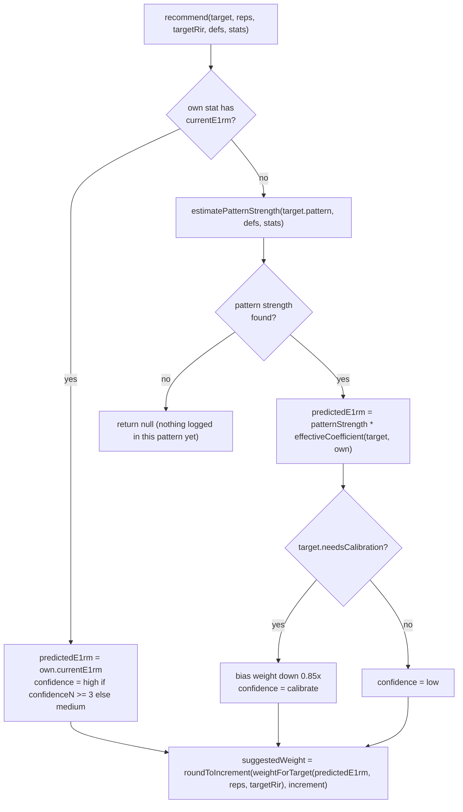
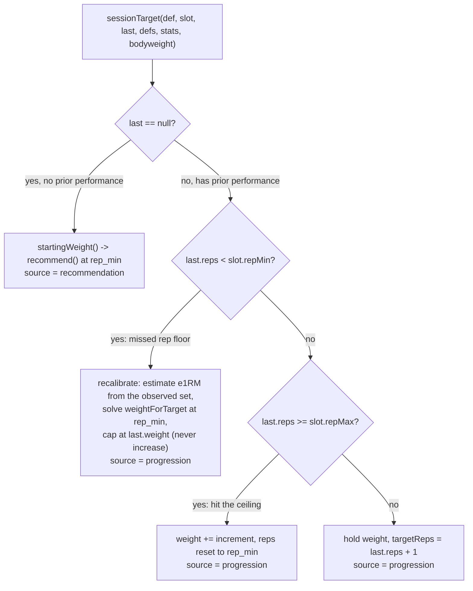
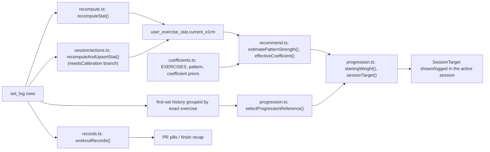

## Purpose and boundary

`src/lib/strength/` is framework-free TypeScript: no Next.js, no Supabase client, no
React. Every function is pure and takes plain data in, plain data out, which is what
lets the same code run the recommender client-side during an active session (from
hydrated catalog, stats, and first-set history) and server-side when rebuilding the
`user_exercise_stat` cache after a write. It is the app's "core algorithm" layer
described in `docs/DECISIONS.md`: normalize every set to e1RM, pool cross-exercise
strength through one latent number per movement pattern, and personalize per-exercise
coefficients by Bayesian shrinkage.

The module has five files, each owning one stage of the pipeline:

- `e1rm.ts` — the RPE/RIR load model and its inverse.
- `coefficients.ts` — the seeded exercise catalog and population strength priors.
- `recommend.ts` — cross-exercise weight recommendation via pattern strength.
- `progression.ts` — the double-progression session-target engine.
- `recompute.ts` — rebuilding `user_exercise_stat.current_e1rm` from `set_log`.
- `records.ts` — replaying saved sets into rep/e1RM/top-weight PRs (a sibling
  consumer of the same e1RM/effective-load conventions, not part of the
  recommendation pipeline).

## e1RM model (`e1rm.ts`)

Every logged set is normalized to an estimated one-rep max (e1RM) so that sets logged
at different rep counts and effort levels are comparable, and so "progressive overload"
can be defined simply as e1RM trending up.

The model is an RPE/RIR load table, not a bare Epley/Brzycki formula. The insight
(documented in the file's header comment) is that an RPE-based load table collapses to
a single curve over "reps to failure" (`effective reps = reps performed + RIR`, since
`RPE = 10 - RIR`). `e1rm.ts` stores that curve as the RPE-10 column of the RTS
(Reactive Training Systems) table, `PCT_BY_RTF`, keyed by reps-to-failure 1–12, and
`pctOf1RM()` linearly interpolates between integer points. Beyond the table (reps-to-
failure > 12) it switches to an Epley-shaped decay anchored to the table's last point,
so the curve stays continuous and monotonic across the boundary — verified directly by
`e1rm.test.ts`.

```
computeE1rm(weight, reps, rir = 2)      // weight / pctOf1RM(reps + max(0, rir))
weightForTarget(e1rm, reps, targetRir)  // e1rm * pctOf1RM(reps + max(0, targetRir))  (inverse)
roundToIncrement(weight, increment)     // nearest achievable plate/stack step
```

`weightForTarget` is the exact algebraic inverse of `computeE1rm`, which is what lets
the recommender and progression engine convert a predicted e1RM back into a weight to
load, and what lets a below-floor set be re-solved for the load that would have hit the
rep floor. RIR is clamped to a minimum of 0 and defaults to 2 when a set does not record
it.

**Invariant:** do not replace this model with a bare Epley/Brzycki 1RM formula. A bare
formula drifts across the 1–12 rep range this app actually trains in; the RPE/RIR table
is deliberately preserved (see `docs/ARCHITECTURE.md` and `docs/DECISIONS.md`).

## Catalog and population priors (`coefficients.ts`)

`coefficients.ts` is the canonical home of pattern-level knowledge in the strength
engine. It seeds:

- **`Pattern`** — 17 movement patterns (`horizontal_press`, `squat`, `hinge`,
  `knee_extension`, …) plus `PATTERN_LABEL`, human-readable names consumed by analytics
  screens.
- **`EXERCISES` / `EXERCISE_BY_ID`** — one `ExerciseDef` per seeded exercise template:
  `id`, `name`, `pattern`, `equipment` (`barbell | dumbbell | cable | machine |
  bodyweight`), `coefficient`, `increment`, and flags `isReference`,
  `needsCalibration`, `stationProfile`.
- **Coefficients** — within each pattern, exactly one exercise is `isReference: true`
  with `coefficient: 1.0` (e.g. Barbell Bench Press for `horizontal_press`, Barbell
  Back Squat for `squat`, Lat Pulldown for `vertical_pull`). Every other exercise's
  `coefficient` is its strength relative to that reference lift, expressed in e1RM
  units. These are rough population priors seeded from general strength-training
  ratios; the file's header comment is explicit that "exact values barely matter
  long-term" because `recommend.ts` self-corrects them per user via Bayesian shrinkage
  after a few sessions.
- **Station identity** — `stationProfile` (`machine | cable | bench | rack | platform |
  none`) says whether a template needs brand/station-tag instantiation before it has
  absolute load identity; `needsStation()` is `stationProfile !== "none"`.
  `resolveStationFields()` validates a brand/tag pair against the template's allowed
  `StationTag`s (`STATION_TAGS_BY_PROFILE`), requiring a brand for cable/bench/rack/
  platform profiles and locking cable to `selectorized`. This machinery is catalog
  identity, not the recommendation math; see the exercise-catalog-and-identity page for
  `resolveVariant`/`createCustomExercise` and merge-with-user-variants behavior in
  `catalog.ts`.

Logging conventions the coefficients depend on: log total load for barbell/machine
(both sides for plate-loaded), one dumbbell's weight for dumbbell movements, and
bodyweight-relative added load (negative for assisted dips/pull-ups) for bodyweight
movements.

## Cross-exercise recommendation (`recommend.ts`)

The core cross-exercise model: one latent "pattern strength" number per user per
movement pattern, expressed in the reference lift's e1RM units. Any exercise's
predicted e1RM is `pattern_strength * coefficient(exercise)`, so a weight can be
suggested even for an exercise the user has never performed.


*Control flow of `recommend()`: direct history on the exact exercise wins; otherwise pattern strength drives a coefficient-scaled prediction, conservatively biased for uncalibrated machines.*

Two supporting mechanisms:

- **`estimatePatternStrength(pattern, defs, stats)`** pools every logged variant in the
  pattern: each stat contributes `variant_e1RM / its_effective_coefficient` as an
  estimate of the reference lift's e1RM, weighted by `1 + min(confidenceN, 5)` so
  variants with more sessions behind them count for more (capped so no single variant
  dominates). Returns `null` when nothing in the pattern has been logged.
- **`effectiveCoefficient(def, stat)`** is the Bayesian-shrinkage step: the population
  prior (`def.coefficient`) is blended with the user's own observed
  `personalCoefficient` weighted by `confidenceN` against a fixed prior weight,
  `PRIOR_WEIGHT = 4`. With no observed personal coefficient yet, it returns the
  population prior unchanged; as `confidenceN` grows, the estimate shifts toward the
  user's own ratio. Confidence levels returned by `recommend()` are `calibrate`
  (needs-calibration exercise, no direct history yet — the weight is additionally
  biased down 15%), `low` (pattern-derived, non-calibration), `medium` (own history,
  fewer than 3 sessions), and `high` (own history, 3+ sessions).

**Invariant:** `PRIOR_WEIGHT` and the population `coefficient` values are a slowly-tuned
population prior, not a per-request recalibration target — do not wire continuous
recalibration of machine coefficients from every session's data; the calibration
contract below intentionally anchors once and then holds.

## Session targets: double progression (`progression.ts`)

`progression.ts` computes the actual weight/rep/RIR a lifter should attempt next for a
program slot. Structure (sets × rep range @ RIR) is fixed for the block; progression
only advances the load/rep target off the last logged performance. Its three exported
functions — `startingWeight()`, `sessionTarget()`, and `selectProgressionReference()` —
are shared by the active session UI and the weekly Coach proposal layer so both surfaces
agree.

### Bounded reference window (`selectProgressionReference`)

Progression history stays exercise-specific, but a slot doing the same exercise across
multiple program days (e.g. a hack squat appearing in both Lower A and Lower B) should
be able to benefit from the stronger recent exposure without letting an old all-time PR
dictate every future target forever. `selectProgressionReference(performances,
programSlotId)`:

1. Sorts all first-set performances for the exact exercise, most recent first.
2. Finds `lastSameSlot` — the latest performance logged under this exact
   `programSlotId`. That performance's timestamp anchors the comparison window.
3. With a same-slot exposure, the window is every performance at or after that
   timestamp (across any slot/program day). With none (a new slot, or a fresh swap),
   the window is the four most recent exposures.
4. Within the window, `bestRecent` is the highest-e1RM performance; ties favor
   recency; a performance with no computable e1RM (e.g. a bodyweight set with unknown
   historical bodyweight) falls back to being compared as "most recent" rather than
   invented as comparable.
5. `selected` is `bestRecent ?? lastSameSlot`.

This means a newer stronger performance on a different day *after* the slot's own last
exposure can advance the slot, but a strong performance from before that anchor cannot
override it.

### `sessionTarget()` decision tree


*Decision tree inside `sessionTarget()`: no history hands off to the recommender; otherwise the "bump test" is reps-only and a missed floor is a calibration correction, never an upward push.*

Rules, in order:

1. **No prior performance** (first session on this slot, or right after a swap) —
   delegate to the recommender via `startingWeight()`, which calls `recommend()` at
   `slot.repMin`/`slot.targetRir` and, for `bodyweight` equipment, converts the
   recommender's effective-load suggestion back into added/assisted load using
   `bodyweight` (returns `null`, no suggestion, if bodyweight is unknown).
2. **Missed the rep floor** (`last.reps < slot.repMin`) — this is treated as a
   load-calibration failure, not a progression step: it estimates an e1RM from the
   observed set (using total effective load for bodyweight movements), solves
   `weightForTarget` for `rep_min` at the prescribed RIR, and caps the result at the
   previously logged load so a missed rep can never increase the target.
3. **Reached the rep ceiling** (`last.reps >= slot.repMax`) — add the exercise's
   `increment` and reset `targetReps` to `slot.repMin`.
4. **Otherwise** — hold the weight and target one more rep, up to `slot.repMax`.

The bump test (step 3 vs. step 4) is reps-only: RIR feeds the e1RM model but never gates
whether the load bumps. This matters for Coach effort-reduction proposals, which key off
the **first working set's** RIR specifically — hard back-off sets must not be allowed to
lower an accurately loaded top set (see `docs/DECISIONS.md`, Phase 9, "Coach
recommendations").

## Machine/cable calibration contract

Machines and cable-brand station variants (`needsCalibration: true` templates) cannot
predict absolute load from free-weight history — leverage, pin stack, and plate-loaded
units are arbitrary per brand. The contract, implemented in `recomputeAndUpsertStat`
inside `src/app/(app)/session/actions.ts` (server-side, called after every set write):

- The **first session** with working sets on that exact exercise is a calibration
  set: `recommend()` returns `confidence: "calibrate"` and biases the suggested weight
  down 15% (`* 0.85`) since it is a guess, not a prediction.
- `personal_coefficient = current_e1rm / estimatePatternStrength(pattern, catalog,
  otherStats)`, computed from every *other* exact-id stat in the same pattern (the
  exercise's own row is excluded). It anchors on the first session with working sets and
  **re-anchors while only one such session exists**, so editing or deleting that single
  calibration session's sets keeps the coefficient consistent; once a second distinct
  session exists, the coefficient holds fixed and later progress moves the pattern-
  strength estimate instead of continuously re-deriving the coefficient.
- `coeff_confidence_n` = count of distinct sessions with working sets on that exact
  exercise, feeding `effectiveCoefficient`'s Bayesian shrinkage in `recommend.ts`.
- If every set for a calibration exercise is deleted, both `personal_coefficient` and
  `coeff_confidence_n` reset to `null`/`0` so the next first set recalibrates from
  scratch.
- Graduating out of `calibrate` confidence is not a separate code path: once the
  exercise has its own `current_e1rm` and `confidenceN`, `recommend()`'s direct-history
  branch naturally returns `medium`/`high`.
- Barbell bench/rack/platform station variants (ordinary lb, no arbitrary units) skip
  this branch entirely.
- A leftover flat-template `set_log` row (logged before a brand/tag variant existed) is
  a different `exercise_id` from the new variant, so it is never rewritten onto the
  variant, and the new variant still goes through its own first-session calibration.

**Invariant:** do not make machine coefficient computation continuous/live off every
session — the anchor-then-hold contract (documented identically in
`docs/ARCHITECTURE.md` and `docs/DECISIONS.md` Phase 5) is intentional so a machine's
number does not wobble as pattern strength moves.

## Rebuilding the cache (`recompute.ts`)

`set_log` is the source of truth; `user_exercise_stat` is a derived, rebuildable cache.
`recompute.ts` is the pure half of that rebuild:

- **`effectiveLoad(def, weight, bodyweight)`** applies the bodyweight/assisted
  convention: for `equipment === "bodyweight"`, effective load is `bodyweight + weight`
  (recorded `weight` is added load, negative for assistance); for everything else it is
  the recorded weight unchanged. Returns `null` when bodyweight is required but unknown
  — the caller must treat this as "not computable," not coerce it to 0 (a 0 would poison
  pattern-strength pooling with a garbage e1RM).
- **`recomputeStat(def, sets, bodyweight)`** returns `current_e1rm` as the **maximum**
  e1RM across all logged (non-warmup-filtered-by-caller) working sets — this represents
  demonstrated current strength, not the first set or a session average (per
  `docs/DECISIONS.md` Phase 2). Sets with non-positive reps or unresolvable/non-positive
  effective load are skipped.

`recompute.ts` intentionally does **not** compute `personal_coefficient` —
that half of the rebuild (the calibration contract above) lives in
`recomputeAndUpsertStat` in `src/app/(app)/session/actions.ts`, which calls
`recomputeStat()` for the e1RM half and then layers calibration bookkeeping around it
before upserting `user_exercise_stat`. This split keeps `recompute.ts` framework-free
and directly testable with `tsx`, while the write/upsert side lives where the Supabase
client is available.

`recomputeAndUpsertStat` runs after every set write/edit/delete (`logSet`, edit, delete)
for the affected exact exercise, keeping the cache from drifting from `set_log`.

## Records (`records.ts`)

`records.ts` is a related but distinct consumer of the same e1RM/effective-load
conventions: it replays **saved** `set_log` rows (never optimistic/unsaved rows — the
comment on `workoutRecords()` is explicit about this) to detect three kinds of personal
records per exact `(exercise_id, equipment_instance_id)` scope:

- **Rep PRs** — more reps at a previously-seen effective load.
- **Top-weight PRs** — a new max effective load (`historicalBodyweight()` recovers
  historical bodyweight for bodyweight lifts by inverting the persisted e1RM with the
  canonical RIR formula, rather than consulting today's bodyweight).
- **e1RM PRs** — a new max estimated e1RM.

`eligibleRecordSet()` excludes machine *templates* (`stationProfile === "machine"`,
never directly loggable) and warmups, but intentionally keeps leftover flat cable/
barbell-station template rows eligible under their own exact id — history policy does
not rewrite them onto a later brand variant, so PR eligibility does not merge across
that boundary either. `workoutRecords()` compares the current session's sets against
the best prior value established in sets finished (and created) strictly before the
session's start, so a later edit to an older session cannot retroactively manufacture a
PR inside a session that already finished. `recapHeadline()`/`recapLines()` are pure
display formatters used by both the live PR pills during a session and the
finish-session recap. Precision matters here too: rep-PR comparisons happen at raw
effective load (`loadPrecision`, 3 decimals) while e1RM/top-weight display and
comparison happen at the same tenth-pound precision shown to the lifter
(`estimatePrecision`), so a `+0.0` cannot register as a PR.

## Where the pieces meet


*How the strength-engine files compose: writes rebuild the stat cache, the recommender pools it with catalog priors into a per-session target, and records replay the same saved sets independently for PR detection.*

## Consumers and related pages

- The active session page and weekly Coach proposals both call `sessionTarget()` and
  `selectProgressionReference()`; per `docs/DECISIONS.md` Phase 5, session targets
  compute **client-side** from hydrated `ExerciseStat[]`, `recentExerciseIds`, and
  recent first-set performances — the server hydrates state, not targets, which is what
  lets an in-session swap re-derive a recommendation instantly with no round trip.
- `catalog.ts` merges these seeded `ExerciseDef`s with user-created station variants and
  custom exercises before either the recommender or progression ever sees them — see the
  exercise-catalog-and-identity page for `resolveVariant`, `createCustomExercise`, and
  variant-id shape (`base__brand__tag`).
- `plateau.ts`/`fluid.ts` (Fluid adaptation) sit downstream of the same
  `ExerciseStat`/e1RM data but own their own detection and swap-ranking logic — see the
  fluid-and-plateau-adaptation page; they are not part of this module.
- Coach report/recommendation generation and the active-session lifecycle both depend on
  the invariants documented here (bounded reference window, reps-only bump test,
  anchor-then-hold calibration) — see the coach-and-ai-agent and
  workout-session-lifecycle pages for how they are invoked end to end.
