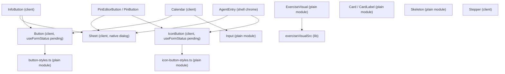
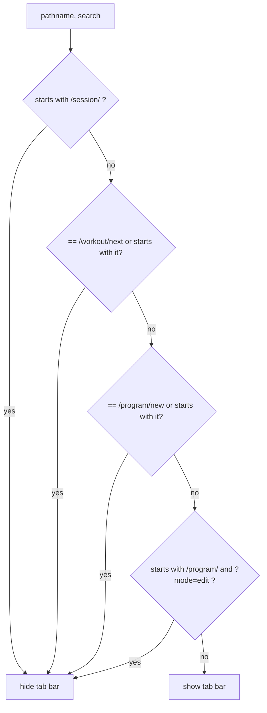

## Scope

This page documents the shared visual language of the app: the primitives in
`src/components/ui/`, the semantic design tokens in `src/app/globals.css`, the
copy-density rules that keep screens glanceable, the Server/Client Component
boundary those primitives are built around, and the tab-shell logic in
`src/lib/app-chrome.ts` plus `AppShell` that hides bottom navigation and Coach
entry chrome on immersive routes.

The canonical source is `docs/UI.md` ("read before changing components,
overlays, motion, or server/client boundaries"), the copy-density spec
`docs/superpowers/specs/2026-09-16-visual-copy-density-design.md`, and the
exercise visual contract
`docs/superpowers/specs/2026-09-28-exercise-visuals-design.md`. Agent protocol
and tool loops are out of scope here; only `AgentEntry` as shell chrome is
covered.

## Design tokens

`src/app/globals.css` defines a near-monochrome palette as CSS custom
properties (`--background`, `--foreground`, `--surface`, `--border`,
`--border-strong`, `--muted`, `--faint`, `--accent`, `--accent-foreground`),
each with a light and a `prefers-color-scheme: dark` value. Color is reserved
for semantic meaning only: `--overload-up` / `--overload-down` (progression
direction), `--calibrate` (a machine still calibrating to the lifter), and
`--record` (gold, PR/record rows only). Tailwind's `@theme inline` block
re-exports these as `--color-*` tokens (e.g. `--color-danger` aliases
`--overload-down`) and binds Geist via `--font-sans` / `--font-mono`, so
utility classes like `text-danger` or `border-border` stay themeable from one
place.

A second `@theme` block fixes the type scale to four steps —
`--text-display`, `--text-heading`, `--text-body`, `--text-caption` — plus one
named exception, `--text-recap` (2.75rem, tight line-height/letter-spacing),
reserved for the finish-recap hero. It is explicitly *not* a fifth general
scale step; using it elsewhere would break the "four sizes carry all
hierarchy" contract. Radii are similarly singular: `--radius-card` (1rem) and
`--radius-control` (0.75rem) are the only two radii in the app, applied via
`Card` and every `*-control` class. `--container-page` (32rem, exposed as the
`max-w-page` utility) caps the single content column on wide viewports while
staying full-width on phones.

Motion tokens (`--animate-tick` 200ms, `--animate-row-in` 180ms,
`--animate-rise` 320ms, the `.skeleton` pulse, the logged-set `row-out`
exit, and the sheet's `dialog.sheet` 250ms transform/opacity transition) are
transform/opacity animations using one easing curve, `--ease-snap`. A global
`@media (prefers-reduced-motion: reduce)` rule collapses every
animation/transition duration to near-zero, so no component needs its own
reduced-motion branch except `withViewTransition` (see below), which checks
the media query directly because View Transitions are opt-in JS, not CSS.

## Primitives (`src/components/ui/`)

*Component dependency graph: plain (non-`"use client"`) modules can be imported by Server Components; the interactive wrappers around them cannot. AgentEntry is shell chrome, not a general primitive.*

- **`Sheet`** (`src/components/ui/sheet.tsx`) is the app's single overlay
  primitive: a native `<dialog>` driven with `showModal()`, giving a real
  focus trap for free. Escape (the dialog `cancel` event), a scrim tap, and a
  swipe-down past 90px on the drag handle all funnel into one `dismiss()`
  function that sets `data-closing`, waits `EXIT_MS` (250ms, which must stay
  numerically aligned with the `dialog.sheet` CSS transition duration in
  `globals.css`), then calls `dialog.close()` and the caller's `onClose`.
  Content inside a Sheet reads the same dismiss handler via the
  `useSheetDismiss()` hook/`DismissContext`, so an inner "Cancel" or "Done"
  button animates out identically to Escape or scrim-tap. Because the parent
  owns `onClose`, a Sheet is conditionally rendered (`{open && <Sheet .../>}`)
  and unmounts only after the exit animation finishes — unmounting immediately
  on click would skip the animation. Program gallery tags use this same Sheet
  behind a Filter control (`TagFilter`), not an always-on chip row; the control
  hides when no program has tags.
- **`InfoButton`** (`src/components/ui/info-button.tsx`) is the one ⓘ
  pattern for helper prose: a 44px (`min-h-11 min-w-11`) circle-i button that
  opens a read-only `Sheet` whose body renders `title` as an `h2.text-heading`,
  short prose, and a ghost "Done" button wired to `useSheetDismiss()`. It
  takes no `variant`/actions — info Sheets never carry Enable/Disable/Save;
  those stay on the originating control's own confirmation Sheet.
- **`Button`** (`button.tsx`, `"use client"`) and its class builder
  `buttonClasses` (`button-styles.ts`, a *plain* module without `"use client"`)
  are deliberately split so that Server Components can style a `<Link>` as a
  button by importing only `buttonClasses`/`iconButtonClasses`, without
  pulling in client-only hooks. `Button` derives its `pending`/busy state from
  either an explicit `pending` prop or `useFormStatus()` when it is a
  `type="submit"` inside a `<form action>`, so a server action submit never
  feels unresponsive even without local state. Variants (`primary`,
  `secondary`, `destructive`, `ghost`) and sizes (`sm`, `md`, `lg`) are fixed
  enums, not open strings, so new call sites cannot introduce ad hoc styling.
  **`IconButton`** (`icon-button.tsx` / `icon-button-styles.ts`) mirrors this
  split for the 44px (`size-11`) named-glyph control and requires an
  `aria-label` in its prop type; it shares the same pressed/disabled/pending
  language as `Button`.
- **`Stepper`** (`stepper.tsx`) is the most-touched control in the gym flow:
  large (`h-11 min-w-11`) −/+ targets, press-and-hold auto-repeat
  (`HOLD_DELAY_MS` / `HOLD_REPEAT_MS`, driven off a `valueRef` read in
  events/effects rather than in render, to avoid stale closures during a
  hold), a `tick` remount that replays the `animate-tick` value animation on
  every change, and a local text draft so the field can hold transient states
  like `"52."` or `"-"` mid-edit before committing a clamped numeric value on
  blur.
- **`Input`** (`input.tsx`, plain module) is the shared text field. Date
  inputs reset native appearance and constrain width so Safari date controls
  do not overflow narrow layouts.
- **`Card`/`CardLabel`** (`card.tsx`, plain module) is the one shared surface:
  one radius, one border, one padding. The `tone` prop (`default` | `active` |
  `done`) is the only way hierarchy is expressed — `active` uses a stronger
  border, `done` recedes via opacity — never a second radius or extra
  drop-shadow. Slot/session UIs derive `tone` from saved-set counts and the
  currently effective phase prescription rather than storing tone as data.
- **`Skeleton`** (`skeleton.tsx`, plain module) renders a pulsing placeholder
  block for route `loading.tsx` files, driven by the `.skeleton` keyframes
  (which respect the global reduced-motion override).
- **`Calendar`** (`calendar.tsx`, `"use client"`) supplies the shared month
  grid — keyboard navigation (arrow keys move a day, Home/End move to the
  week's edges, PageUp/PageDown change month), `role="grid"`/`gridcell`
  semantics, and a `markers` map for day dots. It is intentionally generic:
  callers (e.g. the weight calendar) own the mutation, replacement-conflict,
  and error contracts on top of this shared grid.
- **`ExerciseVisual`** is the only exercise illustration. See the contract
  below.
- **`withViewTransition`** (`view-transition.ts`) wraps a state update in
  `document.startViewTransition` (when supported) and `flushSync` so elements
  carrying a `viewTransitionName` animate positionally between old and new
  layout positions. The program builder uses it for day and slot reorder
  (button moves, not drag), naming each day card `vt-${day.id}` and each slot
  `vt-${slot.id}`. Phase reorder in the same builder is a plain `update()` and
  does not animate. It falls back to a plain synchronous update when
  `startViewTransition` is unavailable or `prefers-reduced-motion: reduce` is
  set, so reordering is never silently broken on older browsers or for
  motion-sensitive users.
- **`cx`** (`cx.ts`) is a minimal class-name joiner (`filter(Boolean).join(" ")`)
  used by every primitive instead of a class-merging library.

## Exercise visual contract

`ExerciseVisual` (`src/components/ui/exercise-visual.tsx`, a plain module) plus
`exerciseVisualSrc` (`src/lib/exercise-visual.ts`) is the one illustration for
any surface that shows a single exercise as the subject. The ink drawings are
16:9; an earlier square + `object-contain` frame letterboxed them, so the
locked frame is a 16:9 `rounded-control` box with `object-cover` and a modest
center zoom (`scale-[1.35]`). Never square + contain.

| Size | Box | Where |
| --- | --- | --- |
| `sm` (default) | 36×64 (`h-9 w-16`) | Rows and tiles: pickers, Track tiles, pin editor, recap rows, program builder/detail rows |
| `lg` | 64×114 (`h-16 w-[7.11rem]`) | Session slot header, planner cards, Exercise review header, in-session history sheet |

The larger frame is the growth. Do not invent a fifth type-scale step to make
the subject feel bigger.

Lookup is by seeded catalog / template id, never by display name, in this
order: `baseExerciseId`, exact `exerciseId`, then the id prefix before `__`
(canonical `base__brand__tag`, plus an owned fourth segment). Custom ids
(`custom-…`) never inherit through that prefix. A mapped id renders
`/exercises/{id}.jpg` from `public/exercises/` via a static `` — do not
import the raster into a client island. A missing map, custom id, or empty id
renders `IconDumbbell` in the same box (`data-exercise-visual="icon"`), never
a broken image. The frame is decorative: `alt=""` and `aria-hidden`. The
exercise name stays adjacent.

Adding art means dropping a correctly typed JPEG or PNG in `public/exercises/`
named for the seeded catalog id and adding that id to `EXERCISE_VISUAL_SRC`.
Station variants inherit automatically. Aggregates (program/day summaries,
last-session recap chips, Coach exposure caption lists) stay text-only so the
frame is not applied to a group.

## Server/Client Component boundary

The primitives are deliberately split into **plain modules** (no `"use
client"` directive: `button-styles.ts`, `icon-button-styles.ts`, `card.tsx`,
`skeleton.tsx`, `input.tsx`, `exercise-visual.tsx`, `cx.ts`, and
`src/lib/exercise-visual.ts`) and **client modules** (`"use client"`:
`button.tsx`, `icon-button.tsx`, `sheet.tsx`, `info-button.tsx`,
`stepper.tsx`, `calendar.tsx`, `view-transition.ts`'s consumers). A Server
Component may import a plain module's style function (e.g. `buttonClasses`)
or `ExerciseVisual` directly to render a styled `<Link>` or illustration
without becoming a Client Component, but it must never import a helper
exported from a `"use client"` module — that can fail at runtime even though
the build succeeds, because the framework only enforces the boundary when the
import is actually exercised on the server. A passing `next build` therefore
does not prove a route works; the primitives' plain/client split exists
specifically to keep this class of mistake out of reach for the common cases
(button/link styling, tone lookups, exercise art).

The route-level embodiment of this boundary is `src/app/(app)/layout.tsx`
(a Server Component: it awaits Supabase auth via `createClient()` and
`getClaims()`, redirecting unauthenticated users to `/login`) wrapping
`AppShell` (`src/app/(app)/app-shell.tsx`, `"use client"`, since it reads
`usePathname()`/`useSearchParams()`). Charts, clipboard access, search boxes,
and other interactive controls are client components throughout the app;
data loading and auth stay server-side.

## Tab shell, `hideAppChrome`, and AgentEntry

`AppShell` renders `TabBar`, a fixed bottom navigation with four destinations
— Lift (`/`), Track, Program, You (`/settings`) — each using `aria-current`
via a per-tab `match(pathname)` predicate. `isTrackPath` (in
`src/lib/app-chrome.ts`) makes Track match on `/analytics`, `/analytics/*`,
and `/history/...`, so Exercise review pages read as part of Track even
though their URL segment is `/history`. Sign out lives on You.

`hideAppChrome(pathname, search)` decides when the tab bar (and its
`pb-[calc(4.25rem+…)]` content padding) disappear entirely, for routes that
already own a sticky primary CTA of their own:

*`hideAppChrome` decision order in `src/lib/app-chrome.ts`; the `mode=edit` branch is the only one that needs `search`.*

This covers the active-workout session (`/session/[id]`, including its
finish recap at `/session/[id]/recap`), the workout planner (`/workout/next`),
new-program creation (`/program/new`), and program edit mode
(`/program/[id]?mode=edit`) — each of which owns Home (and, on recap, "View
recap"/"View workout") as its sticky exit instead of the tab bar. Because
`AppShell` calls the pathname-only overload first (inside a `Suspense`
fallback, before `useSearchParams()` resolves) and only calls the
search-aware overload once search params are available, `/session/*`,
`/workout/next`, and `/program/new` are hidden immediately on navigation —
they never flash the tab bar while search params are still loading. Only the
`mode=edit` check genuinely needs the resolved search string, and until it
resolves, `/program/[id]` briefly shows the tab bar (acceptable, since that
route isn't otherwise immersive).

When the tab bar is shown, `ShellFrame` also mounts `AgentEntry`
(`src/components/agent/agent-entry.tsx`) unless the pathname is `/coach` or
`/coach/*`. That entry is a fixed Coach `IconButton` sitting above the tab
bar; it opens a read-only-of-protocol `Sheet` containing `AgentChat`. It is
shell chrome, not a fifth tab: immersive routes hide it by the same
`hideAppChrome` gate as the tab bar, and `/coach` hides it because that route
already is the coach surface. Do not document the agent protocol, tools, or
chat loop on this page.

`src/lib/app-chrome.ts` also exports date-window helpers (`addDateKey`,
`inLocalDays`) used elsewhere for local-day windows; these are unrelated to
chrome visibility but live in the same module and are covered by
`app-chrome.test.ts` alongside `hideAppChrome`/`isTrackPath`.

## Pins as a display preference

Pins are a per-user display preference layered on top of `IconButton` and
`Sheet`, not a data-model concept. `PinButton`
(`src/app/(app)/pins/pin-button.tsx`) is a ghost `IconButton` with
`aria-pressed` that calls the `toggleExercisePin` server action inside
`useTransition`. It does not flip the pin optimistically: the pressed state
updates only after `{ ok: true, pinned }`, and a refusal surfaces the action
error in an alert without changing `aria-pressed`. Track tiles, session
slots, and history headers each render their own `PinButton`.

`PinEditorButton` (`pin-editor.tsx`) opens an edit-pins `Sheet` titled
"Pins". The body is a search field (`Input`, matching name or exercise id)
over two sections — "Compounds" and "More lifts" — each row showing a
default-size `ExerciseVisual` beside the name and a ghost pin `IconButton`.
Local pinned state updates only after the action succeeds; a failed toggle
sets a `role="alert"` and leaves the previous pressed state. Done dismisses
through `useSheetDismiss()`. Unpinning a default compound hides its tile;
pinning an extra adds one. A cap of 8 visible tiles (`PIN_CAP` in
`src/lib/board.ts`) is enforced inside `toggleExercisePin` via
`canPinExercise`, which refuses with "Pin cap is 8. Unpin something first."
The editor does not disable the control client-side before that refusal.

## Rest timer as a primitive-composition example

The active workout owns exactly one rest timer, and its implementation
threads through several of the conventions above: it is driven by an
absolute end timestamp (so `setInterval` drift and background-tab throttling
cannot desync the displayed countdown), starts optimistically the moment a
set is logged, and uses the per-slot rest override or the profile default
rest length. Its state lives in the `session/[id]` layout (not a leaf page),
so a logged-set data refresh — e.g. re-fetching PR/e1RM chips — cannot
unmount and reset it; the same end timestamp is mirrored into
`sessionStorage` so a hard remount (tab discard, PWA relaunch) can resume the
same countdown. The session route's `loading.tsx` and `error.tsx` both render
the same rest bar so a transient navigation or error state never visually
drops the timer. Vibration, an optional in-tab Web Audio "rest complete" tone,
a system notification when permission was already granted, and a wake lock
are all best-effort enhancements layered on top of the countdown; none of
them gate the core timer, and background/lock-screen delivery depends on the
browser (iPhone needs the app added to the Home Screen to get any of it).

## Copy density

The copy-density rules (`docs/superpowers/specs/2026-09-16-visual-copy-density-design.md`)
exist because product screens had accumulated always-visible captions that
were really developer notes (Web Audio internals, notification-permission
caveats, Coach API mentions) or restated what the control's own label already
said. The rules, in priority order:

1. **Labels first.** If a control's purpose is unclear, fix the label; do not
   add a caption to compensate for an unclear label.
2. **Delete developer/implementation notes** (Web Audio, Notification API,
   Coach internals, cookie persistence) outright — they belong in docs, not
   product copy, and are not candidates for relocation behind an InfoButton
   either.
3. **Helper prose goes behind `InfoButton` → `Sheet`.** How-it-works
   explanations, chart legends, and "why this exists" content use the single
   ⓘ pattern; never a caption under the control, a tooltip, or a second
   overlay type.
4. **Privacy/consent copy stays in dedicated confirmation Sheets** — period
   tracking consent, disable, and delete explanations — not on the Settings
   card surface itself, and not converted into an InfoButton (those Sheets
   carry destructive/consent actions, which read-only info Sheets never do).

The catch-all budget: any visible helper text that is not a label, a live
value, an error/status, or a confirmation should be **≤ ~6 words, or removed
entirely**. The canonical worked example is the rest-complete-tone setting on
`/settings`: the caption explaining Web Audio/notification-permission/
vibration behavior was deleted, and the remaining "why" (two short beeps in
this tab; vibration is separate) moved into an `InfoButton` Sheet next to the
checkbox label.

A few Track surfaces follow the same density contract without a new control
language. Exercise review's e1RM card uses a two-option **Last 8 workouts** /
**All history** toggle (`aria-pressed`), the same `Button` language as the
weight range control. Month-to-month compare uses two `Input type="month"`
controls (this month / other month) with paired metric columns, not an
empty-to-value arrow. Program names are a muted caption under the chart
window and under the compare card. When an exercise has more than one
equipment instance, Exercise review offers a row of text links (`aria-current`
on the selected identity) — not a select and not a third chart control.

## Finish recap and record styling

The finish-recap screen (`achievements.tsx`) reuses `--animate-rise` for its
hero and its list of record rows, each entering with a staggered ~70ms delay
so the payoff reads as a cascade rather than a single flash. `--text-recap`
is used only for that hero, and only when the finish has records; a no-record
finish uses `--text-display` and muted caption text instead. Record gold
(`text-record` / `--record`) is applied to the recap eyebrow and to the
record-line values that correspond to actual `workoutRecords` entries. A
finish with no records must not borrow the gold token just to look
celebratory.

## Related pages

- `/openwiki/architecture/overview.md` for how these primitives fit into the
  overall Next.js app structure.
- `/openwiki/concepts/exercise-catalog-and-identity.md` for the catalog and
  station-variant ids that `ExerciseVisual` inherits from.
- `/openwiki/workflows/coach-and-ai-agent.md` for the agent protocol behind
  `AgentEntry`; this page only covers the chrome.
- `/openwiki/workflows/exercise-swap-and-planning.md` for planner and swap
  surfaces that consume `lg` visuals and hide the tab bar.
- `/openwiki/workflows/workout-session-lifecycle.md` for how the rest timer,
  Sheet-based swap/finish flows, and `hideAppChrome` session/recap hiding
  compose during an actual workout.
