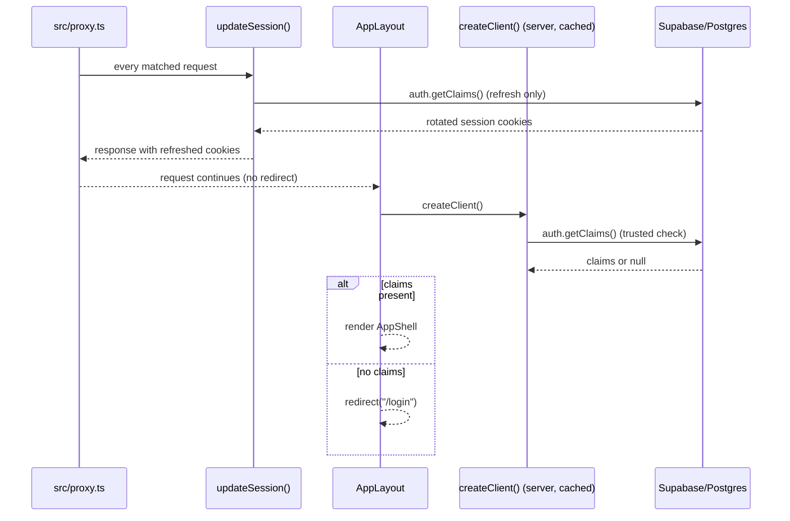

## Overview

Supabase is the app's only backend: Postgres for data, `auth.users` for identity, and
row-level security (RLS) as the default authorization model. The integration has four
moving parts documented here: (1) client construction for browser, server, and proxy
contexts; (2) the trusted server-side auth check, `getClaims()`; (3) owner-scoped RLS as
the default, with a single deliberate elevated read path for the weekly Coach API; and
(4) `SECURITY INVOKER` Postgres RPCs that perform multi-row writes atomically under the
caller's own RLS policies rather than in application code.

## Client construction

Three distinct Supabase client constructors exist, each scoped to a different runtime
context. All three use the public, publishable key (`NEXT_PUBLIC_SUPABASE_PUBLISHABLE_KEY`);
none of them bypass RLS.

- `src/lib/supabase/client.ts` — `createClient()` builds a `createBrowserClient` for
  Client Components. It is a plain, unmemoized function; each call constructs a new client.
- `src/lib/supabase/server.ts` — `createClient()` builds a `createServerClient` bound to
  the request's cookies via `next/headers`. It is wrapped in React's `cache()`, so within a
  single request, layout, page, and Server Action calls that invoke it all resolve to the
  same client instance. `setAll` writes are wrapped in a `try/catch` because Server
  Components cannot set cookies; that is safe because `src/proxy.ts` already refreshes and
  propagates the session on the underlying request.
- `src/lib/supabase/middleware.ts` — `updateSession(request)` builds a `createServerClient`
  bound to the request/response cookie pair and calls `supabase.auth.getClaims()` purely to
  trigger a token refresh, then returns the response with rotated cookies attached. The call
  to `getClaims()` must stay immediately after `createServerClient()`; any code placed between
  the two can break cookie propagation.

`cache()` keys on argument identity. Because `createClient()`, `getCatalogMap()`
(`src/lib/catalog.ts`), and `getCurrentBodyweight()` (`src/lib/current-bodyweight.ts`) are
all wrapped in `cache()`, and because callers pass the same memoized client instance into
the latter two, a single request loads the exercise catalog and the current bodyweight
exactly once no matter how many Server Components or actions need them. This memoization
is intentional and must be preserved when refactoring: breaking the shared client identity
(e.g., calling the unmemoized browser client from server code, or constructing a fresh
server client per call site) reintroduces duplicate queries per request.

*Session refresh in the proxy is separate from, and does not gate, the layout's access check.*

## Auth flow: magic link, refresh, and the trusted check

Login is email magic-link. The link lands on `src/app/auth/callback/route.ts`, which
exchanges the PKCE `code` for a session via `supabase.auth.exchangeCodeForSession(code)`
using the server client, then redirects to a same-origin `next` path (rejecting any value
that doesn't start with a single `/`, to prevent open-redirect via `@evil.com` or `//evil.com`
style parameters) or falls back to `/login?error=auth`.

`src/proxy.ts` (the Next.js 16 successor to `middleware.ts`) runs `updateSession()` from
`src/lib/supabase/middleware.ts` on every request matched by its `config.matcher`, which
excludes Next internals, the manifest, the service worker, and static image assets. This
refreshes and re-propagates Supabase auth cookies on real navigations. **It does not gate
access** — it never inspects the claims result or redirects; it only keeps the session
token fresh so that server-side checks later in the request see valid cookies.

The actual access boundary is `getClaims()`, called directly against a Supabase client
(not the proxy). `src/app/(app)/layout.tsx` is the single top-level gate: it builds the
memoized server client, calls `supabase.auth.getClaims()`, and redirects to `/login` when
`data?.claims` is missing. Every Server Action that reads or writes user data repeats a
narrower version of the same check — a `requireUser()`-style helper (e.g.
`src/app/(app)/weight/actions.ts`) that calls `getClaims()`, extracts `data?.claims?.sub` as
the user id, and throws a user-facing error if the id or the call itself is missing. This
means authorization is enforced twice by design: once at the layout boundary for page
rendering, and again independently inside each Server Action, since actions can be invoked
without necessarily re-running the layout gate.

## Owner-scoped RLS as the default security model

Every user-owned table enables RLS with an "own rows" policy shaped as
`using (user_id = auth.uid()) with check (user_id = auth.uid())` (see
`supabase/migrations/0001_init.sql`); `profile` uses `id = auth.uid()` since its primary
key is the user id. New user-owned tables are expected to follow this same shape — for
example `body_measurement_log` mirrors `bodyweight_log`'s ownership policy. Because the
client library forwards the caller's JWT, Postgres itself — not application code — is the
enforcement point: a query the app forgets to filter by `user_id` still cannot see another
owner's rows, and a forged or missing `user_id` on insert is rejected by the `with check`
clause. The signup trigger (`handle_new_user()`, `security definer`) is a narrow, deliberate
exception that runs with elevated privilege only to create the initial `profile` row after
`auth.users` insert; it is not a precedent for elevated reads elsewhere.

## The sole elevated read path: weekly Coach API

`GET /api/coach/v1/weekly` is the one place the app reads with a privileged key that
bypasses RLS. The call chain is:

`route.ts` → `createCoachWeeklyHandler()` (`src/lib/coach-api.ts`) → `loadCoachWeekly()` /
`loadCoachWeeklyWithClient()` (`src/lib/coach-weekly-data.ts`) → a `@supabase/supabase-js`
client built by `createCoachApiClient()` using `SUPABASE_SECRET_KEY` (a revocable
`sb_secret_...` key, never the publishable key) with `autoRefreshToken: false` and
`persistSession: false`.

Invariants that keep this path safe despite bypassing RLS:

- `createCoachWeeklyHandler()` requires a configured `expectedToken` (≥32 characters) and a
  configured, UUID-shaped `userId` before doing anything else; missing or malformed server
  configuration returns 503 rather than silently reading data.
- The caller must present a matching bearer token (`Authorization: Bearer <COACH_API_TOKEN>`)
  or, for clients that cannot set headers, the same token as a `?token=` query parameter
  (a scoped capability URL, treated as a secret). Token comparison is constant-time
  (`constantTimeTokenEqual`, SHA-256 digest + `timingSafeEqual`) to avoid timing side
  channels. Missing and invalid credentials both return a generic 401.
- Every single query inside `loadCoachWeeklyWithClient()` — `set_log`, `profile`,
  `workout_session`, `bodyweight_log`, `program_day`, `program_slot`, `program_phase`,
  `exercise`, `program` — carries an explicit `.eq("user_id", userId)` (or `.eq("id", userId)`
  for `profile`) predicate, even though the secret key would return all rows regardless.
  This is a deliberate defense-in-depth rule, not an artifact of RLS: since the secret key
  bypasses RLS entirely, the explicit predicate is the *only* thing scoping every read to
  `COACH_API_USER_ID`. A query added to this loader without that predicate would leak all
  users' data through this one endpoint.
- Responses set `Cache-Control: private, no-store, max-age=0`, `Pragma: no-cache`,
  `Vary: Authorization`, and `X-Robots-Tag: noindex, nofollow`, and a loader failure returns
  503 rather than a partial or error-detail body.
- The endpoint serializes the same canonical `CoachCheckInReport` (`src/lib/coach-check-in.ts`)
  used by the in-app Track Coach snapshot rather than re-deriving aggregation logic, and adds
  deterministic proposals from `src/lib/coach-recommendations.ts`. See
  [Coach and AI agent workflow](../workflows/coach-and-ai-agent.md) for the report contract,
  privacy shape, and recommendation semantics, and
  [deployment and config](../operations/deployment-and-config.md) for the required
  `SUPABASE_SECRET_KEY` / `COACH_API_USER_ID` / `COACH_API_TOKEN` environment variables and
  rotation procedure.

No other server code path uses `SUPABASE_SECRET_KEY`; every other read or write in the app
goes through the publishable-key clients and is therefore RLS-scoped to the authenticated
caller.

## SECURITY INVOKER RPCs for atomic multi-row writes

Several writes touch more than one table, or more than one row, in a way that must not be
observed half-applied. Rather than perform these as sequential client-side statements
(risking partial application on failure, or races between concurrent requests), they are
implemented as Postgres functions called via `supabase.rpc(...)` from Server Actions. All of
them are declared `language plpgsql security invoker set search_path = ''`: they run with the
*calling user's* privileges and RLS policies, not elevated ones, and the empty `search_path`
prevents search-path hijacking of unqualified identifiers. Ownership is still re-derived
inside each function from `auth.uid()`, and every function `revoke`s execute from `public`
and `anon`, granting it only to `authenticated`.

- **`save_bodyweight_entry(p_entry_id, p_logged_on, p_weight, p_replace_entry_id)`**
  (`src/app/(app)/weight/actions.ts` → `writeWeightEntry`) — validates the date and weight
  range, takes a per-owner `pg_advisory_xact_lock` to serialize calendar writes (including
  writes to a previously empty date), and inside that lock inserts, updates, or explicitly
  replaces the one-entry-per-user-per-date row. An unconfirmed collision with an existing
  date raises `23505`, which the action layer turns into a "replace it?" confirmation prompt
  rather than a silent overwrite; a missing target row raises `P0002`.
- **`swap_session_exercise(p_session_id, p_slot_id, p_exercise_id, p_pattern, p_scope)`**
  (`src/app/(app)/session/actions.ts`) — writes a workout-scoped exercise substitution into
  `workout_session.exercise_swaps` (jsonb) and, when `p_scope = 'program'`, also updates the
  one target `program_slot` row and records a `movement_adaptation` row for Fluid programs —
  all atomically, and only after re-verifying that the session belongs to the caller, is not
  yet finished, and that the slot belongs to that session's program day. It never rewrites
  `set_log`, preserving historical prescriptions for already-logged sets.
- **`save_program(p_tree)`** and **`set_active_program(p_program_id)`**
  (`src/app/(app)/program/actions.ts`) — `save_program` upserts an entire program tree
  (program row, phases, days, nested slots) from a single JSONB payload in one transaction,
  preserving `program_slot_id` continuity across edits (slot ids are referenced by `set_log`
  foreign keys) and deleting rows no longer present in the payload. When the payload marks
  the program active, activation is a single `update ... set is_active = (id = v_program_id)
  where user_id = v_user` statement so there is never an intermediate state with zero or two
  active programs. `set_active_program` performs the same single-statement activation for the
  "make this program active" action without a full tree rewrite, after verifying ownership of
  the target program.

Because these functions run as the invoking user under `security invoker`, they do not
introduce a new trust boundary the way the Coach API's secret client does — a malicious
payload still cannot touch another owner's rows, since the underlying table RLS policies
still apply inside the function body. Their value is purely transactional atomicity and
server-side invariant enforcement (single active program, one bodyweight reading per date,
no swap on a finished session) that would otherwise require multiple round-trips from
application code with a race window between them.

## Testing

`supabase/tests/*_rls.sql` are pgTAP-style ownership regressions run against a local
Supabase stack (`npx supabase start && npm run test:db`); CI runs this suite on every pull
request, so an RLS regression on a covered table fails the build. The remaining scripts
under `supabase/tests/` (e.g. `program_mutations.sql`, `bodyweight_calendar_writes.sql`,
`exercise_swap_scope.sql`) are psql-style checks — including the `swap_session_exercise`
regression that asserts workout-scoped swaps don't touch the program slot, program-scoped
swaps don't touch prior `set_log` rows, and independent slot swaps coexist in the same
`exercise_swaps` jsonb — that emit no TAP output and are run individually with `psql -f`.
Vitest-level coverage (e.g. `src/lib/coach-api.test.ts`) exercises the token/authorization
and response-shape contract of the Coach handler with a mocked `loadWeekly`, not real
database access. See [testing strategy](../testing/testing-strategy.md) for how these layers
fit together and [data model](../architecture/data-model.md) for the full schema and RLS
table inventory.
