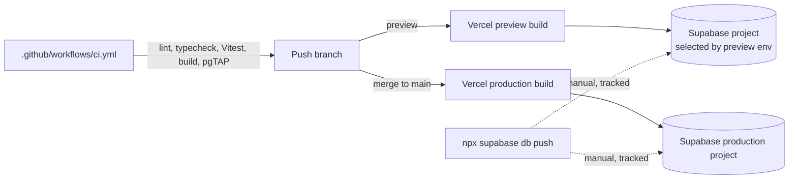

## Overview

The app is a single Next.js project deployed through Vercel's GitHub integration for
`jms-dcksn/lifting-app`. There is no custom deploy pipeline: pushing to `main` releases to
production, and any other branch gets an automatic preview deployment. The recorded
production domain is https://lifting-app-plum.vercel.app, but the current URL should always
be resolved through the Vercel dashboard or GitHub deployment/check status rather than
assumed, since deployment-specific preview URLs churn.

Three things sit outside the automatic Vercel build and must be handled deliberately by a
release author: environment variable configuration (per Vercel environment), Supabase
migration application (`npx supabase db push`, not auto-run by the build), and Supabase Auth
dashboard settings (Site URL, redirect URLs). Getting any of these out of sync with a deploy
is the most common source of "it works locally but not in preview/production."


*Vercel builds the app; it never applies database migrations. Migration application is a
separate, manual, tracked step against whichever Supabase project an environment targets.*

## Environment variables

`.env.local.example` enumerates every configuration variable the application reads:

| Variable | Consumer | Exposure |
| --- | --- | --- |
| `NEXT_PUBLIC_SUPABASE_URL` | Browser/SSR Supabase clients; the weekly Coach loader | Public (bundled into the client) |
| `NEXT_PUBLIC_SUPABASE_PUBLISHABLE_KEY` | Browser/SSR Supabase clients; RLS enforces per-owner access | Public (bundled into the client) |
| `SUPABASE_SECRET_KEY` | Server-only weekly Coach loader; a revocable `sb_secret_...` key that bypasses RLS | Server-only, never `NEXT_PUBLIC_` |
| `COACH_API_USER_ID` | Weekly Coach API — the sole account the endpoint is allowed to read | Server-only |
| `COACH_API_TOKEN` | Weekly Coach API bearer/capability-URL authentication (≥32 high-entropy characters) | Server-only, secret |

The first two are required for the app to function at all and are compiled into the client
bundle at build time — changing either requires a rebuild/redeploy, not just an environment
edit, before clients pick up the new value. The remaining three are optional: without valid
Coach configuration, `GET /api/coach/v1/weekly` returns 503 rather than failing the whole
app. All database reads made through `SUPABASE_SECRET_KEY` in that route are explicitly
scoped to `COACH_API_USER_ID` even though the key itself bypasses RLS — the row-level
restriction is enforced in application code, not the database, for that one path. See
`docs/COACH-REPORT.md` and `/openwiki/integrations/supabase.md` for the full Coach API
contract, auth methods, and privacy properties.

Real values live in an ignored `.env.local` file locally and in Vercel's per-environment
settings (Production and Preview configured separately) in deployment. Before writing test
data through a preview deployment, confirm which Supabase project that preview's environment
variables actually point at — Preview and Production can (and often should) target different
Supabase projects, and there is nothing that prevents a misconfigured preview from writing to
the production database.

CI never uses real secrets for the app/build job: `.github/workflows/ci.yml` builds with
placeholder values (`NEXT_PUBLIC_SUPABASE_URL=http://127.0.0.1:54321`,
`NEXT_PUBLIC_SUPABASE_PUBLISHABLE_KEY=ci-placeholder-publishable-key`) because Next.js only
needs these defined at build time and makes no network request during `next build`.

## Applying database migrations

Supabase is provisioned and migrated independently of the Vercel build:

```bash
npx supabase link --project-ref <project-ref>
npx supabase db push
```

For a brand-new environment this applies every file under `supabase/migrations/` in order.
For an existing project, `db push` is tracked against Supabase's migration history table —
it is meant to bring a project forward to the current migration set, not to be treated as an
idempotent script that can be safely replayed from scratch. Before pushing to an existing
project, inspect its migration history so the operator knows which of the tracked migrations
(covering program phases, session feedback, bodyweight history, Coach recommendation
decisions, exercise swap scope, atomic program/bodyweight-calendar RPCs, period tracking,
rest-tone preference, exercise pins, and body measurement logging) are already applied versus
pending.

Two migrations have UI-visible ordering requirements that make "migrate, then deploy"
non-negotiable:

- Period tracking (`20260915203212_period_tracking.sql`) adds `profile.sex`, consent columns,
  and the `period_observation` table. It must be applied before deploying any build of the
  You (`/settings`) UI that reads those fields, or that UI will fail against a schema that
  doesn't have them yet.
- Rest-complete tone (`20260916120011_rest_tone_enabled.sql`) adds
  `profile.rest_tone_enabled` (default `true`). It must be applied before relying on the
  Settings checkbox that reads it.

Breaking changes to period-tracking consent copy should bump `period_consent_version` in the
corresponding migration/application logic and require re-consent from existing users rather
than silently reinterpreting old consent rows.

**Vercel's build does not run database migrations.** A merge to `main` that depends on schema
introduced by a new migration will deploy application code against the old schema until
someone runs `supabase db push` against that environment's project — order the migration
before the deploy, not after.

## Auth configuration

Email magic-link is the only supported login method. In the Supabase Auth dashboard, Site URL
and the allowed redirect URLs must include the production origin and every preview origin the
team intends to test against. The client-side flow is: the magic-link email points at
`/auth/callback`, which exchanges the PKCE code for a session; `src/proxy.ts` refreshes
session cookies on every matched request; and the app layout and Server Actions authenticate
by calling `getClaims()` directly (see `/openwiki/integrations/supabase.md` for the full
client-construction and auth-boundary model). Because these dashboard settings are edited
outside version control, verify them directly in the target environment at release time
rather than trusting old checklists or screenshots.

## Continuous integration

`.github/workflows/ci.yml` runs on every push to `main` and on every pull request, as two
independent jobs:

- **`app`** — checks out, installs with `npm ci`, then runs `npm run lint`, `npx tsc
  --noEmit`, `npm test` (Vitest, via `vitest run`), and `npm run build` in sequence. The build
  step supplies placeholder public Supabase env vars since no request is made at build time.
- **`database`** — installs dependencies (which pins the Supabase CLI version used, so CI and
  a developer's local `npm run test:db` run the identical binary against the identical test
  files), runs `npx supabase start` to bring up a local Supabase stack, runs `npm run test:db`
  (which resolves to `supabase test db supabase/tests/*_rls.sql`, the pgTAP ownership/RLS
  suite), then tears the stack down with `npx supabase stop` unconditionally (`if: always()`).

Both jobs must pass before a pull request is mergeable in practice. Because the `database`
job runs the pgTAP RLS suite against a real local Postgres instance with the project's actual
migrations and policies applied, an RLS regression on any table the suite covers fails CI
before it can reach `main` — this is a materially stronger guarantee than the mocked
Supabase-client tests Vitest runs in the `app` job. See
`/openwiki/testing/testing-strategy.md` for how the pgTAP suite relates to Vitest's pure-module
and mocked action tests, and for which SQL scripts under `supabase/tests/` are pgTAP
(`*_rls.sql`, TAP output, run by `npm run test:db`) versus plain psql-style checks that must
be run individually with `psql -f` per that feature's own documentation.

`supabase/config.toml` configures the local stack CI and `supabase start` share: only
`db`, `auth`, and `rest` services are enabled (`realtime`, `studio`, `storage`,
`edge_runtime`, and `analytics` are explicitly disabled) to keep the stack lean for both the
GitHub Actions runner and nested-Docker Cloud Agent environments. Its `[auth]` section
(`site_url = "http://localhost:3000"` plus `additional_redirect_urls` globs for `localhost`
and `127.0.0.1`) exists specifically so magic-link PKCE `/auth/callback` verification works
locally, since verifier cookies are per-host.

## Release checklist

There is no separate release script; a release is a reviewed merge, verified locally first:

```bash
npm test
npm run lint
npx tsc --noEmit
npm run build
```

A passing build does not exercise authenticated routes, so within an approved change, push
the branch for a preview deployment, inspect its deployment checks, and manually smoke-test
the flows the change could plausibly affect:

- login/callback (magic link, PKCE exchange, redirect)
- program creation
- planning/Start
- logging/swapping/finishing a workout
- Track/monthly review
- weight calendar edits

Preview writes land in whichever Supabase project that preview's environment variables
select — confirm this before generating test data through a preview URL. Merging or pushing
to `main` releases to production automatically through Vercel's GitHub integration; there is
no manual "promote" step beyond the merge itself.

## Operational notes

- **Rollback does not undo migrations.** Reverting a Vercel deployment (or the merged commit)
  only rolls back application code; any schema change already pushed with `supabase db push`
  remains applied. If a release needs schema repair, write and review a new forward migration
  rather than assuming a rollback restores the previous schema.
- **Token and key rotation** is independent per secret:
  - Rotate `COACH_API_TOKEN` by generating a new high-entropy token, replacing it in the
    deployment's environment settings, updating the capability URL used by any scheduled
    caller after that deployment is live, validating the new token works, and confirming the
    old token now returns 401.
  - Rotate `SUPABASE_SECRET_KEY` independently in both the Supabase project settings and the
    deployment's environment settings whenever database-level access is suspected to be
    exposed; this key bypasses RLS, so leaking it is a broader exposure than leaking the
    Coach token alone.
  - Rotating `NEXT_PUBLIC_SUPABASE_PUBLISHABLE_KEY` additionally requires a rebuild/redeploy
    of every client that already embedded the old value, since it is compiled into the
    browser bundle rather than read at request time.
- This checkout has no pinned Node engine, `.nvmrc`, or `vercel.json`; CI pins Node 20 via
  `actions/setup-node`, but the Vercel-side runtime selection should be verified directly in
  project settings at release time rather than assumed to match.
- Remote deployment health, Auth dashboard settings, and applied-migration state for any
  given environment are operational facts, not something recorded in this repository —
  confirm them directly against the target environment rather than trusting a prior review.
