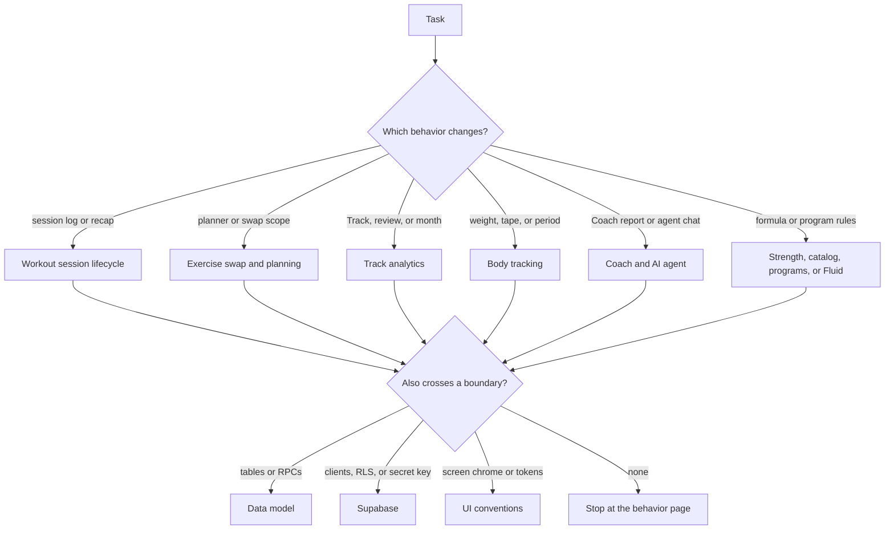

## How to use this wiki

OpenWiki is optional just-in-time context, not required startup reading. Start here only when retrieval tools are unavailable, when architecture or a dependency materially affects the task, or when source inspection leaves an important uncertainty. Read the smallest set of pages below, then stop.

Source code and tests beat wiki pages. If a page and the code disagree, trust the code and treat the page as stale. `docs/architecture.html` is the visual architecture map named in `AGENTS.md`, but it is not in this checkout — do not invent its contents or treat a missing file as a current contract.

Do not enumerate folder indexes. The groups below are the page map.

## Task routing

| If the task is about… | Read |
| --- | --- |
| Request path, auth split, `React.cache()`, mutation revalidation, or why derived caches sit beside `set_log` | [System overview](architecture/overview.md) |
| Postgres tables, owner-scoped RLS shape, additive migrations, atomic write RPCs, or shipped `agent_thread` / `agent_message` rows | [Data model](architecture/data-model.md) |
| e1RM, coefficients, cross-exercise recommendation, double progression, or rebuilding `user_exercise_stat` | [Strength engine](concepts/strength-engine.md) |
| Seeded templates, variant/custom identity, station composition, or machine/cable calibration | [Exercise catalog and identity](concepts/exercise-catalog-and-identity.md) |
| Program tree, templates, classic phases, or the atomic program save | [Programs and periodization](concepts/programs-and-periodization.md) |
| Fluid plateau detection, the rep-range-then-swap ladder, or shared stall evidence | [Fluid and plateau adaptation](concepts/fluid-and-plateau-adaptation.md) |
| Primitives, tokens, copy density, tab chrome, or the exercise visual contract | [UI conventions](concepts/ui-conventions.md) |
| Start, log, rest, finish, records, or failure handling for an active workout | [Workout session lifecycle](workflows/workout-session-lifecycle.md) |
| Cookie-backed next-workout planning, or in-session workout-only vs remainder-of-program swaps | [Exercise swap and planning](workflows/exercise-swap-and-planning.md) |
| Track board, Exercise review, volume, or monthly progress | [Track analytics](workflows/tracking-and-analytics.md) |
| Weight calendar, trend windows, tape measurements, or opt-in period tracking | [Body tracking](workflows/body-tracking.md) |
| Deterministic Coach report, recommendations, the private weekly API, or the shipped read-only AI agent | [Coach and AI agent](workflows/coach-and-ai-agent.md) |
| Browser/server/proxy clients, `getClaims`, owner RLS, the elevated Coach read, or the user-scoped agent path | [Supabase](integrations/supabase.md) |
| Vercel deploy, environment boundaries, migration ordering, CI, or smoke-test limits | [Deployment and configuration](operations/deployment-and-config.md) |
| Vitest, pgTAP, agent evals, or the lint/typecheck/build gate | [Testing strategy](testing/testing-strategy.md) |

One task often needs two pages, not the whole wiki. Pair the behavior page with the boundary it crosses:

- A session write that also changes targets: [Workout session lifecycle](workflows/workout-session-lifecycle.md) plus [Strength engine](concepts/strength-engine.md).
- A swap or planner change that must stay consistent with Fluid: [Exercise swap and planning](workflows/exercise-swap-and-planning.md) plus [Fluid and plateau adaptation](concepts/fluid-and-plateau-adaptation.md).
- Coach facts versus agent language: [Coach and AI agent](workflows/coach-and-ai-agent.md). Schema or RLS for those tables is [Data model](architecture/data-model.md) and [Supabase](integrations/supabase.md), not the workflow page.
- A new screen: [UI conventions](concepts/ui-conventions.md) for primitives and chrome, then the workflow page for the data that screen renders.

*Pick the behavior page first, then add a boundary page only when the change crosses it.*

## Page map

### Architecture

- [System overview and request path](architecture/overview.md) — three layers, auth split, request memoization, and why derived caches exist beside the ledger.
- [Data model and ownership boundaries](architecture/data-model.md) — Postgres schema, owner-scoped RLS, additive migrations, and atomic write RPCs, including shipped agent threads.

### Concepts

- [Strength engine](concepts/strength-engine.md) — e1RM, recommendation, progression, and the rebuildable stat cache.
- [Exercise catalog and identity](concepts/exercise-catalog-and-identity.md) — seeded templates, variant and custom identity, station composition, calibration.
- [Programs and periodization](concepts/programs-and-periodization.md) — classic and Fluid program trees, templates, and week-scoped phases.
- [Fluid and plateau adaptation](concepts/fluid-and-plateau-adaptation.md) — plateau hysteresis, the intervention ladder, and shared stall evidence.
- [UI conventions](concepts/ui-conventions.md) — primitives, tokens, copy density, tab chrome, and the exercise visual contract.

### Workflows

- [Workout session lifecycle](workflows/workout-session-lifecycle.md) — start, log, rest, finish, records, and failure handling.
- [Exercise swap and planning](workflows/exercise-swap-and-planning.md) — cookie-backed next-workout planning versus scoped in-session swaps.
- [Track analytics](workflows/tracking-and-analytics.md) — board, Exercise review, volume, and monthly progress.
- [Body tracking](workflows/body-tracking.md) — weight calendar, trends, tape measurements, and period-tracking privacy.
- [Coach and AI agent](workflows/coach-and-ai-agent.md) — deterministic Coach report and private weekly API, kept separate from the shipped read-only in-app agent.

### Integrations

- [Supabase](integrations/supabase.md) — browser, server, and proxy clients; `getClaims`; owner RLS; the elevated Coach read; the user-scoped agent path.

### Operations

- [Deployment and configuration](operations/deployment-and-config.md) — Vercel deploy, environment boundaries, migration ordering, CI, and smoke-test limits.

### Testing

- [Testing strategy](testing/testing-strategy.md) — Vitest, pgTAP, agent evals, and the lint, typecheck, and build gate.

## Verification routing

For an application change, the owning page says which boundary can fail. The gate itself lives on [Testing strategy](testing/testing-strategy.md): `npm test`, `npm run lint`, `npx tsc --noEmit`, and `npm run build`, plus `npm run test:db` when RLS, ownership, or a covered SQL function changes. Docs-only edits check claims against source instead of those commands. Release and environment limits live on [Deployment and configuration](operations/deployment-and-config.md).
