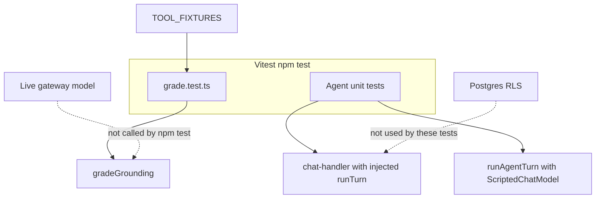
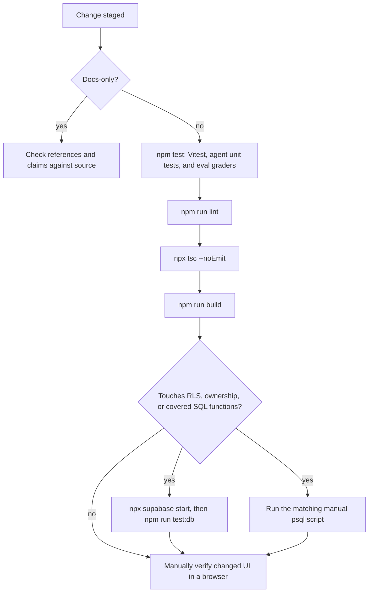

## Overview

Correctness is checked at the boundary that can actually fail, not by one suite:

1. **Vitest** runs co-located TypeScript tests in Node. That includes pure logic, component tests that opt into jsdom, mocked Server Action and data-boundary tests, and agent unit tests. None of these need a database or a live model.
2. **Agent eval graders** also run inside Vitest. They score fixture answers for expected tools and citations. They do not call the gateway model and are not a separate CI job.
3. **pgTAP** under `supabase/tests/*_rls.sql` executes real Postgres row-level security and ownership constraints against a local Supabase stack. `npm run test:db` is that suite, including agent threads. Other SQL files in the same directory are manual `psql -f` scripts and are not part of CI.

Vitest cannot prove that RLS would reject a differently scoped query. pgTAP cannot prove that a Server Action, chat handler, or UI wired the query correctly. Agent unit tests with an injected model or in-memory client cannot prove that a real model stays grounded. A change that crosses those boundaries needs every suite that owns the boundary, plus the lint, typecheck, and build gate below.

There is no browser automation or end-to-end suite. `package.json` defines `test`, `test:watch`, and `test:db` only, and CI has no Playwright, Cypress, or similar job. UI verification is a manual browser check when authenticated state is available.

## Vitest

Configuration is `vitest.config.ts`. The default environment stays `node`, and discovery stays inside `src/lib`:

```ts
export default defineConfig({
  resolve: {
    tsconfigPaths: true,
    alias: { "server-only": "next/dist/compiled/server-only/empty.js" },
  },
  test: {
    environment: "node",
    include: ["src/lib/**/*.test.ts", "src/lib/**/*.test.tsx"],
  },
});
```

- Both `.test.ts` and `.test.tsx` are discovered. Tests sit next to the module they cover (`program-templates.ts` / `program-templates.test.ts`, `src/lib/agent/chat-handler.ts` / `chat-handler.test.ts`). There is no separate `test/` or `__tests__` tree, and files outside `src/lib` are not part of `npm test`.
- `resolve.tsconfigPaths` keeps the `@/` imports used by app code working under Vitest.
- The `server-only` alias points at Next's empty server build (`next/dist/compiled/server-only/empty.js`). Next strips that module in a server build; Vitest does not, so modules such as `src/lib/agent/thread.ts` and `src/lib/coach-weekly-data.ts` would otherwise throw when a unit test imports them. The alias makes the import a no-op. It does not make those modules safe to import from client code.
- `npm test` is `vitest run`. `npm run test:watch` is `vitest` without `run`.

### Default Node, per-file jsdom

The suite default remains `node`, which fits the pure modules that dominate `src/lib` (strength math, analytics, catalog identity, program templates, stall classification). A file that needs a DOM opts in with a first-line `// @vitest-environment jsdom` pragma. That includes component tests such as `info-button.test.tsx`, `rest-timer.test.tsx`, and `agent-chrome.test.tsx`, and the non-component `copy-text.test.ts`. The pragma does not change the suite default. `jsdom` is a devDependency so those files can render with `react-dom/client` rather than a browser runner.

### Pure logic and mocked boundaries

Two practical shapes cover most of `src/lib`:

- **Pure logic tests** call an exported function with fixture input and assert the return value. Strength calculations, template assembly, stall classification, and weekly or monthly summaries have no I/O and no mocks.
- **Mocked action and data-boundary tests** exercise a Server Action or a Supabase-backed loader with `createClient` replaced by `vi.mock`. The mock records `select`, `insert`, `update`, and `delete`, plus chained filters such as `.eq("id", …)` and `.eq("user_id", owner)`. Assertions check that sequence, not only a success flag. `src/lib/program-actions.test.ts` is the canonical pattern, including mocked `rpc`, `auth.getClaims`, and `revalidatePath`. `src/lib/coach-api.test.ts` applies the same idea to the private weekly Coach API by mocking `loadWeekly` and checking authorization, token handling, and response shape.

Those mocks prove the application asked for an owner-scoped operation. They do not prove Postgres would reject a different query. That proof is the pgTAP tier.

### Agent unit tests

Agent behavior that can be decided without a database or a live model is co-located under `src/lib/agent/` and runs in the same `npm test` suite:

| File | What it locks |
| --- | --- |
| `policy.test.ts` | Read-tool names, empty write-tool list, last-N and character budget, and the dedicated LangSmith project name. |
| `chat-state.test.ts` | Thread id parsing, `?thread=` selection, titles, and the chat reducer. |
| `markdown.test.ts` | Source-line splitting and the small markdown renderer used for coach replies. |
| `tools/tools.test.ts` | Read tools against mocked `loadCoachUi` and `getActiveProgram`, plus exact exercise identity and `sessionTarget` hydration. |
| `run.test.ts` | `runAgentTurn` with an injected `ScriptedChatModel`. It checks streamed tool events and that chain, model, and tool callbacks receive `metadata.thread_id`. |
| `chat-handler.test.ts` | `createAgentChatHandlers` with an injected `auth` and `runTurn`, over an in-memory `agent_thread` / `agent_message` store. |

The handler tests are the application-side ownership checks. Unauthenticated POST returns 401 before tools run. A missing or invalid thread id, or blank text, returns 400 and writes nothing. A missing gateway key (`AI_GATEWAY_API_KEY` and `VERCEL_OIDC_TOKEN` both empty) returns 503 before any insert. `threadId: null` creates an owned thread, streams `thread` then `done`, and persists the user and assistant rows. Continuing an owned thread passes earlier messages into `runTurn`. Another user's thread returns 404 without running the agent or writing. If the first message insert fails, the new thread is removed. GET returns the latest owned snapshot, a draft for `?thread=new`, 404 for another user's thread, and 400 for a bad id, and it does not write.

`run.test.ts` never calls `createGatewayModel`. The handler suite stubs a gateway key only so the route proceeds, then replaces `runAgentTurn`. Passing these tests does not show that the real gateway, RLS, or citation behavior works.

## Agent evals

`src/lib/agent/evals/` is a grounding rubric, not a live agent run. `cases.ts` exports `EVAL_CASES`: about twenty labeled questions, each with `expectedTools`, `expectedCitations`, and a `goldAnswer`. The tool names are the four read tools (`weeklyCoach`, `activeProgram`, `exerciseReview`, `nextWorkout`). Refusal cases (`refuse-write`, `refuse-period`, `refuse-start`) expect no tools and no citations. `fixtures.ts` builds `TOOL_FIXTURES` from the same domain helpers the tools use, including `hydrateSlotTargets` and `summarizeExerciseReview`, so gold citations are numbers the product code would actually emit.

`gradeGrounding` in `evals/grade.ts` returns `{ pass, reasons }`. It fails when an expected tool was not used, when any used tool is in `WRITE_TOOL_NAMES`, when a used tool is neither a known read tool nor expected for that case, or when the answer text does not contain each expected citation value and source. The source check also accepts the literal `sessionTarget`, so a next-workout gold answer can name the function that produced the target. `goldUsesFixtureNumbers` grades a case's own gold answer as if the expected tools ran. `inventedAnswer` grades a fixed wrong answer ("Typical squat is 315…") and is the negative control.

`evals/grade.test.ts` is an ordinary Vitest file, so `npm test` and the CI `app` job run it. It requires at least twenty cases, requires every gold answer to pass, requires the invented week answer to fail on a missing citation, pins the fixture squat target at 230 lb for 6 reps from progression, and rejects `saveProgram` even when the answer's citations are empty. Nothing in this directory constructs `ChatOpenAI`, reads `AI_GATEWAY_API_KEY`, or starts a LangSmith experiment. A model change, prompt change, or tool-selection bug is invisible here unless someone separately captures used tools and the answer and passes them to `gradeGrounding`.



*Agent unit tests and the citation rubric both run in Vitest. Neither calls the live model nor Postgres.*

## pgTAP ownership suite

`supabase/tests/` holds SQL that runs against a local Supabase Postgres. `supabase/seed.sql` enables the extension the TAP scripts need:

```sql
create extension if not exists pgtap with schema extensions;
```

Seeds run on `supabase start` and `supabase db reset`. They are not applied by `supabase db push`, so this does not install pgTAP on a deployed project. Scripts wrap fixtures and assertions in `begin; … rollback;`, so they leave no rows behind.

### What `npm run test:db` runs

`package.json` defines:

```json
"test:db": "supabase test db supabase/tests/*_rls.sql"
```

The glob is the ownership suite. It requires the Supabase CLI pinned as a devDependency and a running local stack (`npx supabase start`). CI and local runs therefore use the same binary and the same file set. Files that do not end in `_rls.sql` are not selected.

Current TAP scripts: `agent_thread_rls.sql`, `body_measurement_rls.sql`, `bodyweight_history_rls.sql`, `coach_recommendation_decisions_rls.sql`, `period_tracking_rls.sql`, `program_rls.sql`, `session_feedback_rls.sql`, `set_log_rls.sql`, and `user_exercise_pin_rls.sql`. Each calls `select plan(N)`, uses pgTAP assertions such as `is(...)` and `throws_ok(...)`, and finishes with `select * from finish()`.

The shared shape, illustrated by `set_log_rls.sql` and `agent_thread_rls.sql`:

1. Insert two `auth.users` fixtures and matching owned rows inside the rolled-back transaction.
2. `set local role authenticated` and `set_config('request.jwt.claim.sub', <owner-uuid>, true)` so the request looks like that user to `auth.uid()`.
3. Assert the owner can read and write only their own rows.
4. Assert cross-user writes fail with `42501`, or that a silently filtered update or delete matched zero rows when re-checked as an unrestricted role.

`agent_thread_rls.sql` plans 11 assertions and belongs in this suite, not in the manual list. As the owner it can read one thread and one message, insert a message on its own thread, and start a second thread. It cannot create a thread or message for the other user (`42501`). A thread insert without the app-chosen id fails `23502`, because the multi-thread migration dropped the `gen_random_uuid()` default so the app can supply a UUID v7. Attaching the owner's message to the other user's thread, or moving an owned message onto that thread, fails `23503` from `agent_message_thread_owner_fkey` — the composite `(thread_id, user_id)` foreign key. RLS alone would not stop that, because the message's `user_id` still matches the caller. The script also checks that an owner can update their own message parts.

The in-memory store in `chat-handler.test.ts` imitates the null-id and cross-thread failures. Only this SQL file proves the policies and constraint against Postgres.

### Manual `psql -f` scripts

The other files in `supabase/tests/` are not matched by `*_rls.sql`, so `npm run test:db` and CI never run them. They also do not call `plan()` / `finish()`. They use PL/pgSQL `assert` inside a `do $$ … $$` block, or a final `select 'PASS: …' as result;`. A thrown exception aborts the script and its `rollback`, but there is no TAP count. Run and read them individually:

```bash
psql -f supabase/tests/program_mutations.sql
```

| Script | What a reviewer is checking |
| --- | --- |
| `program_mutations.sql` | `save_program` / `set_active_program`: one active program, cross-user save or activate rejected, empty day trees rejected, `program_slot.id` continuity, and a failing trigger that must roll back a partial multi-table write. |
| `bodyweight_calendar_writes.sql` | One bodyweight reading per date, ownership-scoped overwrite. |
| `exercise_swap_scope.sql` | `swap_session_exercise` workout scope does not mutate `program_slot` or prior `set_log`; program scope updates that slot only; invalid scope or an unrelated slot is rejected. |
| `period_tracking.sql` | Period-tracking data invariants, distinct from `period_tracking_rls.sql`. |
| `strong_foundations_variety.sql` | Exercise-variety invariants for the Strong Foundations template. |

A schema or function change that only breaks one of these will not fail CI. The reviewer runs the script that covers the functions or tables they touched. Feature docs carry the execution notes — for example `docs/PROGRAM-TRANSACTIONS.md` for `program_mutations.sql`.

## CI

`.github/workflows/ci.yml` runs two independent jobs on every push to `main` and every pull request. Both use Node 20 and `npm ci`.

- **`app`** (`Lint, typecheck, test, build`): `npm run lint`, `npx tsc --noEmit`, `npm test`, then `npm run build`. The build sets placeholder `NEXT_PUBLIC_SUPABASE_URL` (`http://127.0.0.1:54321`) and `NEXT_PUBLIC_SUPABASE_PUBLISHABLE_KEY`. The build only needs those defined; it does not call Supabase. `npm test` includes agent unit tests and `evals/grade.test.ts`. It does not include `test:db`.
- **`database`** (`Database RLS tests`): `npx supabase start`, then `npm run test:db`, then `npx supabase stop` with `if: always()` so the stack is torn down on failure. Because `test:db` is the `*_rls.sql` glob, an agent-thread RLS or composite-key regression fails this job. Manual scripts do not.

`openwiki-update.yml` refreshes the wiki. It is not a verification gate for application changes.

## Verification gate

`AGENTS.md` requires, for application changes, `npm test`, `npm run lint`, `npx tsc --noEmit`, and `npm run build`, then a manual browser check of changed UI flows when authenticated state is available. That local sequence matches the CI `app` job. `npm run test:db` is separate because it needs Docker and a local stack. Run it when a change touches RLS, owner-scoped tables, or the `SECURITY DEFINER` / `SECURITY INVOKER` functions covered by the TAP scripts. CI runs it on every pull request regardless. When the change touches a function covered only by a manual script, run that `psql -f` file as well. Docs-only edits check references and claims against source instead of the code commands.



*The required local gate mirrors CI's app job. Database TAP and manual SQL are extra when the change can break them. Browser verification is manual.*

## Relationship to other pages

- [Supabase integration](../integrations/supabase.md) documents the publishable-key clients, `getClaims()`, owner RLS, and the composite `agent_message_thread_owner_fkey` that `agent_thread_rls.sql` executes.
- [Coach report and AI agent](../workflows/coach-and-ai-agent.md) documents the read tools, chat route, and thread model these unit tests and graders lock. This page owns how they are verified.
- [Strength engine](../concepts/strength-engine.md) documents the pure calculations whose co-located Vitest files are the right boundary for formula changes.
- [Deployment and configuration](../operations/deployment-and-config.md) documents the release path around this gate, including preview deploys and the placeholder env vars the CI build uses.
