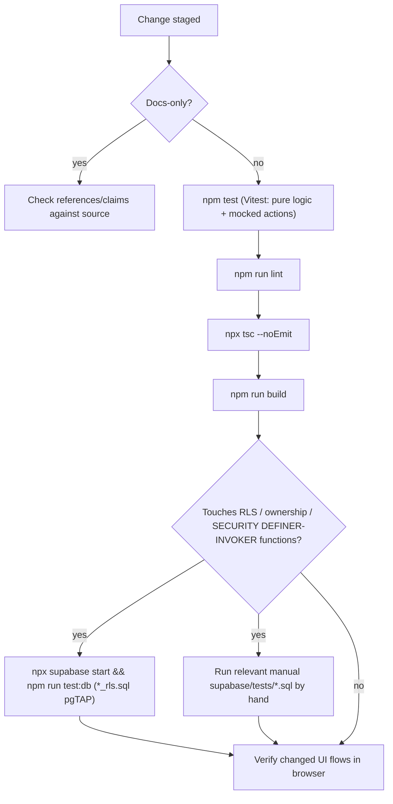

## Overview

The app verifies correctness on two independent tiers, because a single tier cannot cover both
of its responsibilities:

1. **Vitest** exercises pure TypeScript logic (the strength engine, analytics, program
   templates, etc.) and mocked Server Action / data-boundary behavior in Node, without a
   database.
2. **pgTAP SQL scripts** under `supabase/tests/` exercise real Postgres row-level security
   (RLS) and transactional atomicity against a local Supabase stack, because RLS policies and
   `SECURITY DEFINER`/`SECURITY INVOKER` functions can only be proven correct by executing them
   as Postgres would.

Neither tier substitutes for the other: Vitest cannot prove that RLS actually denies a
cross-user write, and pgTAP scripts do not exercise UI or Server Action wiring. A change that
touches both application code and schema/policy needs both suites to pass, plus the standard
lint/typecheck/build gate described below.

## Vitest: co-located unit and mocked-action tests

Configuration lives in `vitest.config.ts`:

```ts
export default defineConfig({
  resolve: { tsconfigPaths: true },
  test: {
    environment: "node",
    include: ["src/lib/**/*.test.ts", "src/lib/**/*.test.tsx"],
  },
});
```

- Discovery is restricted to `src/lib/**/*.test.ts(x)`, so test files are co-located next to the
  module they cover (for example `program-templates.ts` / `program-templates.test.ts`,
  `stall-report.ts` / `stall-report.test.ts`). There is no separate `test/` or `__tests__` tree.
- The default environment is `node`, appropriate for the pure-function modules that dominate
  `src/lib` (strength math in `src/lib/strength/`, analytics, catalog/exercise-identity helpers,
  program template generation, stall/period classification). Tests that need a DOM (component
  tests such as `info-button.test.tsx`, `rest-timer.test.tsx`) opt in per-file with a
  `// @vitest-environment jsdom` pragma at the top of the file rather than switching the whole
  suite to jsdom.
- Run the whole suite with `npm test` (`vitest run`); `npm run test:watch` runs it in watch mode
  during development.

### Two kinds of Vitest test

Within `src/lib`, tests fall into two practical categories:

- **Pure logic tests** call an exported function directly with fixture input and assert on its
  return value — e.g. e1RM/strength calculations, program template assembly, stall
  classification, weekly/monthly analytics summaries. These have no I/O and no mocks.
- **Mocked action / data-boundary tests** exercise a Next.js Server Action (or a data-loading
  helper that calls Supabase) with `@/lib/supabase/server`'s `createClient` mocked out via
  `vi.mock`. The mock's `from(table)` builder records every `select`/`insert`/`update`/`delete`
  call and the filter values chained onto it (typically `.eq("id", …)` and
  `.eq("user_id", owner)`), and the test asserts on the exact sequence of writes and filters —
  not just that the action "succeeded". This is how the app proves, without a database, that an
  action such as `deleteProgram` only ever issues a delete scoped to `id` **and** `user_id`, and
  never touches unrelated tables like `set_log`. See `src/lib/program-actions.test.ts` for the
  canonical pattern (mocked `from`, `rpc`, and `auth.getClaims`, plus assertions on
  `revalidatePath` calls) and `src/lib/coach-api.test.ts` for the analogous pattern applied to
  the private weekly Coach API, where the handler's authorization/token check and response shape
  are exercised against a mocked `loadWeekly` rather than a real database.

Because these are mocks of the Supabase client, they validate that application code *asks for*
owner-scoped access correctly — they cannot prove that Postgres RLS would actually reject a
differently-scoped query if the application code had a bug. That guarantee comes from the pgTAP
tier.

## pgTAP: SQL ownership and atomicity regressions

`supabase/tests/` holds SQL scripts that run against a real local Supabase/Postgres instance.
`supabase/seed.sql` enables the extension the suite depends on:

```sql
create extension if not exists pgtap with schema extensions;
```

Every script wraps its fixtures and assertions in `begin; … rollback;`, so none of them leave
data behind or touch real user rows — they run entirely inside a transaction that is always
rolled back, even in CI.

### TAP-checked scripts (`*_rls.sql`)

Files whose name ends in `_rls.sql` use real pgTAP: they call `select plan(N);` up front, make a
series of `select is(...)`, `select throws_ok(...)` (and similar pgTAP assertion functions)
calls, and finish with `select * from finish();`. These emit standard TAP output that a test
runner can count and verify against the declared plan. The common shape, illustrated by
`supabase/tests/set_log_rls.sql`:

1. Insert two `auth.users` fixtures (an owner and another user) and matching owned rows.
2. `set local role authenticated;` and `select set_config('request.jwt.claim.sub', <owner-uuid>, true);` to simulate an authenticated request as the owner (mirroring how PostgREST/Supabase sets JWT claims per-request).
3. Assert the owner can read/insert/update/delete only their own rows.
4. Assert cross-user writes are rejected — either via `throws_ok(..., '42501', ...)` (insufficient-privilege) for the case that must fail as the acting user, or via `reset role;` afterward to confirm, from an unrestricted role, that a "successful" `update`/`delete` attempted as the wrong user actually matched zero rows and left the other user's data untouched.

The current `*_rls.sql` files are: `body_measurement_rls.sql`, `bodyweight_history_rls.sql`,
`coach_recommendation_decisions_rls.sql`, `period_tracking_rls.sql`, `program_rls.sql`,
`session_feedback_rls.sql`, `set_log_rls.sql`, and `user_exercise_pin_rls.sql` — one per
owner-scoped table (or closely related group of tables) that carries `user_id`-based RLS.

`npm run test:db` runs exactly this set:

```json
"test:db": "supabase test db supabase/tests/*_rls.sql"
```

which requires the Supabase CLI (`supabase`, pinned as a devDependency so CI and local runs use
the same binary) and a running local stack (`npx supabase start`).

### Manual `psql -f` scripts (not glob-matched, not TAP)

The remaining files in `supabase/tests/` do not match `*_rls.sql` and are therefore never picked
up by `npm run test:db` or CI. They also do not call pgTAP's `plan()`/`finish()`; instead they
use plain PL/pgSQL `assert` statements inside a `do $$ … $$` block, or a final
`select 'PASS: …' as result;` line, and emit no TAP output — a syntax error or unhandled
exception aborts the script and its enclosing `rollback`, but there is no structured pass/fail
count to check. These scripts must be run individually and read by hand:

```bash
psql -f supabase/tests/program_mutations.sql
```

Current manual scripts and what each proves:

- `program_mutations.sql` — atomicity and invariants of `save_program`/`set_active_program`:
  exactly one active program at a time, cross-user save/activate rejected, empty-days trees
  rejected, and `program_slot.id` continuity preserved across an edit-in-place save. It also
  injects a failing trigger to confirm a partial multi-table write rolls back completely rather
  than leaving orphaned phases/days/slots.
- `bodyweight_calendar_writes.sql` — write/overwrite semantics for the shared bodyweight
  calendar (one reading per date, ownership-scoped).
- `exercise_swap_scope.sql` — `swap_session_exercise`'s workout-vs-program scope split: a
  workout-scoped swap must not mutate `program_slot` or prior `set_log` rows; a program-scoped
  swap must update the slot's prescription without touching other days, prior logs, or
  unrelated slots' independent entries in `workout_session.exercise_swaps`; an invalid scope or
  an unrelated slot must be rejected.
- `period_tracking.sql` — period-tracking data invariants (as distinct from
  `period_tracking_rls.sql`'s ownership checks).
- `strong_foundations_variety.sql` — exercise-variety/selection invariants for the Strong
  Foundations program template.

Because CI never executes these, a schema or function change that only breaks a manual script
will not fail the build automatically — reviewers must run the relevant script by hand (per the
execution notes in that feature's own doc, e.g. `docs/PROGRAM-TRANSACTIONS.md` for
`program_mutations.sql`) whenever they touch the functions or tables it covers.

## CI wiring

`.github/workflows/ci.yml` runs two independent jobs on every push to `main` and every pull
request:

- **`app`** — `npm ci`, `npm run lint`, `npx tsc --noEmit`, `npm test` (Vitest), then
  `npm run build` with placeholder `NEXT_PUBLIC_SUPABASE_URL` /
  `NEXT_PUBLIC_SUPABASE_PUBLISHABLE_KEY` env vars (the build only needs these defined; no
  network request is made at build time).
- **`database`** — `npm ci`, `npx supabase start` (local Docker-based Supabase stack), then
  `npm run test:db` (the `*_rls.sql` pgTAP suite), then `npx supabase stop` (with
  `if: always()` so the stack is torn down even on failure).

An RLS regression on any table covered by a `*_rls.sql` script fails the `database` job and
therefore the pull request's required checks. A regression in one of the manual scripts does not
fail CI and depends on a human running it.

## The verification gate for application changes

`AGENTS.md` states the required gate for application (non-docs-only) changes: run `npm test`,
`npm run lint`, `npx tsc --noEmit`, and `npm run build`, then verify changed UI flows in a
browser when authenticated state is available. This mirrors the CI `app` job locally, so a
contributor who passes it before pushing should not be surprised by the `app` CI job failing.
`npm run test:db` is called out separately because it needs Docker and a running local Supabase
stack; it is expected to be run when the change touches RLS policies, ownership-sensitive
tables, or the `SECURITY DEFINER`/`SECURITY INVOKER` functions those `*_rls.sql` (or manual)
scripts cover, and CI runs it unconditionally regardless of what changed.

For docs-only edits, the gate instead requires checking references and claims against source,
rather than running the code-verification commands.



## Relationship to other pages

- [Data model](../architecture/data-model.md) documents the full RLS table inventory that the
  `*_rls.sql` suite exists to protect.
- [Supabase integration](../integrations/supabase.md) documents the ownership functions (such as
  `save_program`, `set_active_program`, `swap_session_exercise`) whose atomicity is proven by the
  manual `supabase/tests/*.sql` scripts.
- [Deployment and configuration](../operations/deployment-and-config.md) documents the release
  flow that surrounds this verification gate (preview deploys, smoke tests, Vercel merge-to-main
  release).
