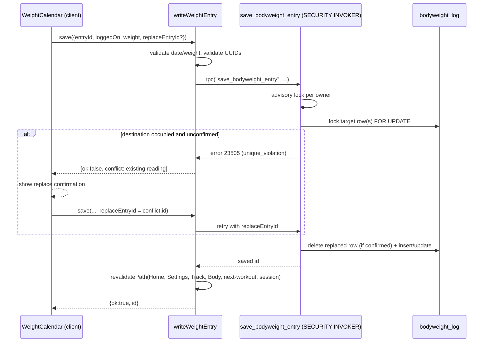

## Overview

This workflow covers four related pieces of the Track/You experience, all keyed to
America/Chicago, date-only observations:

- The **weight calendar** Sheet (`src/components/weight-calendar.tsx`), a shared UI opened
  from both Settings (`/settings`) and the Track Body weight card, backed by an atomic
  `save_bodyweight_entry` RPC.
- **Weight trends** (`/analytics/body`, `src/lib/weight-trends.ts`, `src/lib/bodyweight.ts`):
  rolling seven-day means, weekly bars, and goal-distance summaries.
- **Body measurements** (`/analytics/body`, `src/lib/body-measurements.ts`): tape-based
  waist/neck/arm/thigh/chest inches, charted alongside the weight card.
- **Period tracking** (`src/lib/period-calendar.ts`, `src/app/(app)/period/actions.ts`,
  `src/components/period-calendar.tsx`, `src/components/period-tracking-settings.tsx`): an
  opt-in, female-only, consent-gated calendar of observed period days that overlays
  monthly weight/e1RM charts as context only.

All four share the same date-key conventions (`YYYY-MM-DD`, validated by
`parseDateKey`/`validWeightDate` in `src/lib/bodyweight.ts` and `src/lib/weight-calendar.ts`)
and the same Monday-first calendar layout.

## Weight calendar

### Entry points and interaction

The Weight calendar Sheet is reused by `LogWeightButton` on `/settings` and by the
"Log weight" button on the Track Body weight card (`weight-trend-card.tsx`). It opens
with today selected, or a specific date when invoked from a recent-reading row. Users
browse with month arrows or "Jump to month"; the calendar starts on Monday, dots mark
recorded readings, and an outline marks today. Arrow keys move focus, Home/End move
within a week, PageUp/PageDown move between months, and Enter/Space selects a day.

Selecting an empty day offers **Save**; an existing reading prefills its value and offers
**Update** or **Remove**. Expanding "Correct the date" and choosing a different date
*moves* the reading; if the destination already has a reading, a separate confirmation
step names the reading that will be replaced before the move is retried with
`replaceEntryId` set. Removal asks for its own confirmation. Failed saves keep the
user's input in place; failed month loads show an inline **Retry**.

### Data contract

- `loadWeightMonth` (`src/app/(app)/weight/actions.ts`) reads one calendar month for the
  authenticated user with explicit `user_id`/`logged_on` predicates — at most 31 rows,
  since `(user_id, logged_on)` is unique.
- `writeWeightEntry` validates the date (`validWeightDate`, today-or-earlier back to
  `0001-01-01`) and the weight (finite, `0 < weight <= 1500` lb) before calling the
  `save_bodyweight_entry` RPC.
- `save_bodyweight_entry` (added in `20260912143620_bodyweight_calendar_writes.sql`) is a
  `SECURITY INVOKER` Postgres function that:
  1. Requires `auth.uid()` to be set (raises `42501` otherwise).
  2. Re-validates the date and weight server-side.
  3. Takes a per-owner `pg_advisory_xact_lock` (keyed on `hashtextextended(user_id, 0)`) to
     serialize concurrent calendar writes for the same user, including writes that target a
     previously empty date.
  4. If `p_entry_id` is supplied, locks that row `FOR UPDATE` and confirms it still belongs
     to the caller (`P0002` if not found).
  5. Locks any existing row at the destination date; if one exists and differs from
     `p_entry_id`, it is deleted only when `p_replace_entry_id` explicitly matches it —
     otherwise it raises `23505` so the client can render the "replace this reading?"
     confirmation.
  6. Inserts (new entry) or updates (`logged_on`, `weight`, `updated_at`) in the same
     transaction and returns the saved row's id.
- The RPC is revoked from `public`/`anon` and granted only to `authenticated`; the migration
  adds only this function and its grants — it does not rewrite existing observations.
- `getCurrentBodyweight` (`src/lib/current-bodyweight.ts`) stays newest-`logged_on`-first,
  falling back to `profile.bodyweight` only when no `bodyweight_log` rows exist. Calendar
  writes never touch `profile.bodyweight`, historical sets, e1RMs, or strength caches.
- Successful writes/removals call `revalidatePath` for Home, Settings, Track (`/analytics`),
  the monthly review, the Body page, the next-workout preview, and the session route, so all
  of these read the corrected history immediately. Goal changes in Settings also revalidate
  Track's monthly review.

### Verification

- `npm test` covers calendar date boundaries and the authenticated server actions
  (`src/lib/weight-calendar-actions.test.ts`).
- `supabase/tests/bodyweight_calendar_writes.sql` is a rollback-only test using synthetic
  users: it asserts the RPC is denied to `anon`, that cross-user edits raise
  `no_data_found`, that an unconfirmed overwrite raises `unique_violation`, that invalid
  and future dates are rejected, and (via an injected trigger failure after the replacement
  target is deleted) that the whole transaction rolls back rather than leaving a deleted
  row with no replacement.
- Manual preview review: open Log weight, pick a date several months back, exercise
  save/update/remove, then correct a reading onto an already-occupied date and both confirm
  and cancel the replacement.
- The additive migration must exist in the preview database before these flows can be
  exercised there.

## Weight trends

`/analytics/body` (via `WeightTrendCard`, `src/app/(app)/analytics/weight-trend-card.tsx`)
plots measured weights as dots, a trailing seven-calendar-day mean as a line, and the
saved goal as a dashed reference. The default range is 90 days; 30 days, six calendar
months (month-end clamped via `weightRangeStart`), and all history are also selectable.
The chart uses numeric timestamp positions so real gaps and elapsed time are preserved
rather than compressed.

- `weightChartData` (`src/lib/weight-trends.ts`) reuses `bodyweightTrend`
  (`src/lib/bodyweight.ts`) for every rolling window: the "current" window is the as-of day
  plus the six preceding calendar days, and "previous" is the immediately preceding,
  non-overlapping seven-day window. No observations in a window means `average: null` —
  never a fabricated zero or raw substitute. Points with fewer than three observations
  render as hollow trend markers.
- Summary metrics (latest reading, seven-day average, change vs. prior seven days) always
  use *today* and the prior non-overlapping seven days, independent of the chart's selected
  range filter, so switching ranges never changes what "today's average" means.
- `weeklyWeightData` produces 12 Monday–Sunday calendar-week bars matching the ISO-week
  boundary; the current week is clipped to today and flagged `partial`.
- `loadWeightHistory` reads all owner-scoped observations through today with keyset
  pagination, looping until an empty page (so a server page-size cap smaller than the
  requested 500 rows still yields the full history). Errors surface to the caller rather
  than silently rendering a partial series.
- Tapping a raw dot, or using the equivalent control in the accessible data table, opens
  the shared weight calendar pre-selected at that date; corrections/removals there trigger
  the same revalidation described above, which rebuilds the chart, summary cards, and
  weekly bars.
- The monthly review (`/analytics/month`) reuses this same card with an explicit calendar
  window: chart points are clipped to the window while rolling averages still look back the
  prior six days outside it; summary averages are anchored to the window's end date and
  labeled accordingly. The displayed goal is always the current Settings value, not a
  frozen historical one.

### Goal distance (not a percentage)

`weightGoalDistance` (`src/lib/weight-trends.ts`) reports only **absolute distance and
position** (`"above" | "below" | "at"`, with `"at"` when within 0.05 lb) between the
current seven-day average and `profile.goal_weight`. This is intentional: the schema
stores `goal_weight` but no frozen goal-start observation, so the code does not infer
gain/loss intent, invent a completion percentage, or declare a crossed goal "done" without
a starting point. Goal changes apply immediately and filters never redefine a baseline.
A future percentage indicator would require atomically freezing a baseline weight when a
goal is created or changed — that does not exist today.

## Body measurements

The Body page keeps the weight card first and plots tape-measurement sites beneath it.
Each row in `body_measurement_log` is one site on one Chicago date key; a site with no
value for a date is simply a missing row, not a null column (`src/lib/body-measurements.ts`).

- `SITES` is the fixed list used for validation, chips, and the chart: **waist, neck, arm,
  thigh, chest**. V1 stores a single arm number and a single thigh number (no left/right
  split).
- `writeMeasurements` (`src/app/(app)/measurements/actions.ts`) parses the payload with
  `parseMeasurementWrite` before touching the database: inches must be `0 < inches <= 80`,
  the date must be today or earlier, and only sites with a submitted value are written —
  leaving a field blank never deletes an existing row for that site/date. The same
  `(user_id, logged_on, site)` combination is replaced via `upsert`. Submitting with no
  populated fields returns "Enter at least one site." and writes nothing.
- The write action revalidates only `/analytics/body`; it never touches session, workout,
  or next-workout routes. Tape inches never enter `effectiveLoad`, `getCurrentBodyweight`,
  or the Coach API — they are display-only body-composition context.
- Reads map rows with `parseMeasurementRow`, and `seriesBySite`/`sitesWithPoints` group
  them per site; chips default on for every site that has at least one point, and toggling
  a chip shows/hides that series. `measurementChartData` filters by the same
  `weightRangeStart` range logic used for weight trends. Measurements have no goal line and
  no period overlay.
- The Log control opens a Sheet defaulting to today's date, with all five inch fields
  optional.
- **Ownership:** RLS mirrors `bodyweight_log` — authenticated owners can select, insert,
  update, and delete only their own rows. `supabase/tests/body_measurement_rls.sql` covers
  owner isolation, a denied cross-user insert, invalid inches, a future date, and a
  duplicate `(logged_on, site)` write.

## Period tracking

Period tracking is an **opt-in, female-only** feature that records observed menstrual
bleeding days for monthly-progress context. It adds markers to the calendar and shaded
context bands to weight/e1RM charts. It is explicitly **not** a prediction, fertility, or
training-automation feature: v1 stores calendar observations only.

Despite `docs/PERIOD-TRACKING.md` reading as a "design spec... status: Proposed", the
feature is implemented in this codebase: migration `20260915203212_period_tracking.sql`
added the schema, and `src/lib/period-calendar.ts`, `src/app/(app)/period/actions.ts`,
`src/app/(app)/settings/actions.ts`, `src/components/period-calendar.tsx`, and
`src/components/period-tracking-settings.tsx` implement it. The doc should be read as
design rationale rather than current status; the eligibility, consent, and privacy rules
below reflect the shipped code.

### Eligibility and consent

- `profile.sex` is `text` with a check constraint restricting it to `unspecified` (default),
  `male`, or `female`. The live Settings UI (`src/app/(app)/settings/page.tsx`) offers only
  these three options — the doc's optional fourth "Prefer not to say" value was not built.
- `profile.period_tracking_enabled` (boolean, default `false`), `period_consent_version`
  (text, e.g. `"v1"`), and `period_consent_granted_at` (timestamptz) round out the consent
  fields on `profile`.
- **Eligibility gate:** `isEligibleForPeriodTracking` (`src/lib/period-calendar.ts`) requires
  both `sex = 'female'` **and** `period_tracking_enabled = true`. Every read/write helper in
  `period-calendar.ts` re-checks this at call time — nothing infers eligibility from name,
  training data, or any other signal.
- `enablePeriodTracking` (`src/app/(app)/settings/actions.ts`) refuses to enable tracking
  unless `profile.sex === "female"`, then sets `period_tracking_enabled = true`,
  `period_consent_version = "v1"`, and stamps `period_consent_granted_at`.
- `saveProfile` auto-disables tracking (clearing `period_tracking_enabled` and
  `period_consent_version`, but not `period_consent_granted_at`) whenever the user changes
  `sex` away from `"female"` while tracking was enabled — this hides observations without
  deleting them, matching the "never silently delete" privacy rule.

### Data and access control

- `period_observation` (one row per observed day): `id`, `user_id` (FK to `auth.users`,
  `ON DELETE CASCADE`), `observed_on` (`date`, not-future via a check constraint), and
  timestamps. Unique on `(user_id, observed_on)`, indexed on the same pair for calendar
  range queries — one observation per user per day, no interval/range records.
- RLS policy `"users manage own period observations"` scopes all operations to
  `auth.uid() = user_id`. The *tracking-enabled* gate is enforced at the application layer,
  not in RLS: `isEligibleForPeriodTracking` is called before every load/save in
  `period-calendar.ts`, so disabled users see no observations even though the rows still
  exist and technically satisfy RLS.
- `savePeriodObservation` re-validates eligibility and the date (`validWeightDate`, reusing
  the weight calendar's today-or-earlier rule) before an `upsert` on
  `(user_id, observed_on)`. `deletePeriodObservation` removes one row by id+owner;
  `deleteAllPeriodObservations` hard-deletes every row for a user (used by the
  disable-and-delete-history flow, and would also run as part of account deletion's
  existing cascade).

### Settings UI and lifecycle

`PeriodTrackingSettings` (`src/components/period-tracking-settings.tsx`), rendered from
`/settings`, drives the whole lifecycle from a small state matrix:

- `sex !== "female"` and history exists → a "Manage hidden period data" card with only a
  **Delete history permanently** action (data stays hidden but is never silently removed).
- `sex === "female"`, never enabled, no history → **Enable period tracking** button opens a
  consent Sheet ("You can mark the days you observe... Blank days are not treated as
  confirmed absences... No cycle predictions or auto-adjustments... private and not shared
  with external AI or Coach by default...") with Cancel/Enable actions.
- `sex === "female"`, disabled with kept history → **Re-enable tracking** (no re-consent
  since `period_consent_version` is unchanged) or **Delete history permanently**.
- `sex === "female"`, enabled → **Log period days** (opens `LogPeriodButton`'s calendar
  Sheet) and **Disable tracking**, which opens a Sheet offering **Keep history & disable**
  or **Delete history & disable**.

`disablePeriodTracking(deleteHistory)` always sets `period_tracking_enabled = false`; when
`deleteHistory` is true it also hard-deletes all observations and clears
`period_consent_version`/`period_consent_granted_at`. `deletePeriodHistory` (used from the
hidden-data card) deletes observations and clears the consent-version fields without
touching `period_tracking_enabled`.

### Calendar entry

`LogPeriodButton`/`PeriodCalendar` (`src/components/period-calendar.tsx`) is a **separate**
Sheet from the weight calendar (not a shared mode toggle), reusing the same `Calendar`
primitive, Monday-first layout, and today/loaded-month/retry patterns as
`WeightCalendar`. Marking is a **daily boolean observation**: tapping an empty day saves
one row for that date; tapping a marked day offers removal. There is no numeric value, no
start/end range record, and no "ongoing period" state — users simply mark each day they
observe bleeding and stop marking when it ends. Backfilling any past date is unrestricted.

### Chart context bands

When `isEligibleForPeriodTracking` is true, period days are surfaced as **context only**,
never as inputs to calculations:

- `WeightTrendCard` accepts `eligible`/`periodObservations` props (wired from
  `/analytics/month`'s page loader) and renders a **"Show period context"** checkbox
  (default on, session-only state, not persisted) when observations exist. When shown, each
  observed day inside the visible chart window becomes a Recharts `ReferenceArea` (muted
  purple, `hsl(280 65% 60% / 0.15)`) spanning that calendar day, and the tooltip/legend
  note "Purple bands: period days".
- `ReviewChart`/`E1rmChart` (`src/app/(app)/history/[exerciseId]/review-chart.tsx`,
  `e1rm-chart.tsx`) overlay the same style of band on a lift's e1RM timeline, but **only**
  in the **"All history"** range — the default "Last 8 workouts" view never shows period
  bands, matching the v1 scope decision to keep the default view clutter-free.
- The monthly review's `PeriodPerformanceCard` (`src/lib/period-performance.ts`,
  `src/app/(app)/analytics/month/period-performance.tsx`) is a separate "period × performance
  week" overlay: for each Monday–Sunday week touching the report window it lists observed
  period days alongside that week's bodyweight-average change and canonical PR counts, so a
  user can glance at "in a period week, what happened to weight and strength?" It reuses the
  same eligibility gate and month-window clipping as the chart bands and never sends period
  data anywhere.
- Cross-month periods are **not** stitched together: each monthly view only shows the
  observations that fall inside that calendar month's window; a period spanning a month
  boundary appears as independently clipped bands in each month's review.

### Privacy invariants

These are enforced by the code, not just documented intent:

- No inference: eligibility and rendering depend only on explicit `sex`/
  `period_tracking_enabled`/observation rows — never on weight, training, or other profile
  data.
- No auto-fill or prediction: only explicitly saved `observed_on` rows exist; there is no
  cycle-length calculation or future-day population anywhere in `period-calendar.ts`.
- No external sharing: period observations are not read by the Coach API, exports, or any
  AI integration code path — the loaders live only in period/settings/month/history
  server actions and pages.
- No training automation: period context never changes stall classification, "Best e1RM",
  monthly-change math, PR totals, or Coach recommendations; it is rendered purely as visual
  context on top of authoritative weight/strength data.
- Immediate hide, controlled delete: disabling tracking or changing `sex` away from
  `"female"` hides observations at the next read (via the eligibility gate) without
  deleting them; only an explicit "Delete history" action or full account deletion removes
  rows, via the table's `ON DELETE CASCADE` on `user_id`.

### Verification

- `src/lib/period-calendar.test.ts` and `src/lib/history-page.test.tsx` cover the data-layer
  eligibility/CRUD behavior (the latter mocks `@/lib/period-calendar` to isolate the history
  page).
- `supabase/tests/period_tracking.sql` and `supabase/tests/period_tracking_rls.sql` are
  rollback-only SQL tests covering schema constraints and RLS ownership isolation for
  `period_observation`.
