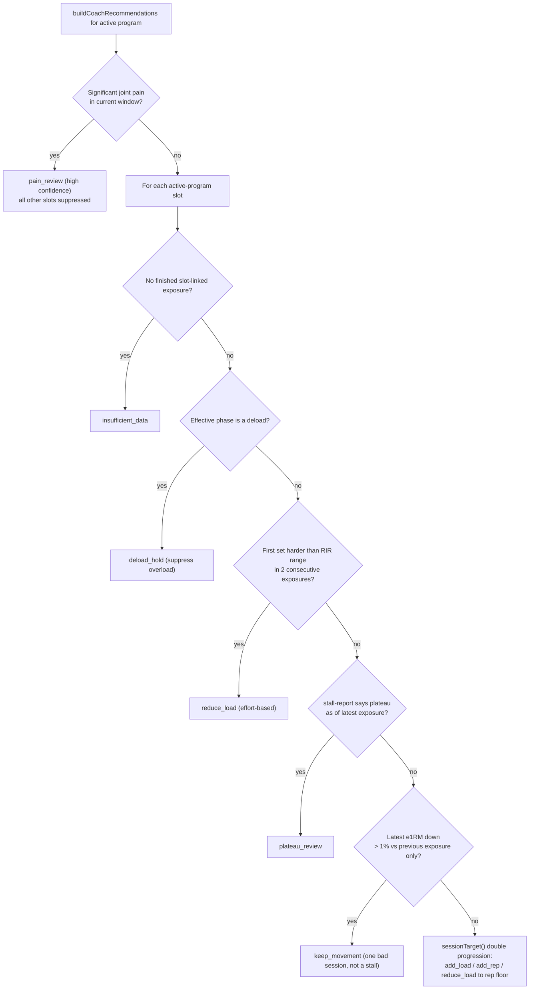
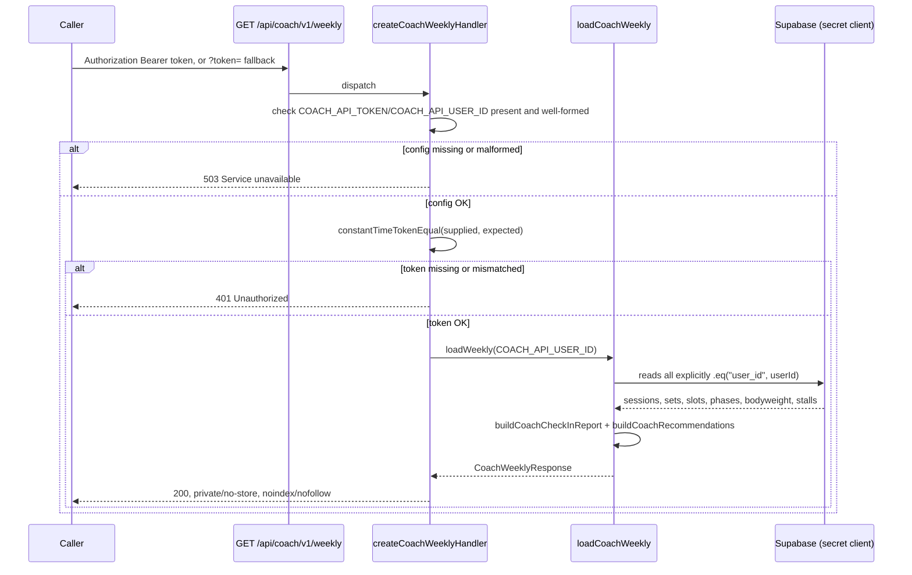

## What this covers

Track Coach (`/analytics/coach`) rests on three deterministic layers that stay strictly
separated, plus a fourth layer that is specified but not yet built:

1. **`CoachCheckInReport`** (`src/lib/coach-check-in.ts`) — a pure, versioned factual
   snapshot of one training week. It never recommends anything.
2. **The recommendations engine** (`src/lib/coach-recommendations.ts`) — a separate
   deterministic layer that turns the factual report and its source rows into ranked,
   reviewable proposals. It never mutates a program.
3. **The private weekly Coach API** (`src/app/api/coach/v1/weekly/`, `src/lib/coach-api.ts`,
   `src/lib/coach-weekly-data.ts`) — a read-only, capability-token-gated export of both,
   scoped to one hardcoded account via a server-only Supabase secret client.
4. **The AI Coach agent** (`docs/AI-COACH.md`, planned `src/lib/agent/`) — a
   memory-backed LangChain agent that wraps these three layers with language, intake,
   navigation, and (later) confirmed writes. As of this writing it is specified but has
   no code.

The engine owns every number; the report is the only source of facts; the agent, when
built, owns only language, intake, drafts, and navigation on top of them.

## `CoachCheckInReport`: the factual contract

`buildCoachCheckInReport()` is a pure function: callers supply sessions, working sets,
program days/slots/phases, the exercise catalog, and bodyweight context, and it returns
facts and classifications only — no programming recommendations and no writes. Both the
Track Coach snapshot and its clipboard text (`formatCoachCheckIn()`) render this same
`CoachCheckInReport` object, and the weekly API serializes it rather than reimplementing
the aggregation.

### Time windows

- The default reporting timezone is `America/Chicago` (`COACH_REPORT_TIMEZONE`).
- The current window is the seven calendar dates ending on `generatedAt` (inclusive); the
  prior comparison window is the immediately preceding seven dates. The two windows never
  overlap.
- A session belongs to a window by `performed_at`; future sessions are excluded.
- Only sessions with `finished_at` contribute to execution metrics — open sessions are
  excluded and counted as a data-quality warning (`unfinishedSessions`).

### Metrics

- **Adherence** — completed sessions versus the supplied weekly plan count.
- **Duration** — `finished_at - performed_at` against a 45-minute target
  (`WORKOUT_DURATION_TARGET_MINUTES`); values under 5 or over 240 minutes are excluded and
  flagged as implausible.
- **Set execution** — completed non-warmup sets versus the effective prescribed set count
  per completed session. The session's stored `week_index` selects its phase, so deload
  set multipliers and RIR ranges apply to that historical exposure rather than to today's
  program definition.
- **RIR execution** — actual RIR compared with the effective phase RIR range; missing RIR
  and sets that cannot be matched to a program slot are surfaced explicitly rather than
  silently dropped.
- **Hard sets and specialization volume** — non-warmup sets at RIR 0–1, rolled up by an
  explicit, intentionally overlapping movement-pattern-to-specialization-group mapping
  (`SPECIALIZATION_GROUPS`: delts, biceps, triceps, quads, hamstrings, glutes, calves — a
  squat counts toward both quads and glutes). Each group also reports `prescribedSets`,
  the effective target-set count from finished sessions in that window using the
  programmed slot exercise, skipping prescriptions whose target RIR floor is above 1
  (deload/easy phases). This field is additive on schema `1.0`. A shortfall renders as one
  line (`Hard-set shortfall: Hamstrings 5/6 · Glutes 6/7`) via
  `specializationHardSetShortfalls()` / `formatSpecializationShortfall()`; it never rewrites
  the program.
- **Fixed-load rep progress** — exact exercise and exact raw logged weight, comparing best
  reps in the current window against best reps in the prior window.
- **Exercise trend classification** — each exercise needs four completed exposures with
  valid e1RM values. The last two form the recent pair, the preceding two the comparison
  pair. `gaining`/`declining` requires both recent marks to clear both comparison marks by
  a 1% noise margin; otherwise the classification is `flat`, and fewer than four valid
  exposures is `insufficient_data`. This absorbs one unusually good or bad session rather
  than reacting to it. The snapshot and clipboard collapse the insufficient-data list to a
  count (`N waiting on 4 exposures`).

### Privacy and versioning

`CoachCheckInReport` carries exercise slugs and display names but never email addresses,
auth claims, user IDs, session IDs, program IDs, program-day IDs, or program-slot IDs.
Consumers key on the `version` field (`COACH_REPORT_VERSION`, currently `"1.0"`) before
relying on its shape; additive or breaking contract changes require an explicit version
decision and matching fixture coverage. The report does not snapshot a slot's prescription
at workout start — it re-resolves the *current* slot definition against the session's
stored week, so an edited slot can change how an old session's prescription displays;
unmatched or deleted slots become data-quality warnings rather than guessed values.

## The deterministic recommendations engine

`src/lib/coach-recommendations.ts` sits over the factual report and the same raw rows,
deliberately kept as a separate module from `coach-check-in.ts` so the v1 report contract
stays stable while the Track Coach workflow and clipboard export layer coaching actions
on top. `buildCoachRecommendations()` never mutates a program, slot, set, or session.

### Guardrail order per program slot

For each slot in the active program, `recommendationForSlot()` walks a fixed guardrail
order, returning the first one that applies:



*Guardrail order the deterministic engine applies per slot before falling back to normal
double-progression via `sessionTarget()`.*

- **Pain first.** Any session with `jointPain === "significant"` in the current window
  suppresses all progression advice for every slot and returns a single top-priority
  `pain_review` recommendation — a conservative review prompt, never a diagnosis.
- **Deload suppression.** `resolvePrescription()` resolves the slot's effective phase for
  the latest exposure's stored week; `isDeload()` (shared with `stall-report.ts`) checks
  the phase's `set_multiplier` or a `deload` keyword in name/description. An effective
  deload phase returns `deload_hold` instead of an overload proposal.
- **Effort-based reduce_load.** The first working set must be harder than the effective
  RIR range in two consecutive comparable slot exposures before a one-increment load
  reduction is proposed. A single isolated first-set miss, or a harder back-off set, never
  triggers it.
- **Plateau review.** Delegates to the shared `detectPlateau()` / `stall-report.ts`
  assessment (see [Fluid and plateau adaptation](/openwiki/concepts/fluid-and-plateau-adaptation.md))
  rather than reimplementing stall logic; only fires when the latest exposure is itself the
  plateau's most recent stalled point.
- **Keep-the-movement.** One down exposure relative to the immediately preceding one (more
  than 1% lower best e1RM) explicitly produces `keep_movement`, not a plateau or swap
  proposal — the existing plateau criteria require more evidence than one bad session.
- **Normal progression.** Falls through to `sessionTarget()` with the same bounded
  best-recent reference the active workout screen uses
  (`selectProgressionReference`/`exerciseProgressionReference`): the slot's latest
  exact-exercise exposure anchors the window, and a stronger first set on another program
  day *after* that anchor can advance the target, but an older all-time best cannot. A
  first set below `rep_min` yields a rep-floor target with load recalibrated from observed
  reps/RIR (including bodyweight for weighted movements); generated targets never
  prescribe reps outside the slot's range.
- **No exposure.** With no finished, slot-linked exposure, the engine returns
  `insufficient_data` rather than substituting a cross-exercise estimate for a weekly
  progression decision.

Every recommendation carries an opaque, content-derived `key` (`stableKey()` hashes kind,
slot, exercise, latest evidence timestamp, action, and summary — so a new exposure
produces a new key), program-day context, an `action` (label plus optional target
weight/reps), `rationale`, an `evidence` window/count/summary, a `confidence`
(`insufficient`/`low`/`medium`/`high`), a plain-language `dataSufficiency` statement, and a
`priority` (`now`/`next`).

### Ranking and tiers

`rankCoachRecommendations()` scores every recommendation as
`CONFIDENCE_SCORE[confidence] × kindImpact(kind, isCompound)`, where `kindImpact` weights
`pain_review` and `reduce_load` highest, then `plateau_review`, then `add_load` (with a
compound bonus for press/pull/squat/hinge/lunge/hip_thrust patterns), then
`keep_movement`/`add_rep`/`deload_hold`, and `insufficient_data` at zero. Any medium-or-
better `add_load` on a compound clears the `NOW_SCORE` threshold (16) and is tagged
priority `now`; low-confidence hold-load/chase-reps on isolation work stays `next`. Pain
and repeated-effort/plateau reviews are pinned to `now` regardless of score. Results sort
by score descending (stable on original slot order for ties), so the list is never plain
slot order. `formatCoachRecommendations()` and the Track Coach UI render mixed lists as
**Do first** / **Also** tiers; a list that is entirely `now` or entirely `next` renders
ungrouped. Ranking never invents a second progression rule — double progression still
comes only from `sessionTarget()`.

### Review state and the UI contract

Accept, dismiss, and defer write only to `coach_recommendation_decision`
(`src/lib/coach-recommendation-decisions.ts`); they never alter a program, slot, set, or
session. `pendingCoachRecommendations()` filters out `insufficient_data`/`insufficient`
confidence items, anything already `accepted` or `dismissed`, and anything `deferred` whose
`deferredUntil` has not yet passed — so a deferred proposal is hidden for 7 days and a new
exposure produces a new key (and therefore a new, undismissed proposal). The Proposed Next
Steps UI applies a decision optimistically (Accept/Later/Dismiss do not stay pending on
refresh) and rolls back with an error on a failed save; a collapsible remaining-count
section replaces the list with a single compact line when nothing needs review. The API
and the coaching clipboard export always retain the full diagnostic recommendation set —
the review-state filtering is a presentation concern layered on top, not a change to the
engine.

## The private weekly Coach API

`GET /api/coach/v1/weekly` (`src/app/api/coach/v1/weekly/route.ts`) returns
`{ apiVersion, report, recommendations }` — the same canonical `CoachCheckInReport` the
Track Coach snapshot renders, plus the same `buildCoachRecommendations()` output, with no
separate aggregation.



*Auth and data-loading flow for the weekly Coach API. Config failures and bad credentials
both fail closed, and the 401 path never distinguishes missing-vs-wrong tokens.*

### Auth and hardening

- `createCoachWeeklyHandler()` (`src/lib/coach-api.ts`) is injected with `expectedToken`,
  `userId`, and `loadWeekly` so the route wiring (`route.ts`) stays a thin binding of
  `process.env.COACH_API_TOKEN` / `process.env.COACH_API_USER_ID` / `loadCoachWeekly`.
- A missing token, a token under 32 characters, a missing user id, or a user id that fails
  a UUID-shape check all return **503** ("Service unavailable") before any credential is
  even checked — malformed server configuration fails closed rather than accidentally
  authorizing.
- Callers that can set headers use `Authorization: Bearer <COACH_API_TOKEN>`. Callers that
  cannot (e.g. some scheduled-task integrations) fall back to a capability URL query
  parameter, `?token=<COACH_API_TOKEN>`; an invalid `Authorization` header is **not**
  overridden by a valid query token — either must independently match. Treat the full
  capability URL as a secret: never paste it into logs, issues, PRs, screenshots, or chat.
- Token comparison is `constantTimeTokenEqual()`: both sides are SHA-256 hashed first, then
  compared with `timingSafeEqual`, so a short candidate never causes a length-mismatch
  branch before the constant-time compare.
- A missing credential and a wrong credential return the identical generic **401** body
  (`{ error: "Unauthorized" }`) — the route does not leak which check failed.
- Responses always carry `Cache-Control: private, no-store, max-age=0`, `Pragma: no-cache`,
  `Vary: Authorization`, and `X-Robots-Tag: noindex, nofollow`.
- The response body is checked to never contain internal identity fields
  (`userId`/`sessionId`/`programId` and snake_case equivalents) — enforced by
  `coach-api.test.ts`.

### Data isolation

`loadCoachWeekly()` (`src/lib/coach-weekly-data.ts`) builds its own Supabase client with
`SUPABASE_SECRET_KEY` (`createCoachApiClient()`), which bypasses row-level security. Every
query in `loadCoachWeeklyWithClient()` is therefore an *explicit* `.eq("user_id", userId)`
(or the profile-table equivalent) predicate against exactly one hardcoded
`COACH_API_USER_ID` — there is no per-request user context to leak, and no query is allowed
to omit the predicate. It fetches sets, profile, sessions, bodyweight log, program days,
slots, phases, the exercise catalog, and the active program in parallel, throws on any
Supabase error, then feeds the same shaping used by `coach-ui-data.ts` into
`buildCoachCheckInReport()`, `loadStallAssessments()` (shared stall evidence — see
[Fluid and plateau adaptation](/openwiki/concepts/fluid-and-plateau-adaptation.md)), and
`buildCoachRecommendations()`. See [Supabase integration](/openwiki/integrations/supabase.md)
for the secret-vs-RLS client distinction more broadly.

### Configuration and rotation

Server-only environment variables (none may use a `NEXT_PUBLIC_` prefix — see
[Deployment and configuration](/openwiki/operations/deployment-and-config.md)):

- `SUPABASE_SECRET_KEY` — a revocable `sb_secret_...` backend key.
- `COACH_API_USER_ID` — the sole account whose data the endpoint may ever read.
- `COACH_API_TOKEN` — at least 32 high-entropy characters from a cryptographic RNG.

To rotate access: generate a new random token, replace `COACH_API_TOKEN` in the deployment,
update the scheduled task's capability URL once the deployment is live, validate the new
token, and confirm the old token now returns 401. Rotate the Supabase secret independently
in Supabase and deployment settings if database access itself is suspected compromised.

## The planned AI Coach agent

`docs/AI-COACH.md` specifies a memory-backed agent that lives in the app and **wraps** the
deterministic Coach; it does not replace it. Track Coach, `CoachCheckInReport`, and the
weekly API stay the factual check-in and private export. **Status: specified
2026-09-20; Slice 0 is the next build; no agent code exists yet.** Product copy may say
"Coach"; code and routes use **agent** (`src/lib/agent/`, `/coach`, `/api/agent/chat`) so
they never collide with Track Coach.

### Locked decisions

| Decision | Lock |
| --- | --- |
| Job vs. Coach | Wrap. Narrate and act on engine output; `/analytics/coach` stays. |
| Build order | Slice 0 first, then Slices 1–5 strictly in order. |
| Runtime | TypeScript inside this Next.js app — no separate Python service. |
| Library | LangChain TypeScript for the agent loop; tools and prompts stay plain TS so the loop can change; Deep Agents is out until Slice 5. |
| Writes | None in Slice 0. Drafts in Slice 2. Confirm-chip `startNextSession` may land in Slice 1. Live mutations wait for Slice 4. |
| Surface | Persistent entry + `Sheet` on Lift/Track/Program/You; full thread at `/coach`; no fifth tab; hidden wherever `hideAppChrome` is true. |
| Data | Logged-in user's Supabase client plus RLS. Domain tools wrap existing loaders — never the weekly Coach secret, never a generic SQL tool, never embeddings over `set_log`. |
| Authority | The engine owns numbers and prescriptions; the agent owns language, intake, drafts, and navigation. |
| Privacy | Period observations stay out of agent context unless a later, separate opt-in — same default as Coach. |
| Context | Full transcript persisted in Postgres; each model turn gets the system prompt plus the last N messages; no summarization, compaction, or distilled user-memory in Slice 0. |

### Invariants

- Strength, report, stall, and target figures come only from the canonical helpers
  (`sessionTarget()`, `buildCoachCheckInReport`, `buildCoachRecommendations`,
  `groupReviewSessions`, `loadStallAssessments`) — the agent's prompt never recomputes
  them.
- Tools take the **user-scoped** Supabase client from the request session. They never
  receive `SUPABASE_SECRET_KEY` or `COACH_API_TOKEN` — the agent cannot reach the weekly
  Coach API's elevated path, only the same RLS-scoped reads a signed-in user already has.
- Program persistence goes through `saveProgram`, `createFromTemplate`, or clone; slot IDs
  stay id-preserving; Slice 2 writes inactive drafts only, and saving in the builder is
  what activates a program.
- A new capability means a new domain tool (plus eval cases), never a new aggregation
  forked from the Coach engine.

### Module layout (planned)

```
src/lib/agent/           tools, policy, prompts, thread helpers
src/app/api/agent/chat/  auth-gated streaming route
src/app/(app)/coach/     full-thread page
src/components/agent/    Sheet, transcript, persistent entry
```

`src/lib/agent/tools/` wraps existing loaders and actions; LangChain `tool()` adapters sit
beside those functions rather than being the public interface. Policy (excluding `period`
data, a write allow-list, a tool-call budget) lives in one module applied by the route.
Streaming UI reuses existing primitives (`Sheet`, `IconButton`, type scale, copy density);
only the stream/message protocol is taken from LangChain / agent-chat-ui, not its chrome.

Slice 0's planned schema is an owner-scoped `agent_thread` and `agent_message` pair with
the same RLS ownership pattern as other user tables. One thread is get-or-created per user,
and **every message is persisted** with `parts` stored as JSON so tool calls survive a
reload — the UI reads the full history, but the model only ever sees the system prompt plus
the last N messages (N a named constant in agent policy), never the whole transcript.
Planned server-only env (Gateway and LangSmith keys, no `NEXT_PUBLIC_` prefix) will be
documented in `.env.local.example` and deployment config once the route lands, with a
dedicated (non-shared) local LangSmith project.

### Slices

Slices build strictly in order; a later slice may add tools but may never weaken an
earlier invariant.

- **Slice 0 — Talking to the ledger.** Auth-gated `POST /api/agent/chat` (`getClaims()` +
  cookie Supabase client), LangChain TS loop, Gateway model, LangSmith tracing, a tool-call
  cap. Four read-only tools, each wrapping an existing path: `weeklyCoach` → `loadCoachUi`;
  `activeProgram` → `getActiveProgram`; `exerciseReview` → the same `groupReviewSessions`
  grouping as `/history/[exerciseId]`; `nextWorkout` → `loadNextWorkout` plus the same
  `sessionTarget()` hydration the session screen uses. Out of scope: writes, navigation,
  screen context, Jev, web search, Deep Agents, onboarding, rolling summaries, embeddings.
  Done when tool-cited numbers match Track Coach / next-workout for the same window and an
  ownership RLS test passes.
- **Slice 1 — Screen context and navigation.** A per-turn context packet (pathname, active
  program id, open session id, focused exercise id); client tools that route
  (`openExerciseReview`, `openCoachCheckIn`, `openProgram`); an optional
  `startNextWorkout` that calls `startNextSession` only after an in-transcript confirm
  chip. No chat during `/session/*`; no settings or program writes yet.
- **Slice 2 — Program intake → draft.** Short chat/chip intake (days, goal, emphasis,
  equipment, omissions, classic vs. fluid) classified through Jev (Choice/Noul/Score) over
  a closed ontology — low confidence asks a follow-up rather than guessing a split. A
  deterministic assembler patches a `PROGRAM_TEMPLATES` entry and persists it the same way
  `createFromTemplate` does (inactive unless the account has no programs); generate never
  calls `saveProgram`, which would activate it. Out: activating on generate, free-form LLM
  JSON programs, Jev emitting prose or slot lists.
- **Slice 3 — Weekly narrative.** A tool that loads `loadCoachUi` and narrates it in the
  thread, wrapping rather than replacing the report; "next steps" hands off to Slice 1
  navigation into `/analytics/coach` rather than accepting proposals itself.
- **Slice 4 — Confirmed writes.** Tools call existing actions with an in-transcript
  confirm: settings patches, Coach accept/dismiss/defer (writing only
  `coach_recommendation_decision`, exactly like the UI), and swaps following the exercise
  swap contract. Cost caps and tighter tool budgets accompany the first write capability.
  Out: unattended `saveProgram` on the active program; new progression rules.
- **Slice 5 — Sophistication.** Only after 0–4 dogfood: candidates include a Deep Agents /
  program-design subagent, research-vs-prescribe web search, agent-first onboarding,
  in-session whispers, rolling summaries/context compaction, and distilled user memory
  beyond last-N. Each candidate needs its own Decision Card; none is implied by shipping
  0–4.

### Evals and observability

Eval questions are labeled as the team dogfoods each slice: Slice 0 grades grounding (tool
choice plus cited numbers against fixtures, ~20 labeled cases co-located under
`src/lib/agent/`); Slice 2 grades ontology confidence and template invariants; Slice 4
grades "no write without confirm." Traces land in a LangSmith project dedicated to this
agent; capability URLs, secrets, and weekly Coach tokens must never be pasted into traces,
issues, or chat.

## How the pieces relate

- The report is the only fact source; the engine is the only recommendation source; the
  weekly API only serializes both for one hardcoded external account; the agent, once
  built, only narrates and navigates around all three — it never recomputes strength,
  report, or stall figures itself.
- The weekly API's elevated secret client and the agent's user-scoped client are
  deliberately different trust boundaries: the agent's tools are explicitly forbidden from
  ever touching `SUPABASE_SECRET_KEY` or `COACH_API_TOKEN`, so a compromised agent tool
  cannot escalate to the weekly export's bypass-RLS path.
- Plateau/stall evaluation is shared, not duplicated: both the recommendations engine and
  the monthly/Fluid review consume the same owner-scoped `stall-report.ts` loader, so phase,
  deload, identity, and adaptation boundaries reset comparison history consistently across
  all three surfaces (see
  [Fluid and plateau adaptation](/openwiki/concepts/fluid-and-plateau-adaptation.md) and
  [Tracking and analytics](/openwiki/workflows/tracking-and-analytics.md)).
