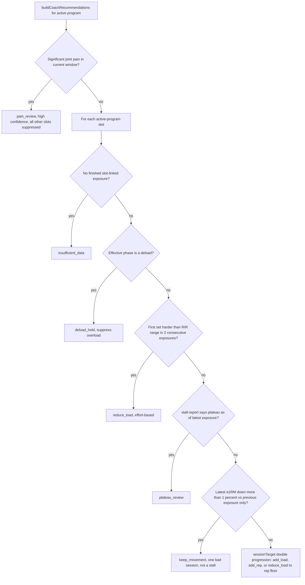
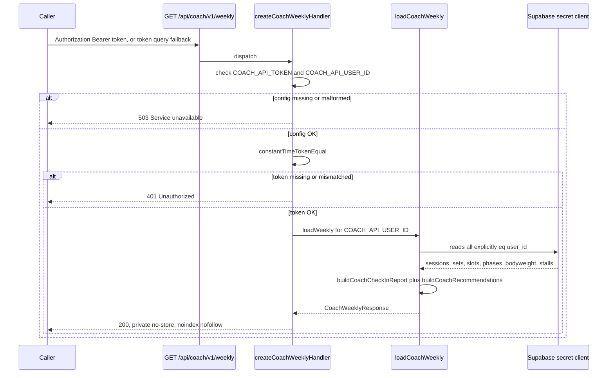
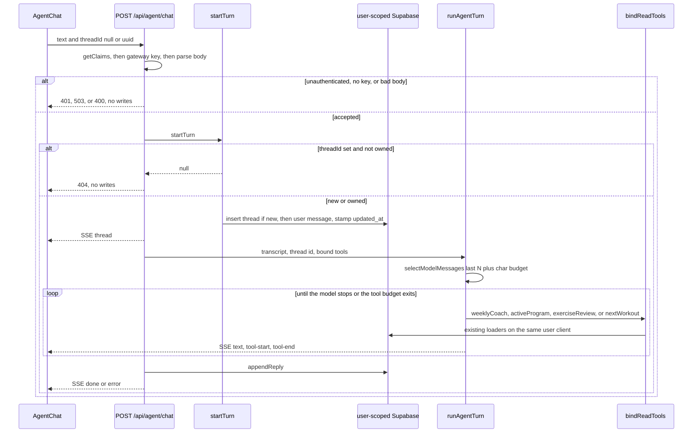

## What this covers

Track Coach (`/analytics/coach`) rests on three deterministic layers that stay strictly
separated, plus a fourth layer that wraps them in language:

1. **`CoachCheckInReport`** (`src/lib/coach-check-in.ts`) — a pure, versioned factual
   snapshot of one training week. It never recommends anything.
2. **The recommendations engine** (`src/lib/coach-recommendations.ts`) — a separate
   deterministic layer that turns the factual report and its source rows into ranked,
   reviewable proposals. It never mutates a program.
3. **The private weekly Coach API** (`src/app/api/coach/v1/weekly/`, `src/lib/coach-api.ts`,
   `src/lib/coach-weekly-data.ts`) — a read-only, capability-token-gated export of both,
   scoped to one hardcoded account via a server-only Supabase secret client.
4. **The in-app AI Coach agent** (`docs/AI-COACH.md`, `src/lib/agent/`) — a memory-backed
   LangChain agent that wraps these three layers with language. Slice 0 shipped on
   2026-09-20 and became multi-thread on 2026-09-27. Slices 1–5 remain specified, not
   built. Writes are still empty.

The engine owns every number; the report is the only source of facts; the agent owns only
language on top of them. Intake, drafts, and navigation are later slices, not current
behavior.

## `CoachCheckInReport`: the factual contract

`buildCoachCheckInReport()` is a pure function: callers supply sessions, working sets,
program days/slots/phases, the exercise catalog, and bodyweight context, and it returns
facts and classifications only — no programming recommendations and no writes. Both the
Track Coach snapshot and its clipboard text (`formatCoachCheckIn()`) render this same
`CoachCheckInReport` object, and the weekly API serializes it rather than reimplementing
the aggregation.

### Time windows

- The default reporting timezone is `America/Chicago` (`COACH_REPORT_TIMEZONE`).
- The current window is the seven calendar dates ending on `generatedAt` (inclusive); the
  prior comparison window is the immediately preceding seven dates. The two windows never
  overlap.
- A session belongs to a window by `performed_at`; future sessions are excluded.
- Only sessions with `finished_at` contribute to execution metrics — open sessions are
  excluded and counted as a data-quality warning (`unfinishedSessions`).

### Metrics

- **Adherence** — completed sessions versus the supplied weekly plan count.
- **Duration** — `finished_at - performed_at` against a 45-minute target
  (`WORKOUT_DURATION_TARGET_MINUTES`); values under 5 or over 240 minutes are excluded and
  flagged as implausible.
- **Set execution** — completed non-warmup sets versus the effective prescribed set count
  per completed session. The session's stored `week_index` selects its phase, so deload
  set multipliers and RIR ranges apply to that historical exposure rather than to today's
  program definition.
- **RIR execution** — actual RIR compared with the effective phase RIR range; missing RIR
  and sets that cannot be matched to a program slot are surfaced explicitly rather than
  silently dropped.
- **Hard sets and specialization volume** — non-warmup sets at RIR 0–1, rolled up by an
  explicit, intentionally overlapping movement-pattern-to-specialization-group mapping
  (`SPECIALIZATION_GROUPS`: delts, biceps, triceps, quads, hamstrings, glutes, calves — a
  squat counts toward both quads and glutes). Each group also reports `prescribedSets`,
  the effective target-set count from finished sessions in that window using the
  programmed slot exercise, skipping prescriptions whose target RIR floor is above 1
  (deload/easy phases). This field is additive on schema `1.0`. A shortfall renders as one
  line (`Hard-set shortfall: Hamstrings 5/6 · Glutes 6/7`) via
  `specializationHardSetShortfalls()` / `formatSpecializationShortfall()`; it never rewrites
  the program.
- **Fixed-load rep progress** — exact exercise and exact raw logged weight, comparing best
  reps in the current window against best reps in the prior window.
- **Exercise trend classification** — each exercise needs four completed exposures with
  valid e1RM values. The last two form the recent pair, the preceding two the comparison
  pair. `gaining`/`declining` requires both recent marks to clear both comparison marks by
  a 1% noise margin; otherwise the classification is `flat`, and fewer than four valid
  exposures is `insufficient_data`. This absorbs one unusually good or bad session rather
  than reacting to it. The snapshot and clipboard collapse the insufficient-data list to a
  count (`N waiting on 4 exposures`).

### Privacy and versioning

`CoachCheckInReport` carries exercise slugs and display names but never email addresses,
auth claims, user IDs, session IDs, program IDs, program-day IDs, or program-slot IDs.
Consumers key on the `version` field (`COACH_REPORT_VERSION`, currently `"1.0"`) before
relying on its shape; additive or breaking contract changes require an explicit version
decision and matching fixture coverage. The report does not snapshot a slot's prescription
at workout start — it re-resolves the *current* slot definition against the session's
stored week, so an edited slot can change how an old session's prescription displays;
unmatched or deleted slots become data-quality warnings rather than guessed values.

## The deterministic recommendations engine

`src/lib/coach-recommendations.ts` sits over the factual report and the same raw rows,
deliberately kept as a separate module from `coach-check-in.ts` so the v1 report contract
stays stable while the Track Coach workflow and clipboard export layer coaching actions
on top. `buildCoachRecommendations()` never mutates a program, slot, set, or session.

### Guardrail order per program slot

For each slot in the active program, `recommendationForSlot()` walks a fixed guardrail
order, returning the first one that applies:



*Guardrail order the deterministic engine applies per slot before falling back to normal
double-progression via `sessionTarget()`.*

- **Pain first.** Any session with `jointPain === "significant"` in the current window
  suppresses all progression advice for every slot and returns a single top-priority
  `pain_review` recommendation — a conservative review prompt, never a diagnosis.
- **Deload suppression.** `resolvePrescription()` resolves the slot's effective phase for
  the latest exposure's stored week; `isDeload()` (shared with `stall-report.ts`) checks
  the phase's `set_multiplier` or a `deload` keyword in name/description. An effective
  deload phase returns `deload_hold` instead of an overload proposal.
- **Effort-based reduce_load.** The first working set must be harder than the effective
  RIR range in two consecutive comparable slot exposures before a one-increment load
  reduction is proposed. A single isolated first-set miss, or a harder back-off set, never
  triggers it.
- **Plateau review.** Delegates to the shared `detectPlateau()` / `stall-report.ts`
  assessment (see [Fluid and plateau adaptation](/openwiki/concepts/fluid-and-plateau-adaptation.md))
  rather than reimplementing stall logic; only fires when the latest exposure is itself the
  plateau's most recent stalled point.
- **Keep-the-movement.** One down exposure relative to the immediately preceding one (more
  than 1% lower best e1RM) explicitly produces `keep_movement`, not a plateau or swap
  proposal — the existing plateau criteria require more evidence than one bad session.
- **Normal progression.** Falls through to `sessionTarget()` with the same bounded
  best-recent reference the active workout screen uses
  (`selectProgressionReference`/`exerciseProgressionReference`): the slot's latest
  exact-exercise exposure anchors the window, and a stronger first set on another program
  day *after* that anchor can advance the target, but an older all-time best cannot. A
  first set below `rep_min` yields a rep-floor target with load recalibrated from observed
  reps/RIR (including bodyweight for weighted movements); generated targets never
  prescribe reps outside the slot's range.
- **No exposure.** With no finished, slot-linked exposure, the engine returns
  `insufficient_data` rather than substituting a cross-exercise estimate for a weekly
  progression decision.

Every recommendation carries an opaque, content-derived `key` (`stableKey()` hashes kind,
slot, exercise, latest evidence timestamp, action, and summary — so a new exposure
produces a new key), program-day context, an `action` (label plus optional target
weight/reps), `rationale`, an `evidence` window/count/summary, a `confidence`
(`insufficient`/`low`/`medium`/`high`), a plain-language `dataSufficiency` statement, and a
`priority` (`now`/`next`).

### Ranking and tiers

`rankCoachRecommendations()` scores every recommendation as
`CONFIDENCE_SCORE[confidence] × kindImpact(kind, isCompound)`, where `kindImpact` weights
`pain_review` and `reduce_load` highest, then `plateau_review`, then `add_load` (with a
compound bonus for press/pull/squat/hinge/lunge/hip_thrust patterns), then
`keep_movement`/`add_rep`/`deload_hold`, and `insufficient_data` at zero. Any medium-or-
better `add_load` on a compound clears the `NOW_SCORE` threshold (16) and is tagged
priority `now`; low-confidence hold-load/chase-reps on isolation work stays `next`. Pain
and repeated-effort/plateau reviews are pinned to `now` regardless of score. Results sort
by score descending (stable on original slot order for ties), so the list is never plain
slot order. `formatCoachRecommendations()` and the Track Coach UI render mixed lists as
**Do first** / **Also** tiers; a list that is entirely `now` or entirely `next` renders
ungrouped. Ranking never invents a second progression rule — double progression still
comes only from `sessionTarget()`.

### Review state and the UI contract

Accept, dismiss, and defer write only to `coach_recommendation_decision`
(`src/lib/coach-recommendation-decisions.ts`); they never alter a program, slot, set, or
session. `pendingCoachRecommendations()` filters out `insufficient_data`/`insufficient`
confidence items, anything already `accepted` or `dismissed`, and anything `deferred` whose
`deferredUntil` has not yet passed — so a deferred proposal is hidden for 7 days and a new
exposure produces a new key (and therefore a new, undismissed proposal). The Proposed Next
Steps UI applies a decision optimistically (Accept/Later/Dismiss do not stay pending on
refresh) and rolls back with an error on a failed save; a collapsible remaining-count
section replaces the list with a single compact line when nothing needs review. The API
and the coaching clipboard export always retain the full diagnostic recommendation set —
the review-state filtering is a presentation concern layered on top, not a change to the
engine.

## The private weekly Coach API

`GET /api/coach/v1/weekly` (`src/app/api/coach/v1/weekly/route.ts`) returns
`{ apiVersion, report, recommendations }` — the same canonical `CoachCheckInReport` the
Track Coach snapshot renders, plus the same `buildCoachRecommendations()` output, with no
separate aggregation. This is the factual/export path. The agent does not call it and does
not share its client.



*Auth and data-loading flow for the weekly Coach API. Config failures and bad credentials
both fail closed, and the 401 path never distinguishes missing-vs-wrong tokens.*

### Auth and hardening

- `createCoachWeeklyHandler()` (`src/lib/coach-api.ts`) is injected with `expectedToken`,
  `userId`, and `loadWeekly` so the route wiring (`route.ts`) stays a thin binding of
  `process.env.COACH_API_TOKEN` / `process.env.COACH_API_USER_ID` / `loadCoachWeekly`.
- A missing token, a token under 32 characters, a missing user id, or a user id that fails
  a UUID-shape check all return **503** ("Service unavailable") before any credential is
  even checked — malformed server configuration fails closed rather than accidentally
  authorizing.
- Callers that can set headers use `Authorization: Bearer <COACH_API_TOKEN>`. Callers that
  cannot (e.g. some scheduled-task integrations) fall back to a capability URL query
  parameter, `?token=<COACH_API_TOKEN>`; an invalid `Authorization` header is **not**
  overridden by a valid query token — either must independently match. Treat the full
  capability URL as a secret: never paste it into logs, issues, PRs, screenshots, or chat.
- Token comparison is `constantTimeTokenEqual()`: both sides are SHA-256 hashed first, then
  compared with `timingSafeEqual`, so a short candidate never causes a length-mismatch
  branch before the constant-time compare.
- A missing credential and a wrong credential return the identical generic **401** body
  (`{ error: "Unauthorized" }`) — the route does not leak which check failed.
- Responses always carry `Cache-Control: private, no-store, max-age=0`, `Pragma: no-cache`,
  `Vary: Authorization`, and `X-Robots-Tag: noindex, nofollow`.
- The response body is checked to never contain internal identity fields
  (`userId`/`sessionId`/`programId` and snake_case equivalents) — enforced by
  `coach-api.test.ts`.

### Data isolation

`loadCoachWeekly()` (`src/lib/coach-weekly-data.ts`) builds its own Supabase client with
`SUPABASE_SECRET_KEY` (`createCoachApiClient()`), which bypasses row-level security. Every
query in `loadCoachWeeklyWithClient()` is therefore an *explicit* `.eq("user_id", userId)`
(or the profile-table equivalent) predicate against exactly one hardcoded
`COACH_API_USER_ID` — there is no per-request user context to leak, and no query is allowed
to omit the predicate. It fetches sets, profile, sessions, bodyweight log, program days,
slots, phases, the exercise catalog, and the active program in parallel, throws on any
Supabase error, then feeds the same shaping used by `coach-ui-data.ts` into
`buildCoachCheckInReport()`, `loadStallAssessments()` (shared stall evidence — see
[Fluid and plateau adaptation](/openwiki/concepts/fluid-and-plateau-adaptation.md)), and
`buildCoachRecommendations()`. See [Supabase integration](/openwiki/integrations/supabase.md)
for the secret-vs-RLS client distinction more broadly.

### Configuration and rotation

Server-only environment variables (none may use a `NEXT_PUBLIC_` prefix — see
[Deployment and configuration](/openwiki/operations/deployment-and-config.md)):

- `SUPABASE_SECRET_KEY` — a revocable `sb_secret_...` backend key.
- `COACH_API_USER_ID` — the sole account whose data the endpoint may ever read.
- `COACH_API_TOKEN` — at least 32 high-entropy characters from a cryptographic RNG.

To rotate access: generate a new random token, replace `COACH_API_TOKEN` in the deployment,
update the scheduled task's capability URL once the deployment is live, validate the new
token, and confirm the old token now returns 401. Rotate the Supabase secret independently
in Supabase and deployment settings if database access itself is suspected compromised.

## The shipped AI Coach agent

`docs/AI-COACH.md` specifies a memory-backed agent that lives in the app and **wraps** the
deterministic Coach; it does not replace it. Track Coach, `CoachCheckInReport`, and
`GET /api/coach/v1/weekly` stay the factual check-in and private export. **Slice 0 shipped
2026-09-20. Chat became multi-thread on 2026-09-27. Slices 1–5 are still specified, not
built. `WRITE_TOOL_NAMES` is empty.** Product copy may say "Coach"; code and routes use
**agent** (`src/lib/agent/`, `/coach`, `/api/agent/chat`) so they never collide with Track
Coach.

The original Slice 0 schema was one thread per user (`agent_thread_user_key unique
(user_id)`). That one-thread claim is no longer true. `thread.ts` and
`20260927170000_agent_multi_thread.sql` are the current contract: many owner-scoped
threads, an app-chosen id, and a composite ownership foreign key.

### Locked decisions

| Decision | Lock |
| --- | --- |
| Job vs. Coach | Wrap. Narrate engine output; `/analytics/coach` stays. Acting on it waits for later slices. |
| Build order | Slice 0 first, then Slices 1–5 strictly in order. Only Slice 0 is built. |
| Runtime | TypeScript inside this Next.js app — no separate Python service. The chat route sets `runtime = "nodejs"`. |
| Library | LangChain TypeScript (`createAgent`, `streamEvents` v3) for the agent loop; tools and prompts stay plain TS so the loop can change. Deep Agents is out until Slice 5. |
| Writes | None. `WRITE_TOOL_NAMES` is empty. Drafts wait for Slice 2. Confirm-chip `startNextSession` may land in Slice 1. Live mutations wait for Slice 4. |
| Surface | Persistent `AgentEntry` + `Sheet` on Lift/Track/Program/You, omitted on `/coach` itself. Full thread at `/coach?thread=`. No fifth tab. Hidden wherever `hideAppChrome` is true. |
| Data | Logged-in user's cookie Supabase client plus RLS. Domain tools wrap existing loaders — never the weekly Coach secret, never a generic SQL tool, never embeddings over `set_log`. |
| Authority | The engine owns numbers and prescriptions; the agent owns language. Intake, drafts, and navigation are specified later slices. |
| Privacy | Period observations stay out of agent context unless a later, separate opt-in — same default as Coach. The system prompt refuses them. |
| Context | Full transcript per thread in Postgres. Each model turn gets the system prompt plus that thread's last N messages. No summarization, compaction, or distilled user-memory in Slice 0. |

### Invariants

- Strength, report, stall, and target figures come only from the canonical helpers
  (`sessionTarget()`, `buildCoachCheckInReport`, `buildCoachRecommendations`,
  `groupReviewSessions`, `loadStallAssessments`) — the agent's prompt never recomputes
  them, and it must not treat earlier tool JSON in the window as current.
- Tools take the **user-scoped** cookie client from the request session
  (`createClient()` with `NEXT_PUBLIC_SUPABASE_PUBLISHABLE_KEY` and `getClaims()`).
  `bindReadTools` never receives `SUPABASE_SECRET_KEY` or `COACH_API_TOKEN`. The agent
  cannot reach the weekly export's bypass-RLS path.
- Program persistence, when later slices add it, goes through `saveProgram`,
  `createFromTemplate`, or clone; slot IDs stay id-preserving. Slice 2 is specified to
  write inactive drafts only, and saving in the builder is what activates a program. None
  of that path exists in the agent today.
- A new capability means a new domain tool (plus eval cases), never a new aggregation
  forked from the Coach engine.

### Module layout

```
src/lib/agent/           tools, policy, prompts, threads, chat state, run loop
src/app/api/agent/chat/  auth-gated snapshot (GET) and streaming turn (POST)
src/app/(app)/coach/     full-screen chat page
src/components/agent/    Sheet entry, transcript, chat chrome
```

`src/lib/agent/tools/` wraps existing loaders. LangChain `tool()` adapters in
`bindReadTools` sit beside those functions; they are not the public interface. Policy
(read-tool names, an empty write allow-list, `CONTEXT_MESSAGE_LIMIT`,
`MODEL_CONTEXT_CHAR_BUDGET`, `TOOL_CALL_BUDGET`) lives in `policy.ts` and is applied by
`runAgentTurn`. Streaming UI reuses existing primitives (`Sheet`, `IconButton`, type
scale, copy density). Your turns sit on the right; Coach sits on the left. The model
writes markdown, and the sheet renders bold, lists, and gain percents. A single trailing
`Source:` line is lifted under the Coach bubble. Take stream/message protocol from
LangChain; do not take its chrome.

`AppShell` mounts `AgentEntry` only when `hideAppChrome` is false and the path is not
`/coach`. That hides the entry on `/session/*`, `/workout/next`, `/program/new`, and
program edit mode — the same routes that hide the tab bar. `/coach` itself has no floating
entry because the page is already the full thread.

### Threads

Owner-scoped `agent_thread` and `agent_message` use the same RLS ownership pattern as
other user tables: a row is visible and writable only when `auth.uid()` equals its own
`user_id`. A user has many threads, and **every message persists**. Message `parts` are
stored as JSON so tool calls survive a reload. The UI reads a thread's full history. The
model does not: `selectModelMessages` is the only place that cuts the transcript, and the
chat route does not apply a second cut.

- **Draft, then saved.** New chat is a draft with no row. Opening the sheet, loading
  `/coach?thread=new`, or pressing New chat never writes. The first send inserts the
  thread row, then its first message (`startTurn` / `openThread`). If that message insert
  fails, `openThread` deletes the thread row before rethrowing.
- **Id and title.** The app picks the thread id with LangSmith `uuid7()`. The migration
  drops the database default so an insert without an app-chosen id fails (`23502`). The
  same id is the LangSmith `metadata.thread_id`, which groups a conversation's traces.
  There is no checkpointer and no `configurable.thread_id`; Postgres is the transcript.
  The title is the first user message with whitespace collapsed and cut to 80 code points,
  or `New chat` when that is empty (`threadTitleFromUserText`).
- **Order.** Each message insert moves the thread's `updated_at` to that message's
  `created_at`. History lists the latest 50 threads by `updated_at desc`
  (`agent_thread_user_updated_idx`, `THREAD_LIST_LIMIT`).
- **Ownership.** `agent_message (thread_id, user_id)` references
  `agent_thread (id, user_id)` (`agent_message_thread_owner_fkey`, `on delete cascade`).
  RLS checks only a row's own `user_id`, so without the composite key a caller could point
  their own message at another user's thread id. There is no second RLS `exists` policy.
  A continue against a thread the caller does not own returns 404 and writes nothing.
- **Migration.** `20260927170000_agent_multi_thread.sql` deletes Slice 0's empty threads,
  backfills titles from each thread's earliest user text, drops `agent_thread_user_key`,
  and replaces it with `agent_thread_id_user_key unique (id, user_id)`.

pgTAP coverage is `supabase/tests/agent_thread_rls.sql`. It checks own-row reads, a second
thread, a required app-chosen id, and that a user cannot attach or move their own message
onto another user's thread (`23503`).

### Chat contract

`createAgentChatHandlers` in `src/lib/agent/chat-handler.ts` serves `/api/agent/chat`.
The route binds auth to the cookie client and `getClaims().sub`. Every JSON and SSE
response is `private, no-store` and `noindex, nofollow`. GET never writes. POST checks the
Gateway key and parses the body before `startTurn`, so a 400 or 503 also writes nothing.

| Request | Result |
| --- | --- |
| `GET` | History list and the latest thread, or a draft when the caller has none. |
| `GET ?thread=new` | History list and a draft. |
| `GET ?thread=<uuid>` | That thread, or 404 when the caller does not own it. |
| `GET ?thread=<anything else>` | 400. |
| `POST { text, threadId: null }` | Starts a thread and streams the turn. |
| `POST { text, threadId: <uuid> }` | Continues the caller's thread, or 404 with no writes. |
| `POST` without the `threadId` key, with blank text, or with a malformed id | 400 with no writes. |
| Unauthenticated `GET` or `POST` | 401 before tools run. |
| `POST` without `AI_GATEWAY_API_KEY` or `VERCEL_OIDC_TOKEN` | 503 with no writes. |

A turn streams SSE in a fixed order: `thread` (the saved summary and user message), then
zero or more `text` / `tool-start` / `tool-end`, then `done` (the saved user message plus
the saved reply) or `error`. The route emits `thread` before `runAgentTurn`, and the run
loop emits `text` and tool events before the handler appends the reply and emits `done`.



*One chat turn. The user-scoped client never receives the weekly Coach secret, and the
model sees only the windowed transcript.*

The client is one reducer (`chatReducer` in `src/lib/agent/chat-state.ts`) over three
screens: `loading`, `chat` (a conversation plus an optional in-flight turn), and
`history` (a conversation plus the row being opened). The `thread` event adopts the saved
id, replaces the optimistic user row, and moves that thread to the top of the list; `done`
merges by message id. `/coach` reads `?thread=` (`new`, a thread id, or absent for latest;
an unknown or malformed id falls back to latest) and mirrors the open conversation into
the URL with `window.history.replaceState`. A draft's first send therefore moves the URL
to `/coach?thread=<id>` when the `thread` event arrives, without a server round-trip. The
sheet has no initial snapshot: it fetches `GET /api/agent/chat` each time it opens. Chat
history, New chat, and Full screen are disabled while a turn streams (`canNavigate`).
Full screen opens the same conversation at `/coach?thread=<id>`, or `/coach?thread=new`
for a draft.

### Context window and tool budget

`CONTEXT_MESSAGE_LIMIT` is 20. `selectModelMessages` takes the last 20 persisted messages,
then walks the start backward while it would split a `tool` row off its preceding
assistant call, so the window can be 21. `MODEL_CONTEXT_CHAR_BUDGET` is 24,000 characters.
If the window is over budget, `trimToolResultsToBudget` replaces the oldest tool results
with `{ omitted: true }` stubs before it drops user or assistant text. Omitted results
become the literal `[omitted]` tool message. The prompt still says to call a tool again
rather than trust earlier tool JSON.

`TOOL_CALL_BUDGET` is 8. `runAgentTurn` applies it with `toolCallLimitMiddleware`
(`runLimit: 8`, `exitBehavior: "continue"`), so a turn that hits the cap finishes the
reply instead of failing the stream. The model is `openai/gpt-5.4` unless server-only
`AGENT_MODEL` overrides it, at temperature 0, through `https://ai-gateway.vercel.sh/v1`.

### Read tools

`bindReadTools(supabase, userId)` is the only tool set the route passes in. Each adapter
JSON-stringifies a domain function. There is no SQL tool and no write tool.

| Tool | Wraps | Returns |
| --- | --- | --- |
| `weeklyCoach` | `loadCoachUi(userId, supabase)` | `checkInText`, `report`, `recommendations`, and review `decisions`. The catalog is omitted. |
| `activeProgram` | `getActiveProgram` | Name, style, days, and slot prescriptions, or `program: null`. |
| `exerciseReview` | `groupReviewSessions` plus the review equipment helpers | Last session, 21-day window, and last-8 e1RM chart for one exact exercise plus equipment instance. A vague name returns `needsDisambiguation` instead of blending matches. |
| `nextWorkout` | `loadNextWorkout` plus `selectProgressionReference` / `sessionTarget` | The next day and hydrated targets, so "why is this target X?" matches Home and the session screen. |

`weeklyCoach` uses the same user-scoped client as the Track Coach page. It does not call
`loadCoachWeekly` and does not recompute e1RM, adherence, or targets. `exerciseReview`
queries `set_log` with `.eq("user_id", userId)` on that same client, then groups finished
non-warmup sets the way `/history/[exerciseId]` does.

### Env (Slice 0, server-only)

`AI_GATEWAY_API_KEY` (or Vercel OIDC `VERCEL_OIDC_TOKEN`), `LANGSMITH_API_KEY`,
`LANGSMITH_TRACING`, and `LANGSMITH_PROJECT=lifting-app-agent`. Optional `AGENT_MODEL`.
None may use a `NEXT_PUBLIC_` prefix. `enableLangSmithTracing()` turns tracing on only
when `LANGSMITH_API_KEY` is set, and fills the project name if the deployment omitted it.
The local LangSmith project is dedicated to this agent. Capability URLs, secrets, and
weekly Coach tokens must never be pasted into traces, issues, or chat.

### Slices

Slices build strictly in order; a later slice may add tools but may never weaken an
earlier invariant. Only Slice 0 is implemented.

- **Slice 0 — Talking to the ledger. Shipped.** Auth-gated `GET`/`POST /api/agent/chat`,
  LangChain TS loop, Gateway model, LangSmith tracing, a tool-call cap, persistent Sheet
  plus `/coach`, and the four read tools above. Multi-thread replaced the original
  one-thread-per-user key on 2026-09-27. Still out of scope: writes, navigation, screen
  context, Jev, web search, Deep Agents, onboarding, rolling summaries, embeddings.
- **Slice 1 — Screen context and navigation. Specified, not built.** A per-turn context
  packet (pathname, active program id, open session id, focused exercise id); client tools
  that route (`openExerciseReview`, `openCoachCheckIn`, `openProgram`); an optional
  `startNextWorkout` that calls `startNextSession` only after an in-transcript confirm
  chip. No chat during `/session/*`; no settings or program writes.
- **Slice 2 — Program intake → draft. Specified, not built.** Short chat/chip intake
  classified through Jev (Choice/Noul/Score) over a closed ontology — low confidence asks
  a follow-up rather than guessing a split. A deterministic assembler patches a
  `PROGRAM_TEMPLATES` entry and persists it the same way `createFromTemplate` does
  (inactive unless the account has no programs); generate never calls `saveProgram`.
- **Slice 3 — Weekly narrative. Specified, not built.** A tool that loads `loadCoachUi`
  and narrates it in the thread, wrapping rather than replacing the report. "Next steps"
  hands off to Slice 1 navigation into `/analytics/coach`. Slice 0's `weeklyCoach` already
  returns the report; it does not add this narrative product surface.
- **Slice 4 — Confirmed writes. Specified, not built.** Tools call existing actions with
  an in-transcript confirm: settings patches, Coach accept/dismiss/defer (writing only
  `coach_recommendation_decision`), and swaps following the exercise swap contract. Cost
  caps and tighter tool budgets accompany the first write capability. Out: unattended
  `saveProgram` on the active program; new progression rules.
- **Slice 5 — Sophistication. Specified, not built.** Only after 0–4 dogfood. Candidates
  include a Deep Agents / program-design subagent, research-vs-prescribe web search,
  agent-first onboarding, in-session whispers, rolling summaries/context compaction, and
  distilled user memory beyond last-N. Each candidate needs its own Decision Card.

### Evals and tests that matter

Slice 0 grounding cases live in `src/lib/agent/evals/cases.ts` (about twenty labeled
questions: expected tool plus cited fixture numbers, including refuse-write, refuse-period,
and refuse-start). `gradeGrounding` fails a write tool or a missing citation. These grade
labeled answers; they do not call the Gateway.

The behavioral checks that pin the contract are:

- `chat-handler.test.ts` — GET latest/draft/owned/404/400 never writes; POST 401/400/503
  write nothing; a new thread streams `thread` then `done`, uses a uuid7 id, and is deleted
  if the first message insert fails; another user's thread is 404 with no agent run.
- `policy.test.ts` — last-N plus char budget drops old tool results first, and
  `WRITE_TOOL_NAMES` stays empty.
- `run.test.ts` — chain, model, and tool starts all carry `metadata.thread_id`.
- `tools.test.ts` — `weeklyCoach` wraps `loadCoachUi` without the catalog; `nextWorkout`
  targets match `sessionTarget`; a vague exercise name does not guess.
- `agent-chrome.test.tsx` — entry hidden on session and planner routes; the reducer adopts
  the `thread` event and mirrors `/coach?thread=`.
- `supabase/tests/agent_thread_rls.sql` — owner-only reads and the composite foreign key.

## How the pieces relate

- The report is the only fact source; the engine is the only recommendation source; the
  weekly API only serializes both for one hardcoded external account. The shipped agent
  narrates those facts through read tools. It does not recompute strength, report, or stall
  figures, and it cannot yet navigate, draft, or write.
- The weekly API's elevated secret client and the agent's user-scoped cookie client are
  different trust boundaries. Agent tools never receive `SUPABASE_SECRET_KEY` or
  `COACH_API_TOKEN`, so a tool cannot escalate to the weekly export's bypass-RLS path.
- Plateau/stall evaluation is shared, not duplicated: both the recommendations engine and
  the monthly/Fluid review consume the same owner-scoped `stall-report.ts` loader, so phase,
  deload, identity, and adaptation boundaries reset comparison history consistently across
  those surfaces (see
  [Fluid and plateau adaptation](/openwiki/concepts/fluid-and-plateau-adaptation.md) and
  [Tracking and analytics](/openwiki/workflows/tracking-and-analytics.md)).
