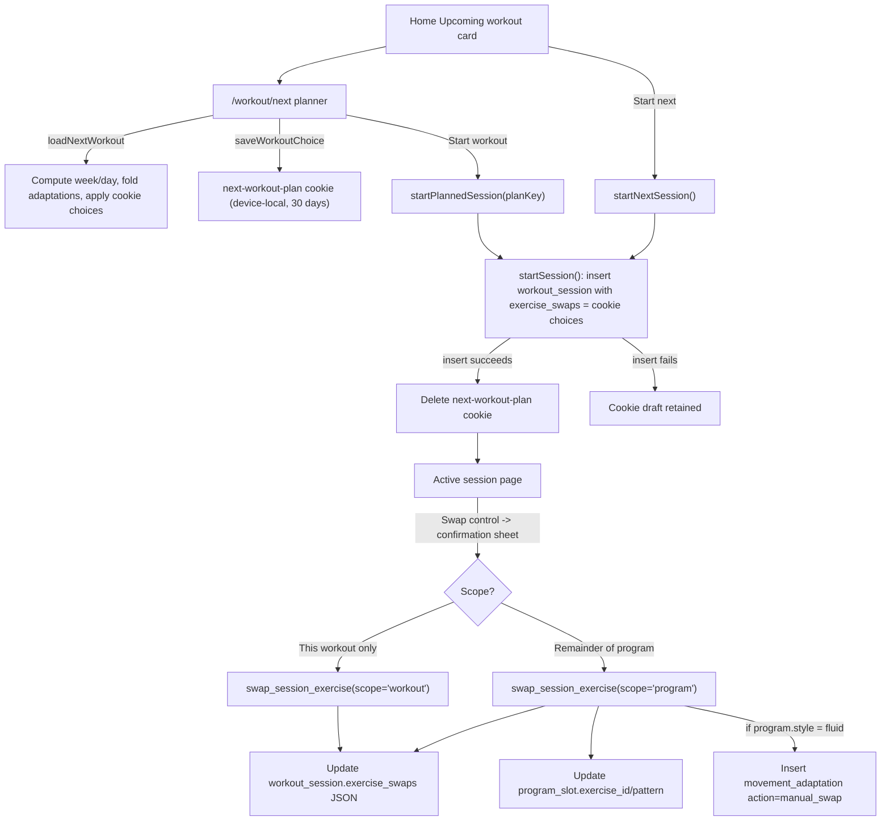

# Exercise swap scope and workout planning

The app has two distinct pre-workout exercise decisions, backed by different persistence
mechanisms:

1. **Next-workout planning** (`/workout/next`): a full-page, cookie-persisted "dry run" of the
   upcoming workout, available before a session exists.
2. **In-session exercise swap**: a scoped substitution made once a `workout_session` row exists,
   persisted server-side in `workout_session.exercise_swaps` and optionally in `program_slot`.

Both ultimately feed the same exercise-resolution logic and both interact with fluid-program
adaptation state (see `/openwiki/concepts/fluid-and-plateau-adaptation.md`).


*How Home, the planner, session start, and in-session swaps all route through `loadNextWorkout` and `swap_session_exercise`.*

## Planning the next workout

Home's "Upcoming workout" card links to `/workout/next`, a full-page planner that shows every
exercise in the upcoming workout with its effective, week-specific sets, reps, RIR, rest, and
phase description (`src/app/(app)/workout/next/page.tsx`, `workout-planner.tsx`). It reuses the
same station-resolving `ExercisePicker` (`resolveStations`) used by the active session, so the
same brand/machine-type resolution rules apply in both places. If the user already has an open
session for the active program, the planner redirects to that session instead of planning a new
one.

### `loadNextWorkout`: the shared computation

`loadNextWorkout` (`src/lib/next-workout.ts`) is the single function used by Home, the planner,
and session start to determine "what is the next workout":

- It counts finished sessions for the active program to derive `week` and picks the day at
  `completed % program.days.length`, so days always cycle in program order.
- For fluid programs, it loads `movement_adaptation` rows per slot and folds them with
  `foldPrescription` (`src/lib/strength/plateau.ts`) — the same folding function the active
  session uses — to get each slot's adaptation-adjusted `baseExerciseId` and rep range.
- It reads the planning cookie via `readWorkoutPlan`, keyed by `workoutPlanKey(userId, programId,
  dayId, completed)`, and layers any device-local choice on top of the adaptation-folded default:
  `exerciseId = choices[slot.id] ?? baseExerciseId`.
- It resolves the per-week prescription with `resolvePrescription` and falls back to the profile's
  `default_rest_seconds` (or 120) when a slot has no explicit rest.
- Any database read error is thrown rather than silently defaulting to week one, so planning never
  shows a wrong week on a transient failure.

Because the key includes `completed`, the same program day repeating in a later week is a
different plan key, and stale cookies naturally stop matching.

### Persistence and the start boundary

Planning choices are stored in a same-site, `HttpOnly` cookie (`next-workout-plan`, `httpOnly`,
`sameSite: "lax"`, 30-day `maxAge`) via the `saveWorkoutChoice` Server Action
(`src/app/(app)/workout/next/actions.ts`). This is intentionally **not** synced across devices,
and the UI states that limitation. Key properties of this Server Action:

- It re-derives the current plan with `loadNextWorkout` and rejects the save if the workout is
  already open (`next.open`) or if the caller's `key` no longer matches the freshly computed key
  (a stale page from a prior day/week), telling the user to return home and reopen it.
- It validates the target slot still exists in the current day and that the chosen exercise
  resolves to a loggable (non-template) catalog entry via `isLoggableExercise`.
- It serializes `{ key, choices }` and rejects the write outright — visibly, not silently — if the
  encoded cookie would exceed 3800 bytes, rather than reporting a false success.
- `exerciseId: null` deletes that slot's entry, i.e. "Reset" only clears one slot's planned
  choice and leaves every other slot's choice and the program default intact.

`readWorkoutPlan` (`src/lib/workout-plan.ts`) is the read-side counterpart: it parses the cookie,
discards it entirely if `draft.key` doesn't match the freshly computed key, and per slot keeps
only choices whose exercise still exists in the caller's merged catalog, still matches the stored
id (guards against id collisions), and is loggable — silently dropping choices for deleted slots,
unknown/removed exercises, or unresolved station templates rather than surfacing an error mid-read.

Selecting a brand-new custom station variant from the picker still persists that catalog row
immediately through the existing authenticated `resolveVariant`/`createCustomExercise` actions
(`src/app/(app)/exercise/actions.ts`) — only the *choice of which exercise to use* is deferred to
the cookie, not the creation of the exercise/variant record itself.

Planning never creates a `workout_session` row or a `set_log` row, so browsing the planner
contributes no duration, adherence, or training-history data. It reads, but does not mutate,
adaptation state.

### Starting from the plan

`startNextSession` and `startPlannedSession(planKey)` (`src/app/(app)/session/actions.ts`) both
funnel into a shared `startSession(planKey?)`:

- It redirects to an already-open session if one exists, and to `/workout/next` if a provided
  `planKey` no longer matches the freshly computed key (a stale planner page's Start button does
  not start a mismatched workout).
- It inserts the new `workout_session` row with `exercise_swaps` set directly to the resolved
  planning `choices` — the *same* JSON column and shape that in-session swaps write to — so a
  workout started from the planner begins with its device-local choices already recorded as
  session-scoped swaps.
- On success it deletes the `next-workout-plan` cookie; on a failed insert the cookie draft is
  left in place so the choices are not lost.
- `startNextSession` (Home's Start button, no explicit `planKey`) always creates or resumes without
  a stale-key check, but shares the same insert/cookie-clear path.

Resuming an existing open session never overwrites `exercise_swaps` — it is only set at insert
time — so an in-progress session's swap choices are never clobbered by a later planner visit.

## In-session exercise swap scope

Inside an active workout, tapping the Swap control (or a profile-specific "Choose machine /
cable / bench / rack / platform" label from `chooseStationCopy`) opens the shared
`ExercisePicker`; picking a replacement opens a confirmation `Sheet`
(`src/app/(app)/session/[id]/active-session.tsx`) with two choices:

- **This workout only** — use the replacement now; the program's exercise returns next time this
  slot comes up.
- **Remainder of program** — use the replacement now and for this slot every time this program
  day recurs. Other slots, other days, and shared program templates used by other users are
  unaffected.

Cancel leaves the current selection unchanged. The sheet cannot be dismissed while a save is in
flight (`dismissible={!savingSwap}`); a failed save shows an inline error and the sheet stays open
for retry. Both scopes save immediately, before the first set of the workout is logged, and
survive reload. Sets already logged keep their original `exercise_id` and performance; their
exercise name is shown alongside the set when it differs from the currently selected exercise.
Weight/rep recommendations continue to be computed from each specific exercise's own history,
independent of which exercise is "current" for the slot.

### `swapSessionExercise` and the `swap_session_exercise` RPC

The Server Action `swapSessionExercise` (`src/app/(app)/session/actions.ts`) validates `scope` is
`"workout"` or `"program"`, resolves the chosen exercise against the caller's merged catalog, and
rejects unresolved station templates via `isLoggableExercise` before calling the database:

```
supabase.rpc("swap_session_exercise", {
  p_session_id, p_slot_id, p_exercise_id, p_pattern, p_scope,
})
```

The RPC itself (`supabase/migrations/20260911005629_exercise_swap_scope.sql`) is
`security invoker` with `search_path = ''`, granted to `authenticated` only (revoked from `public`
and `anon`) — it runs under the *caller's* RLS policies, not an elevated role. It:

1. Requires `auth.uid()` to be set and re-validates the scope and exercise/pattern inputs.
2. Locks the `workout_session` row (`for update`) by `id` and `user_id`, and rejects if the
   session doesn't exist for that user or is already finished (`finished_at is not null`) —
   finished workouts reject swaps.
3. Locks the `program_slot` row (`for update`) and requires it to belong to the session's
   `program_day_id`, rejecting slots from another day or program.
4. Looks up the owning program's `style`, requiring the day/program/user chain to be consistent.
5. Always updates `workout_session.exercise_swaps` with `jsonb_set(exercise_swaps,
   array[p_slot_id::text], to_jsonb(p_exercise_id))` — a targeted key update that leaves every
   other slot's choice in the JSON object untouched.
6. Only for `scope = 'program'`, additionally updates `program_slot.exercise_id` and
   `program_slot.pattern` (the prescription — sets/reps/RIR — is untouched), and, only if the
   program's `style` is `'fluid'`, inserts a `movement_adaptation` row with
   `action = 'manual_swap'`.

No synthetic `set_log` rows are ever created by either scope. A later "workout only" swap after an
earlier "program" swap on the same slot still leaves the earlier permanent `program_slot` change
in place — only the session's temporary top-of-stack choice changes. A future `workout_session`
created after a program-scope swap inherits the new `program_slot.exercise_id`, but its own
`exercise_swaps` JSON starts empty (`{}`) since temporary, session-scoped overrides never carry
forward.

### Resolving the current exercise for a slot

The session page (`src/app/(app)/session/[id]/page.tsx`) resolves each slot's displayed exercise
in this priority order, so an explicit choice always wins even before anything is logged:

1. `session.exercise_swaps[slot.id]` — an explicit workout-only or program swap for this session.
2. The exercise actually logged for this slot this session (`sessionExercise`) — a legacy
   fallback for sessions started before `exercise_swaps` existed, or as a stabilizer once sets
   exist.
3. The fluid-adaptation-folded default (`foldedBySlot`).
4. `slot.exercise_id` — the plain program default.

This same page also surfaces `lastUsedAlternate` per slot by scanning recent `manual_swap`
`movement_adaptation` rows for a same-pattern, loggable exercise different from the slot's current
resolved exercise, powering a quick "last used" suggestion in the swap picker.

## Interaction with fluid adaptation

`foldPrescription` (`src/lib/strength/plateau.ts`) chronologically folds a slot's
`movement_adaptation` rows into a single effective prescription, and treats `manual_swap`
differently from the system-driven `swap` action used by plateau interventions:

- A plateau-driven `swap` resets the rep range back to the slot's original home band.
- A **`manual_swap`** (from either swap scope, when the program is fluid) instead **preserves the
  currently effective rep range**, while still resetting `ladderStep` to 0, clearing
  `recentBands`, and clearing `lastDismissAt` — so a user-initiated substitution doesn't discard
  in-progress rep-range progression, but does supersede prior plateau state and dismiss history
  for that slot going forward. Only program-scope swaps write `manual_swap` rows (never
  workout-only swaps), since only program-scope swaps represent a durable change to what the slot
  "is" going forward; system-generated swap suggestions accepted through the plateau UI still use
  the plateau `swap` action's home-band reset and, via `acceptAdaptation`, also call
  `swapSessionExercise` with `scope: "workout"` to persist the active session's immediate choice.

Because `loadNextWorkout` folds adaptations with the same `foldPrescription` function the active
session uses, a `manual_swap` from an in-session program-scope swap is visible the next time the
planner or Home computes the upcoming workout — it changes `baseExerciseId`, not just a session
override. The planner's own cookie-based choices, by contrast, are purely additive on top of that
folded default: saving a workout-only planner choice does not touch `program_slot`,
`movement_adaptation`, or any adaptation history, and a planner Start writes only a `workout`-scope
equivalent — a session-local `exercise_swaps` entry — never a `manual_swap` row.

## Verification

- `npm test` includes fluid-program regression cases covering manual substitutions layered on
  top of prior fluid swaps, rep changes, and dismissals (`src/lib/strength/plateau.test.ts`).
- `workout-plan.test.ts` covers user/program/day/exposure key isolation, malformed cookies,
  removed slots, unknown exercises, and station-template rejection in `readWorkoutPlan`.
- `workout-planning-actions.test.ts` exercises the `saveWorkoutChoice`/`startPlannedSession`
  authenticated-action boundary with mocked database/cookie adapters: saving without session
  creation, preserving other slots' choices, reset, stale/invalid rejection, resume behavior,
  the atomic insert payload, and cookie draft retention on a failed insert.
- `session-swap-actions.test.ts` checks the `swapSessionExercise` station gate rejects unresolved
  templates before ever calling the RPC.
- `supabase/tests/exercise_swap_scope.sql` runs as `postgres` with transaction-scoped fixtures
  (rolled back at the end) and asserts as `authenticated`: both scopes persisting correctly,
  independent JSON keys for different slots coexisting, a later workout-only swap preserving an
  earlier program-scope change, logged sets and other program days staying unchanged, a future
  session inheriting the program change but not the temporary override, `manual_swap` events
  being recorded once the program is fluid, rejection of an invalid scope string, rejection of a
  slot that doesn't belong to the session's day, rejection of swaps on a finished session, and
  rejection of a swap attempted by a different user.
- `npm run lint`, `npx tsc --noEmit`, and `npm run build` are shipping gates for both flows; no
  migration or environment-variable change is required for planner work since it reuses the
  existing `exercise_swaps` column.
