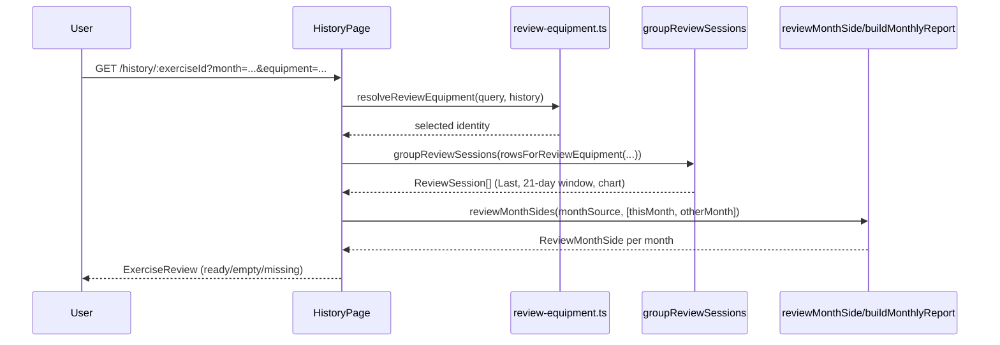
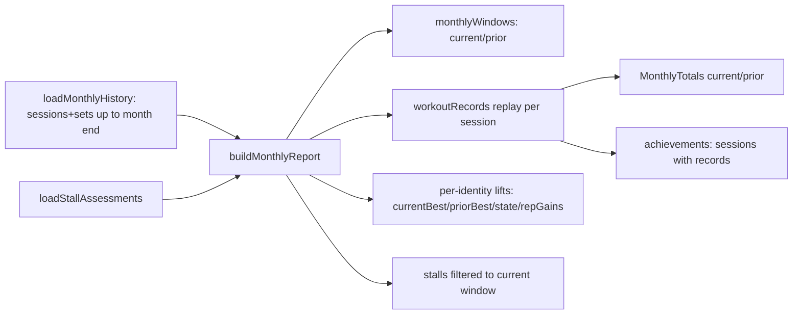

# Track: analytics, exercise review, and monthly progress

The Track tab (`/analytics`) is the home for three related but distinct data
flows, all reading from `set_log`/`workout_session` and all owner-scoped:

1. **The board** (`/analytics/page.tsx`, `src/lib/board.ts`, `src/lib/analytics.ts`)
   — a grid of tiles (default compounds plus user pins) with current e1RM and a
   trend sparkline.
2. **Exercise review** (`/history/[exerciseId]`, `src/lib/exercise-review-sessions.ts`,
   `src/lib/exercise-review-months.ts`, `src/lib/exercise-review-month-stats.ts`) —
   a single exact exercise/equipment history: Last card, 21-day window, e1RM chart,
   month-to-month comparison, equipment switcher.
3. **Monthly progress** (`/analytics/month`, `src/lib/monthly-progress.ts`,
   `src/lib/monthly-progress-data.ts`) — a dashboard replaying a calendar month
   of workouts against the canonical recap engine, plus the shared "stall" /
   plateau contract also consumed by Coach and Fluid.

`docs/MONTHLY-PROGRESS.md` is the canonical, terse contract for #2 and #3 and is
the primary source for this page; read it alongside the code for exact edge-case
wording.

## 1. The board (`/analytics`)

`AnalyticsPage` (`src/app/(app)/analytics/page.tsx`) loads every non-warmup
`set_log` row for the user (joined to `workout_session` for `performed_at`,
`finished_at`, `program_id`), normalizes it into `AnalyticsSetRow[]`, and feeds
it to `exerciseSummaries` in `src/lib/analytics.ts`.

- `exerciseSummaries` groups rows by **exact identity** — `exerciseId` +
  `equipmentInstanceId` (not just exercise) — buckets each identity's sets into
  sessions, and keeps only the identity with the latest `lastPerformedAt` per
  raw `exerciseId` (`latestByExercise`). Warmups and unfinished sessions
  (`finishedAt === null`) are excluded. Each `ExerciseSummary` carries
  `currentE1rm` (latest session's best e1RM), `bestE1rm` (all-time max over the
  identity), `delta` (latest vs. previous session), `trend`, and `e1rmSeries`
  (session-by-session bests, used for the tile sparkline).
- `src/lib/board.ts` decides **which tiles appear and in what role**:
  - `defaultCompoundIds(catalog)` picks one non-machine reference exercise per
    `BOARD_PATTERNS` (squat, hinge, horizontal/vertical press, horizontal/vertical
    pull) — these are the always-present "default compound" tiles.
  - `visibleBoardIds` unions the visible defaults (hidden ones removed via
    explicit pins, `hiddenDefaultIds`) with `extraPins` (user-added pins beyond
    the defaults, ordered by `position`). `trainedTileIds` extends "trained"
    membership through `exerciseFamilyIds` so a default compound tile counts as
    trained if *any* family variant (barbell/machine/cable sharing
    `baseExerciseId`) has history.
  - `canPinExercise` enforces `PIN_CAP` (8) extra pins.
  - `buildBoardLifts` is the tile assembler: for a default-compound id it uses
    `latestFamilyMember` (from `src/lib/exercise-history.ts`) to find the most
    recently trained **exact** family member and displays that member's stats —
    i.e. the tile groups by family for *display*, but the underlying
    `reviewExerciseId` routes to that one exact variant's Exercise review, and
    PRs/records are never merged across family members. Non-default (extra
    pinned) tiles use the summary for their own exact `exerciseId` with no
    family grouping.
  - `recentRecord` flags a tile when its `reviewExerciseId` appears in this
    week's PR chips (`loadWeekRecordChips` / `week-records-data.ts`), rendered
    via `sessionRecordChips`/`weekRecordChips`/`sessionRecordSummary`, which
    reuse `recapLines`/`recordCounts` from `strength/records.ts`.
- The pin editor (`PinEditorButton`) is fed `pinItems` built from
  `defaultCompoundIds` (group `"compound"`) plus any extra pinned or logged
  exercises (group `"extra"`, filtered to `isLoggableExercise`).

```mermaid
flowchart TD
  A[set_log + workout_session rows] --> B[normalizeRows]
  B --> C[exerciseSummaries: group by exact identity, keep latest per exerciseId]
  C --> D[buildBoardLifts]
  P[pins-data: PinRow[]] --> D
  W[loadWeekRecordChips] --> D
  D --> E[BoardGrid tiles: defaults via latestFamilyMember + extra pins exact]
```

### Invariants
- Identity for summaries/PRs is always exact exercise + equipment instance;
  only the board's default-compound tile *display* groups by family
  (`exerciseFamilyIds`/`baseExerciseId`), never records or PR totals.
- Unfinished sessions never contribute to `exerciseSummaries` or the board.
- `defaultCompoundIds` deliberately skips `stationProfile === "machine"`
  references so the six default tiles represent free/barbell-style compounds.

## 2. Exercise review (`/history/[exerciseId]`)

`HistoryPage` (`src/app/(app)/history/[exerciseId]/page.tsx`) loads the full
finished-session history for one `exerciseId` (all equipment instances),
determines the **equipment switcher** state, groups sessions, and renders
`ExerciseReview`.

### Equipment switcher
`src/lib/review-equipment.ts` computes:
- `reviewEquipmentChoices` — every equipment instance (or `null`/"none") the
  user has finished sets on for this exercise, ordered by latest use.
- `resolveReviewEquipment` — honors an explicit `?equipment=` query value
  (`"none"` maps to `null`); otherwise defaults to `latestReviewEquipment`, the
  identity used in the most recently finished session.
- `rowsForReviewEquipment` filters history down to the selected exact identity
  before any session grouping, chart, or comparison math runs. Only finished
  sessions (`finishedAt` set, and both `performedAt`/`finishedAt` at or before
  "now") count toward equipment choices or history at all.

### Session grouping and the Last / Past-three-weeks cards
`src/lib/exercise-review-sessions.ts` (`groupReviewSessions`) buckets the
selected identity's rows by `sessionId`, computes each session's `dateKey` in
`America/Chicago`, and keeps each session's best e1RM. Sessions are sorted
chronologically; `reviewToday` is the last one.

- **Last card**: the most recent finished session for the exact identity, with
  a delta against the session before it. e1RM shown is the *stored* value from
  that day — it is never recomputed against today's bodyweight.
- **Past three weeks card** (`reviewRecentWindow`, `REVIEW_RECENT_DAYS = 21`):
  filters sessions within 21 elapsed local days of "now" (`inLocalDays`,
  Chicago). Zero sessions in that window renders a "gap" state showing only
  the last-trained date (explicitly not a decline). One session shows its date
  and e1RM directly; two or more show workout count, best e1RM, and a delta
  between the window's first and last dated points.
- **e1RM chart** (`review-chart.tsx` + `e1rm-chart.tsx`): a client toggle
  between `"last8"` (last `REVIEW_CHART_SESSIONS = 8` workouts) and `"all"`
  history, built from `reviewChartPoints` (one point per session with a
  non-null best e1RM). When period tracking is enabled and the range is
  `"all"`, `periodDatesInChartRange` overlays purple reference bands for
  observed period days that fall inside the chart's date span. Fewer than two
  chart points renders a "log another workout" placeholder instead of a chart.
- Each session card below the summary cards links to its session recap
  (`sessionPath`) and lists individual sets (weight, reps, RIR), labeling
  bodyweight-equipment loads as "added".

### Month-to-month compare (`MonthCompare`)
A client widget (`month-compare.tsx`) lets the user pick any two calendar
months (native `<input type="month">`, clamped to `[0002-01, currentMonth]`)
and compares PRs, best e1RM, volume, and exposures side by side.

- Defaults come from `reviewCompareDefaults` (`exercise-review-months.ts`):
  `thisMonth` is the inbound `?month=` (or current month), `otherMonth` is the
  prior calendar month (falling back to `thisMonth` itself before month
  `0002-01`).
- Each side is computed by `reviewMonthSide` (`exercise-review-month-stats.ts`),
  which calls `monthlyWindows` for that month's Chicago window and then
  `buildMonthlyReport` — **the same monthly-progress engine that powers
  the dashboard** — but scoped to a `ReviewMonthSource` containing only this
  exact identity's sessions/sets. It filters the resulting report's
  `lifts`/`achievements` back down to the identity, derives PR counts via
  `recordCounts`, and computes volume via `identityVolume` (effective-load ×
  reps summed within the Chicago window; excludes sets with no usable load,
  never falls back to UTC weeks). A month with zero sessions for this
  identity returns `reviewEmptyMonthSide` (not a zero-value trained month).
- `MonthCompare` is not restricted to the exercise's own `?month=` param —
  users can freely browse any historical month pair for this identity.

### Navigation and the back link
Arriving via `/history/[exerciseId]?month=YYYY-MM&equipment=...` (built by
`exerciseReviewHref`, where `equipmentQueryValue(null)` becomes `"none"`)
shows a "← Back to `{month}` month review" link at the top (`ReviewShell`) and
seeds `MonthCompare`'s `thisMonth` from that param. Exercise review is a single
shared page/template for both entry paths (from the board tile and from a
monthly report link) — it does not fork into a month-only variant.



## 3. Monthly progress dashboard (`/analytics/month`)

`MonthPage` resolves a `?month=YYYY-MM` (defaulting to the current Chicago
month), redirects to the bare route if `monthlyWindows` rejects it, and calls
`loadMonthlyReport` (`src/lib/monthly-progress-data.ts`), which:

1. `loadMonthlyHistory` (`strength-history-data.ts`) reads all of this user's
   sessions/sets up through the month's end (paginated, UUID keyset,
   continuing until an empty page even if a page returns fewer rows than
   requested — the full earlier baseline is loaded, not just the two compared
   windows).
2. `loadStallAssessments` reads slot/phase/adaptation history and produces
   `StallAssessment[]` via the shared stall contract (below).
3. `buildMonthlyReport` (pure, in `src/lib/monthly-progress.ts`) combines both
   into a `MonthlyReport` (`version: "1.2"`).

### `buildMonthlyReport` mechanics
- `monthlyWindows(month, now, timeZone)` computes `current`/`prior` calendar
  windows (`monthRange`/`shiftMonth`, `weight-calendar.ts`). A completed month
  compares two complete calendar months; the current (in-progress) month
  compares elapsed dates against the *same* elapsed dates in the prior month,
  capped at the prior month's length (`inProgress` flag set).
- Sessions are deduplicated by ID, filtered to this user, finished, and not in
  the future (`performed_at`/`finished_at` ≤ `now`), then further filtered so
  only sessions whose Chicago date falls at or before `current.end` remain.
  Sets are deduplicated by ID and joined back to their session.
- **Workout replay**: for every session in the prior and current windows (in
  chronological order), `workoutRecords` (the same canonical per-workout recap
  engine used by session recaps and Coach) is replayed **against the complete
  earlier baseline** — i.e. each session's records are computed as if browsing
  history live, respecting finish-before-start ordering and reconstructing
  historical bodyweight from that session's stored context. First observations
  and ties never earn a record; a later same-workout improvement can still earn
  one with no historical delta, per the existing recap contract.
- **Totals** (`current`/`prior` `MonthlyTotals`) are `recordCounts` folded over
  each window's recap groups: workout count, rep/e1RM/top-weight PR counts,
  distinct exercises with records, and workouts with any record.
- **Per-identity `lifts`**: sets are grouped by `recordScope` (exact
  exercise/equipment/context key) into current/prior point maps. Only eligible
  working sets (`eligibleRecordSet`) count; ineligible sets increment
  `quality.excludedWorkingSets`. `currentBest`/`priorBest` are the maximum
  **stored** e1RM (rounded to 0.1 lb) per window — sets with no stored e1RM
  increment `quality.missingStoredEstimates` and are *not* regenerated from
  current bodyweight. `state` is `not_trained` (no current exposures),
  `unavailable` (exposed but no valid current best), `new` (current best but no
  prior), or `improving`/`declining`/`stable` by sign of `delta`. `percent` is
  `delta / priorBest * 100`, used to rank the top-5 "where you improved" list.
  `repGains` (v1.2 addition) captures, per normalized effective load, any
  current-window rep max that beats the prior-window rep max at that same
  load — reusing record eligibility/bodyweight rules but not itself a PR or
  e1RM-classification input.
- **Achievements** are current-window sessions with at least one record,
  carrying the full `ExerciseRecords[]` for that session (grouped by exact
  exercise/equipment in the UI's expandable list). **`currentWorkouts`** lists
  every finished current-window session regardless of records (consumed by the
  period-performance overlay to count training days without a second query).
- **`stalls`** are filtered from the input `StallAssessment[]` to those whose
  latest point falls inside the current window — a lift trained only in an
  earlier month never surfaces as a current stall.



### Monthly dashboard UI (`review.tsx`)
Renders four compact summary cards (workouts, rep/e1RM/top-weight PRs, each
with the prior-window count) plus a "lifts improving" count; the top-5
percentage improvers as name+percent links; a collapsible list of rep-only
gains (name + "`priorReps` → `currentReps` reps at `load` lb effective load");
a "Worth reviewing" list of supported plateaus (linking to Coach's next steps,
filtered to that exercise, only while the month `inProgress`); and expandable
"Achievements" grouped by exact exercise/equipment. It never lists every lift
or renders an SVG trend line on the month page itself (that lives in Exercise
review). Improved/rep-gain/stall names all link to
`/history/[exerciseId]?month=...&equipment=...` via `exerciseReviewHref`, with
`equipment=none` meaning no equipment instance. A period-tracking overlay card
(`buildPeriodPerformanceOverlay`, gated on `sex = female` and
`period_tracking_enabled`) can appear above the summary metrics; see
`docs/MONTHLY-PROGRESS.md` for its Monday–Sunday week/purple-day-mark contract.
There is no persisted monthly cache — every visit rebuilds from current saved
sets, and finishing/editing/deleting a workout or a weight entry revalidates
both the monthly and Track routes.

## The shared stall / plateau contract

`src/lib/stall-report.ts` (`buildStallAssessments`) produces one
`StallAssessment` per program slot; Monthly review, weekly Coach (UI, export,
API), and Fluid all consume the *same* function, and `strength/plateau.ts`
retains the shared threshold calculation (`detectPlateau`, `defaultPatience`)
and Fluid's intervention ladder. This replaced separate, inconsistent history
rules previously used by Coach (latest-exercise history, which could join
across an away-and-back swap) and Fluid (grouped by set creation date,
including unfinished work).

- Evidence is built per slot by walking that slot's finished, owner-scoped
  sessions in `performed_at` order; several workouts logged on one calendar
  date are **not** collapsed into a single exposure.
- Identity for a stall series is the **exact exercise and equipment
  instance**, folded through recorded adaptations
  (`foldPrescription`/`resolvePrescription`) and the stored session week.
  A swap away and back, a mixed-identity workout, a phase change, or a
  recorded adaptation resets the evidence series (`points = []`).
- A deload session (`isDeload`: `setMultiplier < 1` or name/description
  containing "deload") breaks the series; the state for that slot becomes
  `"deload"`, and the next normal workout starts a fresh baseline.
- Default patience is four stalled exposures for barbell equipment and three
  for everything else (`defaultPatience`), on top of the initial baseline, and
  requires at least 14 elapsed training days; explicit per-slot
  `plateauPatience` overrides this uniformly for every consumer.
- A running-best e1RM improvement must exceed `max(1%, 1 lb)` to reset the
  clock (`detectPlateau`). A rep increase at a previously observed canonical
  effective load also resets it even when stored e1RM is flat — but a rep max
  at a *new* load is not itself a gain. Bodyweight load is always reconstructed
  from the historical set, never the current profile.
- States: `monitoring` and `insufficient_data` are internal (not enough
  stalled exposures yet, or a fresh baseline); only `"plateau"` becomes a
  Worth-reviewing card. `"deload"` is a distinct boundary state.
- An adaptation accepted after the latest workout clears a former plateau
  immediately (`current.phaseStartAt` after `lastSetAt` resets `points`).
  Historical monthly views deliberately ignore adaptations recorded after the
  selected window, and a late-entered old workout uses its own performed date
  for context rather than borrowing a later adaptation.
- The report shows evidence only — no recommendation or program change is
  applied by monthly review or by this contract itself; Coach retains its own
  pain/deload/repeated-effort prioritization, and Fluid retains its
  dismiss/snooze/confirmation state independent of the underlying evidence.
- Deleted slots are omitted from stall classification (their sets still
  contribute to PR totals via `workoutRecords`), and unrecorded historical
  program-builder prescription edits cannot be reconstructed — only the stored
  session week, current phase/slot definitions, and recorded adaptations are
  available as context.

## Cross-cutting invariants

- **Owner scoping and pagination**: every session/set/slot/phase/adaptation
  read across all three flows uses explicit owner predicates and UUID keyset
  pagination that continues until an empty page (even when a page returns
  fewer rows than the requested limit). Failed reads surface an error rather
  than a partial report.
- **No caches**: none of the board, Exercise review, or monthly dashboard
  persist an aggregate; every request recomputes from current `set_log`/
  `workout_session` rows. Weekly Coach report contracts and schema/version
  remain independent and unchanged by this work.
- **Stored estimates over live recompute**: monthly trend/e1RM-PR comparisons
  intentionally use *persisted* e1RM values (never regenerated from today's
  bodyweight or the current strength formula), so if an old persisted estimate
  differs from the canonical formula, the monthly trend and a recap's PR value
  for the same set can legitimately differ — this is accepted, not a bug to
  silently rewrite.
- **Signed change ≠ stall signal**: a lower monthly best alone never triggers
  a plateau card, and a plateau card alone never changes PR totals or e1RM
  classification — the two systems (records/percent-change and stall
  detection) are computed independently and only share input sessions/sets.

## Related pages

- `/openwiki/concepts/exercise-catalog-and-identity.md` — `baseExerciseId`
  families, `stationProfile`, and exact exercise/equipment identity that
  `board.ts`, `recordScope`, and the stall contract all key off of.
- `/openwiki/concepts/fluid-and-plateau-adaptation.md` — the intervention side
  of `strength/plateau.ts` and how Fluid consumes `StallAssessment`.
- `/openwiki/workflows/body-tracking.md` — the weight card shown on
  `/analytics/month`, `bodyweightTrend`, and period-tracking eligibility.
- `/openwiki/workflows/coach-and-ai-agent.md` — Coach's own consumption of
  `buildStallAssessments` for weekly next-steps and repeated-effort/decline
  comparisons.
