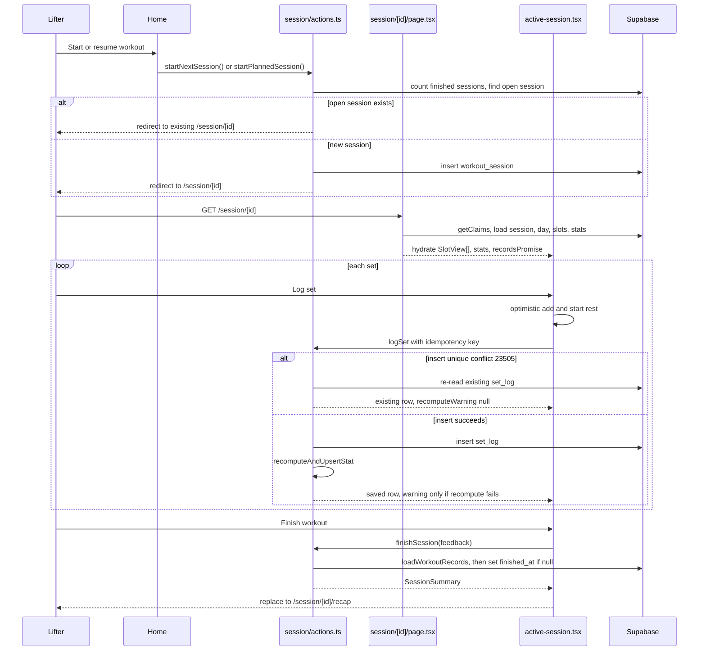
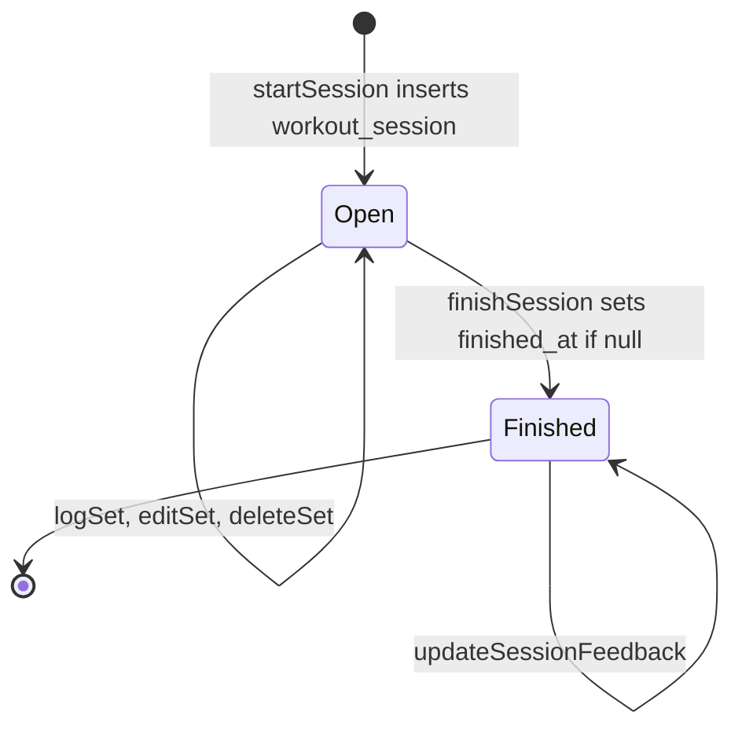
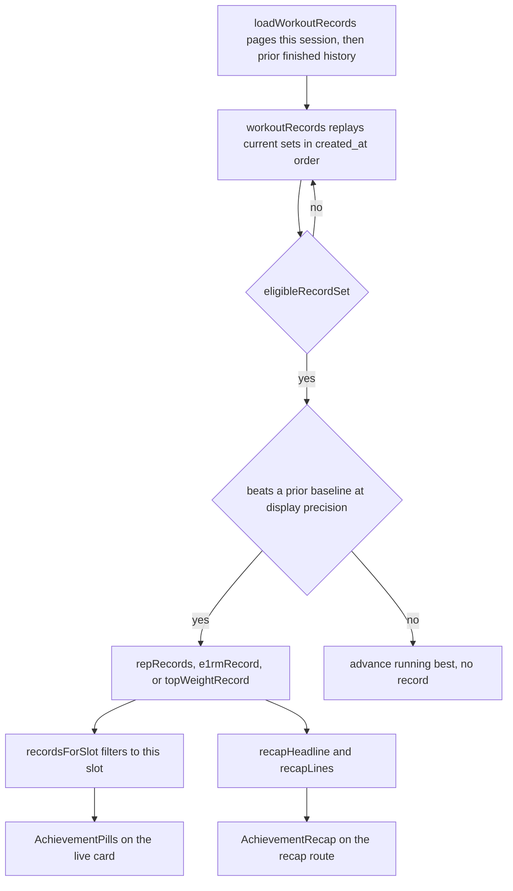
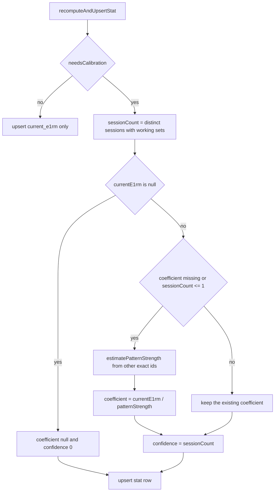

## Overview

This page traces one lifting session end to end: resuming or starting it, deriving which
program day/week it represents, the client/server split for logging sets, the rest timer
that survives tab throttling, optional readiness/pain/note feedback, finishing the session,
and the record replay that powers both live PR pills during the workout and the cinematic
recap afterward. The session screen (`src/app/(app)/session/[id]/`) is the app's keystone
UI; almost every other concept (recommendation, progression, plateau adaptation, exercise
identity) is consumed here.

*End-to-end flow from resume-or-start through idempotent logging, a non-blocking recompute, and the recap redirect.*

## Entry points and files

- `src/app/(app)/session/[id]/page.tsx` — Server Component that loads and hydrates one
  session (auth, day/slots/prescriptions, stats, progression history, pending Fluid
  suggestions, and a still-pending `recordsPromise`).
- `src/app/(app)/session/[id]/active-session.tsx` — the client component tree: `ActiveSession`
  (session-level chrome: header, phase banner, readiness prompt, finish bar) and `SlotCard`
  (per-exercise set entry, swap, history, plateau suggestions, achievement pills).
- `src/app/(app)/session/[id]/layout.tsx` — wraps the page and its `loading.tsx`/`error.tsx`
  siblings in `RestTimerProvider`, so the rest timer state is a layout-scoped context, not
  page-scoped.
- `src/app/(app)/session/[id]/rest-timer.tsx` + `src/lib/rest-timer-state.ts` — the timer
  hook and its storage/pub-sub primitives.
- `src/app/(app)/session/actions.ts` — all server actions: session creation, `logSet`,
  `editSet`, `deleteSet`, `finishSession`, feedback writes, swap, and Fluid adaptation
  accept/dismiss.
- `src/lib/session-feedback.ts` — validation/normalization for readiness, joint pain, and
  session notes; shared by the active session, the recap, and `finishSession`.
- `src/lib/strength/records.ts` (`workoutRecords`, `recordsForSlot`, `recapHeadline`,
  `recapLines`) and `src/lib/workout-records.ts` (`loadWorkoutRecords`) — the PR/e1RM/top-
  weight replay engine and its paginated Supabase read path.
- `src/app/(app)/session/[id]/recap/page.tsx` + `session-recap.tsx` — the post-finish
  recap screen, a distinct route from the live session.

## Starting or resuming a session

`startNextSession`/`startPlannedSession` (`session/actions.ts`) both delegate to an internal
`startSession(planKey?)`. Day and week are **derived, not stored as a cursor**: `loadNextWorkout`
(`src/lib/next-workout.ts`) counts the user's *finished* sessions for the active program,
then `week = floor(completed / days.length) + 1` and `day = days[completed % days.length]`.
If an open (unfinished) session already exists for that program, and it has a
`program_day_id`, the user is redirected straight into the most recently performed one
instead of creating a new one — a session in progress is always resumed, never duplicated.
A planned start whose cookie `planKey` no longer matches the derived next workout redirects
to `/workout/next` rather than starting a stale plan. `startSession` copies the resolved
`exercise_swaps` (from the pre-session workout-plan cookie) and the `week_index` /
`program_day_id` onto the new `workout_session` row, then deletes the cookie only after the
insert succeeds. Later phase/week resolution for that exact workout therefore replays against
the week it was actually performed in, even if the program is edited afterward. Swap scope
and the cookie planner live on
[Exercise swap and planning](exercise-swap-and-planning.md).

`SessionPage` does not recount finished sessions. It reads the persisted `week_index`
(defaulting a missing value to 1) and `program_day_id`, resolves the classic phase with
`phaseForWeek`, and additionally hydrates:

- `ExerciseStat[]` (from `user_exercise_stat`) and recent first working sets per exact
  exercise, so `active-session.tsx` can compute each slot's target client-side via
  `sessionTarget()`/`selectProgressionReference()` (see
  [Strength engine](../concepts/strength-engine.md)) — a swap re-derives the target with no
  round-trip. That history query is capped at 500 rows and is a progression reference, not
  the all-time record replay.
- the session's own `set_log` rows, grouped **by `program_slot_id`**, so a duplicated
  exercise across two slots keeps independent set lists. The displayed exercise is the
  explicit `exercise_swaps[slotId]` when present, otherwise the most recently logged
  exercise for that slot, otherwise the folded Fluid prescription. An in-session swap
  therefore survives a reload even before the first set is logged.
- Fluid-program plateau suggestions (`loadPendingSuggestions`) and per-slot "last used
  alternate" exercises for quick re-swap in a crowded gym. Fluid folding itself stays on
  [Fluid and plateau adaptation](../concepts/fluid-and-plateau-adaptation.md).
- `recordsPromise` — deliberately **not awaited** on the page. See
<!-- openwiki: broken internal link [#live-pr-pills-without-blocking-the-page] heading anchor "live-pr-pills-without-blocking-the-page" does not exist in /openwiki/workflows/workout-session-lifecycle.md. Fix the href or restore the target, then delete this comment. -->
  [Live PR pills without blocking the page](#live-pr-pills-without-blocking-the-page).

A missing user redirects to `/login`. A session without `program_day_id`, or a missing day
row, is `notFound()` — including an unfinished session whose program was later deleted.

## The `requireUser`/`getClaims` auth boundary

Every server action in `session/actions.ts` starts by calling a local `requireUser()`
helper, which calls `supabase.auth.getClaims()` and redirects to `/login` if there is no
`claims.sub`. `SessionPage`, the session layout, and the recap page perform the equivalent
check inline. This is the app convention: `auth.uid()` inside Postgres RLS is the hard
boundary, but `getClaims()` gates a whole action or page before any work. Several mutations
also re-check ownership with an explicit `.eq("user_id", userId)` (session select in
`logSet` and `finishSession`; the readiness and feedback updates) as defense in depth
alongside RLS. `deleteSet` selects and deletes by set id only, so its ownership check is
the RLS policy rather than an application-level user filter.

## Logging sets

`logSet(input: LogSetInput)` is the hot path, called once per logged set from `SlotCard`'s
`handleLog`:

1. Loads the merged exercise catalog, rejects unresolved station templates
   (`isLoggableExercise`) and invalid weight/reps/RIR (`validSetNumbers`). New writes also
   require RIR; a missing RIR is rejected rather than computed as zero. Non-bodyweight
   exercises require a positive weight.
2. Confirms the session id belongs to the caller (`"Session not found"` otherwise). It does
   **not** require `finished_at` to be null. The finished screen hides the finish bar and
   disables swaps, but `SetEntry` stays mounted, and `editSet`/`deleteSet` likewise have no
   finished-session guard. Editing or deleting a finished workout's sets therefore
   recalculates the recap; it does not move `finished_at`.
3. Computes `set_index` **scoped to `(session, program_slot_id)`** when a slot id is
   present, or `(session, exercise_id)` for ad-hoc sets — so the same exercise logged in two
   different slots keeps independent set numbering. The index is a count of existing rows,
   not a lock; the idempotency key below is what makes a retry safe, not the index.
4. Computes effective load (`effectiveLoad`, bodyweight/assisted-aware, using today's
   bodyweight) and e1RM (`computeE1rm`) from the day's RPE/RIR table. `editSet` is different:
   a bodyweight edit recovers the bodyweight implied by the originally persisted e1RM
   (`historicalBodyweight`) and keeps e1RM null when that history is unknown, instead of
   substituting today's weigh-in.
5. Inserts the `set_log` row, marking `is_calibration` only when this is the first exact-id
   set ever and the definition `needsCalibration` (machine/cable variants). A second set of
   the same variant is not a calibration set. Barbell-station variants skip the flag, and
   leftover template rows on a different `exercise_id` are not rewritten.
6. Calls `recomputeAndUpsertStat` to refresh `user_exercise_stat` for that exercise (see
   [Calibration anchoring](#recomputeandupsertstat-and-calibration-anchoring)).
7. Revalidates `/session/[id]`, `/session/[id]/recap`, and `/history/[exerciseId]`.

**Idempotent set writes.** `handleLog` generates one `crypto.randomUUID()` per log intent
(`generateIdempotencyKey`) and closes over that same key inside `retryServerAction`. The
database constraint is a partial unique index on `(session_id, idempotency_key)` where the
key is not null — not a globally unique column. If the insert hits Postgres `23505` and a
key was supplied, `logSet` re-reads that session's existing row and returns it with
`recomputeWarning: null`. It does **not** recompute stats on the conflict path: the first
successful insert already owns the recompute, and a retry must not look like a second
stat-cache failure. A conflict whose row cannot be re-read throws
`"Could not retrieve existing set"`. A `23505` without an idempotency key is an ordinary
failure. `retryServerAction` retries only transient network, timeout, 408, 429, and 5xx
errors, at most three attempts, so a validation or auth error is not retried.

**Optimistic UI, explicit failure surfacing.** `SlotCard` uses `useOptimistic` to append the
set immediately and starts the rest timer *before* the network call resolves. The rest
period is real regardless of whether the log persisted (`docs/DECISIONS.md`, Phase B). If
the server call throws, the optimistic row reverts when the transition settles, and a
`text-danger` message explains the failure instead of letting the row silently disappear
(Phase 7). A failed write produces no record and does not revalidate; a later successful
retry with a new log intent can. `editSet`/`deleteSet` follow the same recompute-then-
revalidate shape. Both revalidate the analytics routes because those views read `set_log`
directly; a plain `logSet` does not. `deleteSet` of a missing row returns without throwing.
Optimistic `temp-` rows cannot be edited or deleted until the server id replaces them.

**A recompute warning is not a failed write.** If `recomputeAndUpsertStat` throws after the
set insert, update, or delete has succeeded, the action still returns the saved result plus
a `recomputeWarning` string (`"Set saved…"` or `"Set deleted…"`). `SlotCard` renders that as
a muted banner with "Retry stats update", wired to `retryRecomputeStat`. That retry rebuilds
the stat cache only; it does not insert another set. A second failure replaces the banner
with "Still couldn't update stats…" and leaves the saved sets alone. The conflict path above
never emits this warning.

## Rest timer: absolute end timestamp survives tab throttling

The rest timer is a single session-scoped instance (`RestTimerProvider` in
`session/[id]/layout.tsx`, keyed by session id), not one per slot — a lifter only rests for
one exercise at a time. The layout passes `enabled={!session?.finished_at}` and
`toneEnabled` from `profile.rest_tone_enabled` (default on). Key mechanism, in
`src/lib/rest-timer-state.ts` plus `useRestTimer`:

- `start(seconds)` stores `endsAt = Date.now() + seconds * 1000`, not a decrementing
  counter, in both an in-memory `Map` and `sessionStorage`
  (`lifting-rest-timer:<sessionId>`) via `writeRestEndsAt`. The seconds come from the slot's
  `rest_seconds`, or `profile.default_rest_seconds` (120 when unset). A null per-slot value
  means "use the profile default", so a later profile change applies to slots that were not
  explicitly overridden.
- A 250ms interval recomputes `remaining = round((endsAt - Date.now()) / 1000)` on every
  tick (`restRemainingSeconds`), so drift from a throttled tab or a missed tick self-corrects
  instead of accumulating.
- `readRestEndsAt` treats an already-expired stored timestamp as absent, so a stale
  `sessionStorage` value never resurrects a finished rest. If `sessionStorage` throws, the
  in-memory map still updates subscribers.
- Logging a set revalidates the page, and the first saved set of an exercise is when
  `loadWorkoutRecords` starts paging history. That refetch can suspend
  `session/[id]/loading.tsx`. The timer lives in the **layout** (layouts are not replaced by
  `loading.tsx`), and `loading.tsx` / `error.tsx` both render `SessionRestBar`, so the
  countdown stays visible through the fallback. `sessionStorage` covers a full remount.
- When the layout marks the provider disabled (finished session), the hook clears the stored
  end timestamp and cancels the scheduled notification. `handleFinish` also calls
  `rest.skip()` before leaving for the recap. `+30s` extends the same absolute timestamp and
  reschedules the notification; Skip clears it.
- `useScreenWakeLock(!alreadyFinished)` keeps the screen on for an unfinished session and
  re-acquires the lock when the tab becomes visible. A refused lock is non-fatal. The
  remaining failure mode is a manual phone lock or a backgrounded tab, both of which throttle
  JS timers.
- Completion vibrates unconditionally, plays Web Audio beeps only when
  `profile.rest_tone_enabled` is on, and shows a Notification API banner when permission is
  already granted. Permission is requested at rest start (a user gesture), not on page load.
  `/rest-sw.js` is a notification-only service worker: it schedules the same banner from the
  end timestamp so Android can still alert if the page timer is frozen. It does not cache
  documents or add offline sync. Denied permission degrades to vibration plus the optional
  tone.

## Session feedback: readiness, joint pain, note

`src/lib/session-feedback.ts` defines the shared contract: `readiness` (1–5 integer),
`jointPain` (`none | mild | significant`), and a trimmed note capped at 280 characters
(`SESSION_NOTE_MAX_LENGTH`). Empty notes become null. All three live on `workout_session`,
not a general wellness model, because they describe one training exposure and share that
row's ownership/RLS boundary.

- **Readiness** is prompted once, before any set is logged (`ReadinessPrompt`, shown only
  when the session is unfinished, no slot has server-hydrated sets, and
  `initialFeedback.readiness == null`). Skip hides it locally without writing. `saveSessionReadiness`
  enforces the same window server-side: the session must still be unfinished, and any existing
  `set_log` row for that user/session rejects the write with
  `"Readiness can only be logged before the first set"`. It is a pre-workout signal, not
  something to retcon. The prompt's save failure tells the lifter they can keep training.
- **Joint pain and note** are optional. Finish opens `SessionFeedbackSheet` in `"finish"`
  mode and passes the payload into `finishSession`. After finishing, `SessionFeedbackDetails`
  can reopen the sheet in `"edit"` mode on both the finished session page and the recap.
  `updateSessionFeedback` writes `joint_pain`/`notes` only and never touches `finished_at`.
  Significant pain is copy that tells the lifter to pause progression advice; it is not a
  diagnosis and does not itself change the strength engine.

## Finishing a session

`finishSession(sessionId, feedback?)`:

1. Re-derives ownership via an explicit select (also needed to read `performed_at` and the
   current feedback), throwing `"Session not found"` if missing or not owned. It does not
   require the session to still be open.
2. Loads the full record replay **before** any finish write. A failed history read throws and
   leaves `finished_at` null, so a recap is never returned for an unfinished session whose
   records could not be loaded.
3. If a feedback payload was provided, normalizes and persists `joint_pain`/`notes`. A
   feedback write failure also leaves `finished_at` unchanged.
4. Sets `finished_at = now()` guarded by `.is("finished_at", null)`. Re-opening the summary
   therefore returns a fresh replay without moving the original finish time. A failed finish
   update throws and does not return a success summary.
5. Computes `topE1rm`: the best non-warmup e1RM per exercise from *this* session, paired with
   `prevE1rm` from that exercise's most recent earlier finished session in the same replay
   history. The returned `SessionSummary` is `achievements`, `totalSets` (non-warmup sets),
   `feedback`, and `topE1rm`.
6. Revalidates home, analytics, history, and the session/recap paths.

`ActiveSession.handleFinish` wraps the call in `retryServerAction`. Only after success does
it stop the rest timer, close the sheet, and `router.replace` to `sessionRecapPath`. The
live page does not flip into a finished rendering mid-transition. The recap route redirects
back to `/session/[id]` when `finished_at` is still null, and `notFound()` when the session
row is missing. From a finished session, "View recap" is a separate navigation; from the
recap, "View workout" returns to the finished session page. The recap page loads records
synchronously and does not display `topE1rm` — that field is part of the finish action's
return value, not the recap route's props.

*Open sessions can log and rest. Finish stamps finished_at once. Later set edits recalculate records but do not move that timestamp.*

## Live PR pills and the finish recap: paginated record replay

`workoutRecords` (`src/lib/strength/records.ts`) is a **pure function**. It dedupes by set
id, keeps only the caller's rows, splits prior finished history from this session, and
replays the current session in `created_at` then `id` order. Optimistic rows are never
passed in. It returns `ExerciseRecords[]`, one group per `(exercise_id,
equipment_instance_id)` scope, each carrying:

- `repRecords`: best reps at a specific effective load, consolidated so only the latest gain
  at that load remains.
- `e1rmRecord`: a new high estimated 1RM for that scope.
- `topWeightRecord`: a new heaviest effective load, independent of e1RM.

A record fires only when the current set beats a prior baseline. The first observation in a
workout does not itself become a record; a later set in the same workout can, with
`improvement: null` so the UI does not invent a historical delta. `eligibleRecordSet`
excludes machine **templates** (`stationProfile === "machine"`), warmups, invalid numbers,
and bodyweight sets whose historical bodyweight cannot be recovered. Leftover cable or
barbell-station template rows stay eligible on their exact id; `needsStation` is not a PR
merge. Estimates are compared at the displayed tenth of a pound, so a sub-display gain is
not a record. Bodyweight sets recover historical bodyweight by inverting the persisted e1RM
(`historicalBodyweight`) rather than using today's weigh-in.

`loadWorkoutRecords` is the read path shared by the live session, `finishSession`, and the
recap page. It pages `set_log` in `PAGE_SIZE = 500` chunks, ordered by `created_at` then
`id`, for this session's sets and then for prior history of the exercises touched in this
session. Prior history must be a different session, non-warmup, performed and created before
this session's `performed_at`, and finished at or before that timestamp. An empty current
session does not query history. A read error throws (`"Unable to load workout records…"` or
`"Unable to load record history…"`) instead of inventing a baseline. The page size exists
because silently accepting a client library's default row cap would produce false all-time
records once history exceeds that cap. The loader then calls `workoutRecords` once over
`[...history, ...current]`.

**Live pills don't block the page.** `SessionPage` does not await `recordsPromise`. It
streams the promise, catches a load failure as `null`, and lets a `Suspense`-wrapped
`WorkoutRecordsSync` resolve it with React `use()`. A null result leaves the achievement
state empty rather than failing the session page. `recordsForSlot` filters the flat list to
records whose source set belongs to that slot, and `AchievementPills` renders `recapLines`.
Blocking here would suspend `loading.tsx` and could remount the rest timer, so records
intentionally arrive after the rest of the hydrated session.

**The finish recap** (`session-recap.tsx`, via `AchievementRecap`) awaits the same loader on
the recap page. `recapHeadline` returns a single "N PRs" headline only when every record is
the same kind. Mixed kinds stay a joined string ("3 rep PRs · 2 e1RM records · …") rather
than a fabricated combined count. `recapLines` appends a `+delta` only when a real prior
baseline existed.

*The same pure replay feeds live per-slot pills and the recap. A first observation is not a record; a later within-workout beat can be, with a null delta.*

## `recomputeAndUpsertStat` and calibration anchoring

Called after every successful `logSet`/`editSet`/`deleteSet` — but not after an idempotent
conflict — `recomputeAndUpsertStat` rebuilds `user_exercise_stat` for one `exercise_id` from
that exercise's non-warmup `set_log` rows. `set_log` is the source of truth;
`user_exercise_stat` is a rebuildable cache (see
[Strength engine](../concepts/strength-engine.md)). `currentE1rm` is the maximum e1RM across
working sets (`recomputeStat`), not a session average or the first set. An unknown catalog
id returns without writing. The upsert uses today's bodyweight for the rebuild, including
after an edit that preserved a historical bodyweight on the individual set row.

For definitions with `needsCalibration` (machines and cable/brand variants, whose absolute
load units are not free-weight pounds), it also maintains `personal_coefficient` and
`coeff_confidence_n`:

*Calibration anchors on the first working session, re-anchors while only one exists, then holds. Deleting every set clears the coefficient.*

Invariants:

- **Anchor-then-hold.** The coefficient is recomputed only while it is null or
  `sessionCount <= 1`. Once a second distinct session has working sets, later progress moves
  `currentE1rm` (and, through `estimatePatternStrength`, the pattern estimate other exercises
  calibrate against) but not this exercise's own coefficient. If pattern strength is missing,
  the existing coefficient is left unchanged.
- **Delete-to-zero resets calibration.** If `currentE1rm` is null, both
  `personal_coefficient` and `coeff_confidence_n` become null and 0, so the next first set
  recalibrates instead of keeping a coefficient for data that no longer exists.
- **`coeff_confidence_n`** counts distinct sessions with working sets on that exact
  `exercise_id`, not sets. It feeds the Bayesian shrinkage in `recommend()`.
- **No separate graduation path.** Once a machine has its own `currentE1rm` and a non-trivial
  confidence count, `recommend()`'s direct-history branch returns medium/high confidence.
  There is no calibrate-to-graduated state to maintain.
- A recompute failure never rolls back the set write. It surfaces as `recomputeWarning`, with
  `retryRecomputeStat` as the manual retry.

## Relationship to swap, progression, and plateau features

The active session consumes exercise substitution and progression targeting live.
`swapSessionExercise` (`workout` or `program` scope) calls the `swap_session_exercise` RPC,
which checks session/slot ownership and keeps the original `program_slot_id` while changing
the logged `exercise_id`. See
[Exercise swap and planning](exercise-swap-and-planning.md). Session-side target computation
and the pattern/coefficient model are covered in
[Strength engine](../concepts/strength-engine.md). Why a bare station template blocks
`logSet` and swap until resolved is covered in
[Exercise catalog and identity](../concepts/exercise-catalog-and-identity.md). Card `tone`,
the sticky finish bar, and the native-dialog `Sheet` are documented in
[UI conventions](../concepts/ui-conventions.md).

## Focused tests

- `src/lib/record-actions.test.ts` drives `logSet`, `editSet`, `deleteSet`, and
  `finishSession` through the real record loader: identical achievements on finish and
  reopen, no duplicate record count on a repeated save, no record after a failed write, recap
  recalculation after editing a finished session, calibration only on the first cable-variant
  set, and a failed record read or finish update leaving `finished_at` null.
- `src/lib/workout-records.test.ts` locks pagination past a 1,000-row history cap, the prior-
  finished filters, and a thrown read instead of an invented baseline.
- `src/lib/strength/records.test.ts` locks eligibility, display-precision comparisons,
  within-workout null deltas, and headline honesty.
- `src/lib/rest-timer-state.test.ts` locks the absolute end timestamp, expired-value
  rejection, in-memory fallback, and per-session isolation.
- `src/lib/idempotent-logset.test.ts` only checks UUID shape and key stability. The conflict
  behavior itself is in `logSet`, not in that file.
