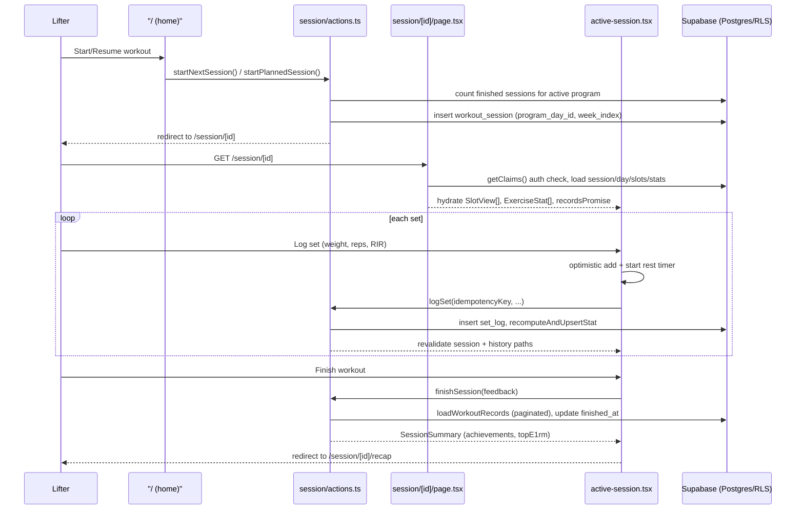
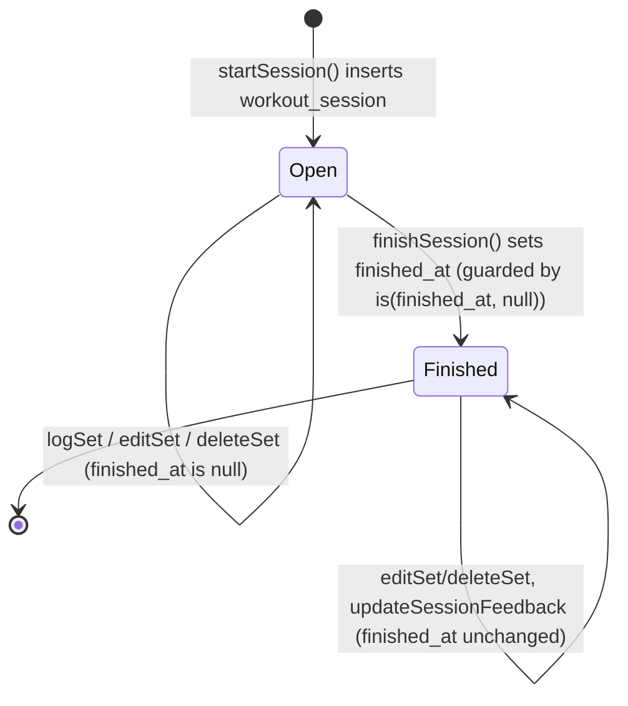
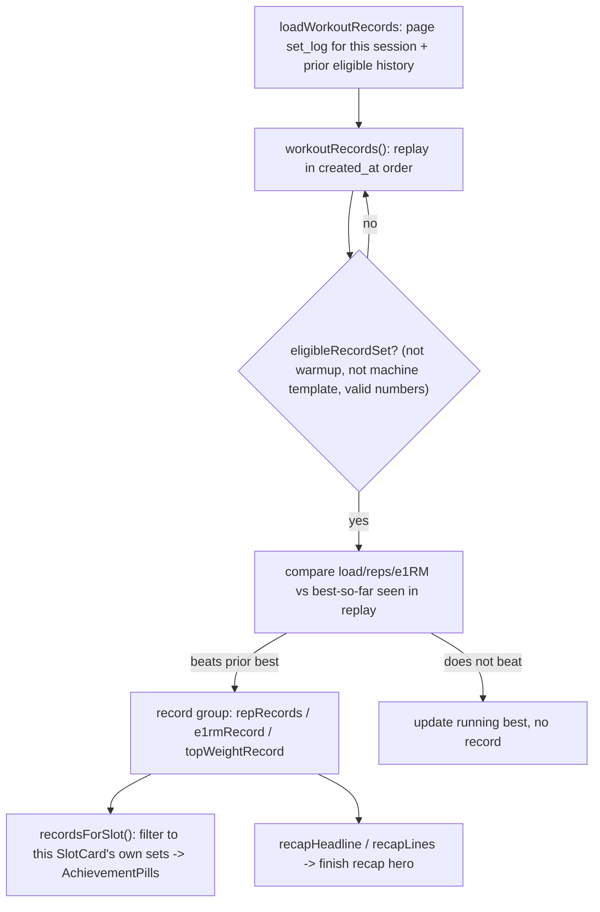
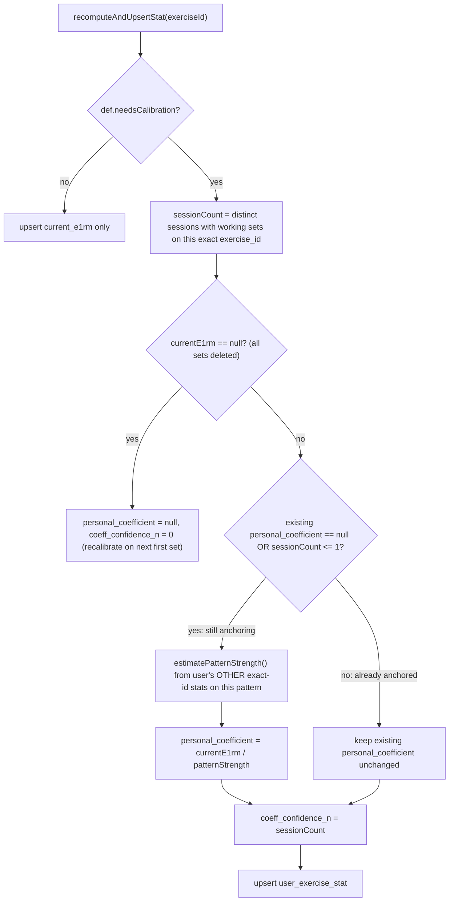

## Overview

This page traces one lifting session end to end: resuming or starting it, deriving which
program day/week it represents, the client/server split for logging sets, the rest timer
that survives tab throttling, optional readiness/pain/note feedback, finishing the session,
and the record replay that powers both live PR pills during the workout and the cinematic
recap afterward. The session screen (`src/app/(app)/session/[id]/`) is the app's keystone
UI; almost every other concept (recommendation, progression, plateau adaptation, exercise
identity) is consumed here.

*End-to-end flow from resuming a session through logging, finishing, and the recap redirect.*

## Entry points and files

- `src/app/(app)/session/[id]/page.tsx` — Server Component that loads and hydrates one
  session (auth, day/slots/prescriptions, stats, progression history, pending Fluid
  suggestions, and a still-pending `recordsPromise`).
- `src/app/(app)/session/[id]/active-session.tsx` — the client component tree: `ActiveSession`
  (session-level chrome: header, phase banner, readiness prompt, finish bar) and `SlotCard`
  (per-exercise set entry, swap, history, plateau suggestions, achievement pills).
- `src/app/(app)/session/[id]/layout.tsx` — wraps the page and its `loading.tsx`/`error.tsx`
  siblings in `RestTimerProvider`, so the rest timer state is a layout-scoped context, not
  page-scoped.
- `src/app/(app)/session/[id]/rest-timer.tsx` + `src/lib/rest-timer-state.ts` — the timer
  hook and its storage/pub-sub primitives.
- `src/app/(app)/session/actions.ts` — all server actions: session creation, `logSet`,
  `editSet`, `deleteSet`, `finishSession`, feedback writes, swap, and Fluid adaptation
  accept/dismiss.
- `src/lib/session-feedback.ts` — validation/normalization for readiness, joint pain, and
  session notes; shared by the active session, the recap, and `finishSession`.
- `src/lib/strength/records.ts` (`workoutRecords`, `recordsForSlot`, `recapHeadline`,
  `recapLines`) and `src/lib/workout-records.ts` (`loadWorkoutRecords`) — the PR/e1RM/top-
  weight replay engine and its paginated Supabase read path.
- `src/app/(app)/session/[id]/recap/page.tsx` + `session-recap.tsx` — the post-finish
  recap screen, a distinct route from the live session.

## Starting or resuming a session

`startNextSession`/`startPlannedSession` (`session/actions.ts`) both delegate to an internal
`startSession(planKey?)`. Day and week are **derived, not stored as a cursor**: `loadNextWorkout`
(`src/lib/next-workout.ts`) counts the user's *finished* sessions for the active program,
then `week = floor(completed / days.length) + 1` and `day = days[completed % days.length]`.
If an open (unfinished) session already exists for the program, the user is redirected
straight into it instead of creating a new one — a session in progress is always resumed,
never duplicated. `startSession` also captures the resolved `exercise_swaps` (from a
pre-session workout-plan cookie) and the `week_index`/`program_day_id` onto the new
`workout_session` row so later phase/week resolution for that exact workout replays against
the week it was actually performed in, even if the program is edited afterward.

`SessionPage` re-derives `week`/`day`/`phase` the same way from the persisted
`week_index`/`program_day_id`, and additionally hydrates:

- `ExerciseStat[]` (from `user_exercise_stat`) and recent first-set performances per exact
  exercise, so `active-session.tsx` can compute each slot's target client-side via
  `sessionTarget()`/`selectProgressionReference()` (see
  [Strength engine](../concepts/strength-engine.md)) — a swap re-derives the target with no
  round-trip.
- the session's own `set_log` rows, grouped **by `program_slot_id`**, so a duplicated
  exercise across two slots keeps independent set lists, and the most recently logged
  exercise per slot (or an explicit `exercise_swaps[slotId]`) determines which exercise that
  slot is currently showing — this is what makes an in-session swap survive a page reload.
- Fluid-program plateau suggestions (`loadPendingSuggestions`) and per-slot "last used
  alternate" exercises for quick re-swap in a crowded gym.
- `recordsPromise` — deliberately **not awaited** on the page. See
  [Live PR pills without blocking the page](#live-pr-pills-without-blocking-the-page).

## The `requireUser`/`getClaims` auth boundary

Every server action in `session/actions.ts` starts by calling a local `requireUser()`
helper, which calls `supabase.auth.getClaims()` and redirects to `/login` if there is no
`claims.sub`. `SessionPage` and the recap page perform the equivalent check inline. This is
the same convention used across the app (see `AGENTS.md`): `auth.uid()` inside Postgres RLS
policies is the hard boundary, but `getClaims()` is the trusted server-side read used to
gate a whole action/page before doing any work, and several actions additionally re-check
row ownership with an explicit `.eq("user_id", userId)` select before mutating (e.g.
`finishSession` selects the session first; `logSet` and `swapSessionExercise` scope every
query to `userId`) as defense in depth alongside RLS.

## Logging sets

`logSet(input: LogSetInput)` is the hot path, called once per logged set from `SlotCard`'s
`handleLog`:

1. Loads the merged exercise catalog, rejects unresolved station templates
   (`isLoggableExercise`) and invalid weight/reps/RIR (`validSetNumbers`).
2. Computes `set_index` **scoped to `(session, program_slot_id)`** when a slot id is
   present, or `(session, exercise_id)` for ad-hoc sets — so the same exercise logged in two
   different slots keeps independent set numbering.
3. Computes effective load (`effectiveLoad`, bodyweight/assisted-aware) and e1RM
   (`computeE1rm`) from the day's RPE/RIR table.
4. Inserts the `set_log` row, marking `is_calibration` when this is the exercise's first
   ever set and its exercise definition `needsCalibration` (machine/cable variants).
5. Calls `recomputeAndUpsertStat` to refresh `user_exercise_stat` for that exercise (see
   [Calibration anchoring](#recomputeandupsertstat-and-calibration-anchoring)).
6. Revalidates `/session/[id]`, `/session/[id]/recap`, and `/history/[exerciseId]`.

**Idempotent set writes.** The client generates a `crypto.randomUUID()` idempotency key per
logged set (`generateIdempotencyKey`) and passes it through. `set_log` has a unique
constraint on the key; if the insert hits Postgres error `23505` (unique violation) and an
idempotency key was supplied, `logSet` re-reads and returns the already-inserted row instead
of erroring. This makes `retryServerAction`-driven retries (used for every action call from
the client, including `logSet`) safe against duplicate submission from network retries or
overlapping submits — the client only ever sees one logical set persisted.

**Optimistic UI, explicit failure surfacing.** `SlotCard` uses `useOptimistic` to append the
set immediately and starts the rest timer *before* the network call resolves — "the rest
period is real regardless of whether the log persisted." If the server call throws, the
optimistic row reverts on the next transition settle, and a `text-danger` message is shown
explaining the failure rather than letting the row silently disappear (a UX fix from Phase
7 of `DECISIONS.md`). `editSet`/`deleteSet` follow the same recompute-then-revalidate shape;
`deleteSet` additionally revalidates `/analytics*` routes since aggregate views read
`set_log` directly.

If `recomputeAndUpsertStat` throws (e.g. a transient write failure), `logSet`/`editSet`/
`deleteSet` still succeed — the set itself is saved — but return a `recomputeWarning`
string. `SlotCard` renders this as a dismissible-by-retry banner with a "Retry stats
update" button wired to `retryRecomputeStat`, so a stat-cache hiccup never blocks logging.

## Rest timer: absolute end timestamp survives tab throttling

The rest timer is a single session-scoped instance (`RestTimerProvider` in
`session/[id]/layout.tsx`), not one per slot — a lifter only rests for one exercise at a
time. Key mechanism, in `src/lib/rest-timer-state.ts` plus the `useRestTimer` hook in
`rest-timer.tsx`:

- `start(seconds)` stores `endsAt = Date.now() + seconds * 1000`, not a decrementing
  counter, both in an in-memory `Map` and in `sessionStorage`
  (`lifting-rest-timer:<sessionId>`) via `writeRestEndsAt`.
- A 250ms interval recomputes `remaining = round((endsAt - Date.now()) / 1000)` on every
  tick (`restRemainingSeconds`), so drift from a throttled/backgrounded tab or a missed tick
  self-corrects instead of accumulating error.
- `readRestEndsAt` treats an already-expired stored timestamp as absent, so a stale
  `sessionStorage` value from a previous session/tab never resurrects a finished rest.
- Storing the end timestamp (not just in-memory state) matters because logging a set
  revalidates the page, and the very first logged set of an exercise triggers
  `loadWorkoutRecords`'s paginated history fetch, which can suspend
  `session/[id]/loading.tsx`. Living in the **layout** (layouts are not replaced by
  `loading.tsx`) plus persisting to `sessionStorage` means the timer keeps counting through
  that remount instead of resetting.
- `useScreenWakeLock(!alreadyFinished)` (in `active-session.tsx`) keeps the screen on for
  the duration of an unfinished session and re-acquires the lock on tab refocus, narrowing
  the timer's real failure mode to a user manually locking the phone or backgrounding the
  tab (both throttle JS timers regardless of wake lock).
- Completion plays Web Audio beeps (gated by `profile.rest_tone_enabled`) and vibrates
  unconditionally; a Notification API banner and a notification-only service worker
  (`/rest-sw.js`) back this up when the tab is fully suspended, scheduling from the same end
  timestamp so Android can still alert. None of this adds offline/document caching — it is
  strictly a completion signal.

## Session feedback: readiness, joint pain, note

`src/lib/session-feedback.ts` defines the shared contract: `readiness` (1–5 integer),
`jointPain` (`none | mild | significant`), and a capped 280-character free-text `note`
(`SESSION_NOTE_MAX_LENGTH`), all stored directly on `workout_session` rather than a general
wellness model, since they describe exactly one training exposure and share the session's
ownership/RLS boundary.

- **Readiness** is prompted once, before any set is logged (`ReadinessPrompt`, shown only
  when `!hasLoggedSets && initialFeedback.readiness == null`), and `saveSessionReadiness`
  enforces that server-side too (`"Readiness can only be logged before the first set"` if
  the session already has logged sets) — it is a pre-workout signal, not something to
  retcon later.
- **Joint pain and note** are optional and editable both during the session (`Finish
  workout` opens `SessionFeedbackSheet` in `"finish"` mode) and after
  (`SessionFeedbackDetails`'s edit affordance opens it in `"edit"` mode, on both the active
  session and the recap page). Editing after finishing never touches `finished_at`.
- `finishSession` accepts an optional feedback payload; if provided it normalizes and
  persists `joint_pain`/`notes` in the same call that marks the session finished.
  Significant pain is surfaced elsewhere (Coach recommendations) as a reason to pause
  progression advice, never as a diagnosis.

## Finishing a session

`finishSession(sessionId, feedback?)`:

1. Re-derives ownership via an explicit select (also needed to read `performed_at` for the
   overload/record queries), throwing `"Session not found"` if missing or not owned.
2. Optionally persists joint pain/note first.
3. Calls `loadWorkoutRecords` for the full record replay (see below).
4. Sets `finished_at = now()` guarded by `.is("finished_at", null)` — so re-opening and
   re-viewing the summary (e.g. via a repeat navigation) never moves the original finish
   time.
5. Computes `topE1rm`: the best e1RM per exercise from *this* session's working sets, each
   paired with `prevE1rm` (the best e1RM from that exercise's most recent earlier finished
   session) — the same live overload-delta signal used elsewhere in the app, here summarized
   per exercise for the finish response.
6. Revalidates the home, analytics, history, and session/recap paths, then returns a
   `SessionSummary` (`achievements`, `totalSets`, `feedback`, `topE1rm`).

`ActiveSession.handleFinish` wraps the call in `retryServerAction`, stops the rest timer
(`rest.skip()`), closes the feedback sheet, and `router.replace`s to
`sessionRecapPath(sessionId)` — the session page itself never re-renders "finished" inline
mid-transition; the recap is a separate route (`session/[id]/recap/page.tsx`) that redirects
back to the live session if `finished_at` is still null (defending against a direct link to
an unfinished session's recap).

*A session is either open (loggable, rest timer active, readiness promptable) or finished (read-mostly, feedback still editable).*

## Live PR pills and the finish recap: paginated record replay

`workoutRecords` (`src/lib/strength/records.ts`) is a **pure function**: given every
relevant `set_log` row (this session's plus prior eligible history) it replays them in
`created_at` order and returns `ExerciseRecords[]`, one group per `(exercise_id,
equipment_instance_id)` scope, each carrying:

- `repRecords`: rep PRs at a specific load (best reps ever at that exact weight).
- `e1rmRecord`: a new all-time estimated-1RM high.
- `topWeightRecord`: a new heaviest-weight-ever high, independent of e1RM.

A record fires only when it beats the *prior* history's best (or is the first-ever
qualifying set — `improvement: null` distinguishes "PR" from "first data point"), and
`eligibleRecordSet` excludes machine **templates** (`stationProfile === "machine"`),
warmups, and invalid set numbers. Bodyweight sets recover their historical bodyweight from
the persisted e1RM (`historicalBodyweight`) rather than trusting today's weigh-in, so an old
set's record status never shifts because the user's current bodyweight changed.

`loadWorkoutRecords` (`src/lib/workout-records.ts`) is the read path both the live session
and the finish flow share: it pages through `set_log` in `PAGE_SIZE = 500` chunks for both
the current session's sets and prior eligible history (across all exercises touched this
session), because silently accepting a client library's default row cap "would produce
false all-time records" once a user has enough history. It then calls `workoutRecords` once
over `[...history, ...current]`.

**Live pills don't block the page.** `SessionPage` does *not* await `recordsPromise`; it
streams the promise into the client and lets a `Suspense`-wrapped `WorkoutRecordsSync`
resolve it in the background (via React `use()`), pushing results into
`ActiveSession`'s `achievements` state once ready. `recordsForSlot` then filters that flat
list down to the records earned by each slot's own logged sets, driving `AchievementPills`
on the corresponding `SlotCard`. Blocking the page here would suspend `loading.tsx` and, per
`DECISIONS.md`, risk unmounting the rest timer along with it — so records intentionally
arrive late relative to the rest of the hydrated session.

**The finish recap** (`session-recap.tsx`, via `AchievementRecap`) reuses the exact same
`ExerciseRecords[]` shape from a synchronous `loadWorkoutRecords` call on the recap page (no
streaming needed there — the page just redirect-guards on `finished_at`). `recapHeadline`
composes a single honest headline only when every record in the session is the same kind
("3 rep PRs" / "2 e1RM records" / a joined string when mixed — never a fabricated single "N
PRs" count across different record types), and `recapLines` renders each group's compact
lines with `+delta` deltas only when a real prior baseline existed.

*The same pure replay feeds both the live per-slot PR pills and the finish-recap headline.*

## `recomputeAndUpsertStat` and calibration anchoring

Called after every `logSet`/`editSet`/`deleteSet`, `recomputeAndUpsertStat` rebuilds
`user_exercise_stat` for one `exercise_id` from all of that exercise's non-warmup `set_log`
rows — `set_log` is the source of truth, `user_exercise_stat` a rebuildable cache (see
[Strength engine](../concepts/strength-engine.md)). `currentE1rm` is the maximum e1RM across
all working sets (`recomputeStat`), representing demonstrated current strength rather than a
session average or first-set value.

For exercises whose definition sets `needsCalibration` (machines and cable/brand variants,
whose absolute load units cannot be predicted from free-weight math), it additionally
maintains `personal_coefficient` and `coeff_confidence_n`:

*Calibration anchors on the first session with working sets, re-anchors while only one exists, then holds; later progress moves the pattern-strength estimate, not the coefficient.*

Invariants worth calling out explicitly:

- **Anchor-then-hold.** `personal_coefficient` is (re-)computed only while `sessionCount <=
  1` or it was previously `null`. Once a second distinct session's working sets exist, the
  coefficient is frozen — subsequent progress on that machine moves `currentE1rm` (and, via
  `estimatePatternStrength`, the pattern-strength estimate other exercises calibrate
  against) but not this exercise's own coefficient.
- **Delete-to-zero resets calibration.** If every set for a calibrating exercise is deleted
  (`currentE1rm == null`), both `personal_coefficient` and `coeff_confidence_n` reset to
  `null`/`0` so the very next logged set recalibrates from scratch, rather than keeping a
  coefficient anchored to data that no longer exists.
- **`coeff_confidence_n`** is the count of *distinct sessions* (not sets) with working sets
  on that exact `exercise_id`, and feeds the Bayesian shrinkage in `recommend()`
  ([Strength engine](../concepts/strength-engine.md)) — more confirming sessions pull the
  recommender further from population priors toward the observed personal ratio.
- **No separate "graduation" code path.** Once a machine has its own `currentE1rm` and a
  non-trivial `coeff_confidence_n`, `recommend()`'s direct-history branch naturally returns
  medium/high confidence — there is no explicit calibrate → graduated state transition to
  maintain.
- A recompute failure never blocks the write that triggered it; it surfaces as
  `recomputeWarning` (see [Logging sets](#logging-sets)) with a manual retry path.

## Relationship to swap, progression, and plateau features

The active session is also where exercise substitution and progression targeting are
consumed live: `swapSessionExercise` (`workout`- or `program`-scoped) preserves the original
`program_slot_id` while changing which `exercise_id` is logged against, so progression
history for the slot stays intact across a swap; see
[Exercise swap and planning](../workflows/exercise-swap-and-planning.md) for that flow in
depth. Session-side target computation (`sessionTarget`, `selectProgressionReference`) and
the pattern/coefficient model referenced above are covered fully in
[Strength engine](../concepts/strength-engine.md). Exercise identity — templates, brand/type
variants, and why a bare station template blocks `logSet`/swap until resolved — is covered
in [Exercise catalog and identity](../concepts/exercise-catalog-and-identity.md). Visual
conventions used throughout this screen (Card `tone`, sticky finish bar with safe-area
padding, native `<dialog>`-based `Sheet`, monochrome-plus-semantic color) are documented in
[UI conventions](../concepts/ui-conventions.md).
